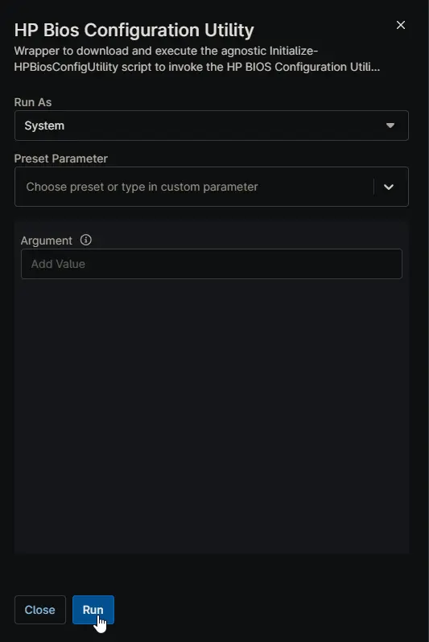
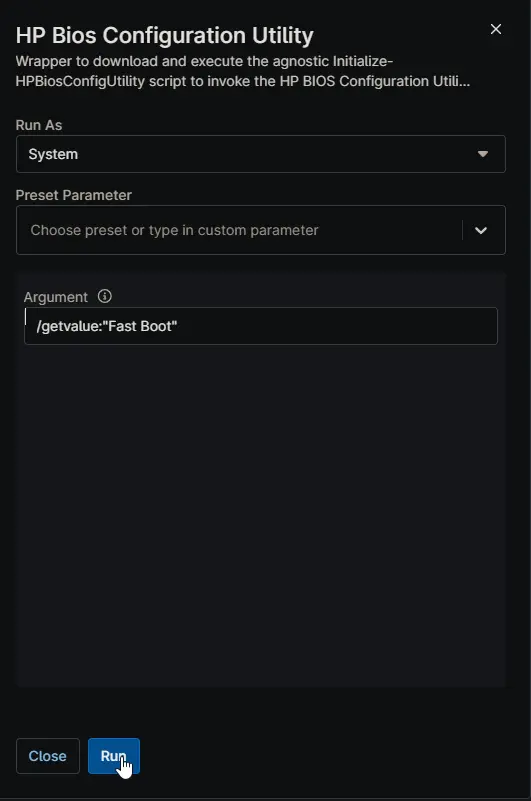
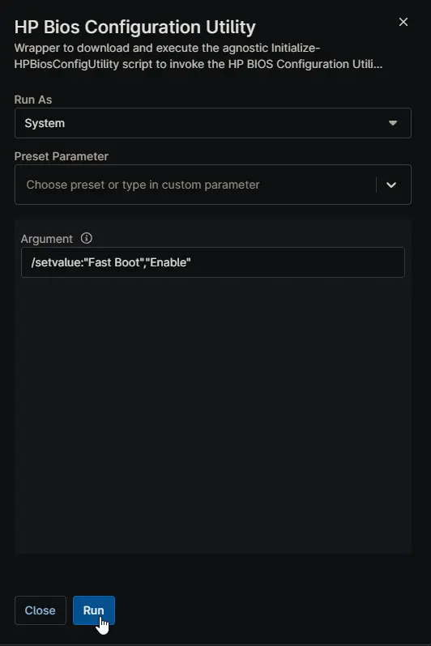
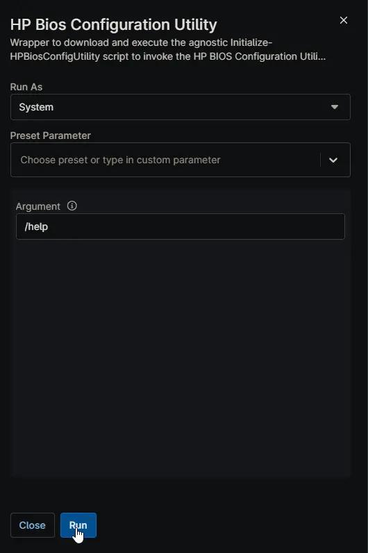

## Overview

Wrapper to download and execute the agnostic [Initialize-HPBiosConfigUtility](/docs/f7456518-5258-490c-b2f8-40ebef1c4007) script to invoke the HP BIOS Configuration Utility (BCU) on HP workstations.

**References:**

- [HP BIOS Configuration Utility | HP Client Management Solutions](https://ftp.ext.hp.com/pub/caps-softpaq/cmit/HP_BCU.html)
- [BIOS_Configuration_Utility_User_Guide.pdf](https://ftp.hp.com/pub/caps-softpaq/cmit/whitepapers/BIOS_Configuration_Utility_User_Guide.pdf)

## Sample Run

**Example 1:**

Run a read-only configuration scan (installs BCU if missing):

**Example 2:**

Get the current value of the "Fast Boot" setting:

**Example 3:**

Set the "Fast Boot" setting to "Enable":

**Example 4:**

Display BCU help and supported commands:

## Dependencies

- [Initialize-HPBiosConfigUtility](/docs/b5d53223-2755-48da-b4f5-a1cd5fa9f58f)

## Parameters

| Name | Example | Accepted Values | Required | Default | Type | Description |
| ---- | ------- | --------------- | -------- | ------- | ---- | ----------- |
| Argument | <ul><li>`/help`</li><li>`/getvalue:"Fast Boot"`</li><li>`/setvalue:"Fast Boot","Enable"`</li><li>`--Version`</li></ul> | | False | | String/Text | The argument to pass to the HP BIOS Configuration Utility (BCU) via the agnostic script. If left blank, the default value `/get` will be used. |

## Automation Setup/Import

[Automation Configuration](https://github.com/ProVal-Tech/ninjarmm/blob/main/scripts/hp-bios-configuration-utility.ps1)

## Output

- Activity Details
