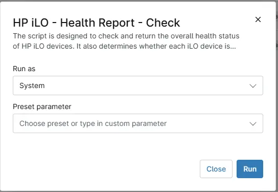

## Overview

The script is designed to check and return the overall health status of HP iLO devices. It also determines whether each iLO device is operating normally or reporting warnings or critical issues. This allows for proactive monitoring and quick identification of potential hardware or management interface problems.

## Sample Run

`Play Button` > `Run Automation` > `Script`  

## Dependencies

- [Solution - HP iLO Health Check](/docs/593be8f7-970f-4b6a-80b0-7cf0ff3396a6) 

## Automation Setup/Import

[Automation Configuration](https://github.com/ProVal-Tech/ninjarmm/blob/main/scripts/hp-ilo-health-report-check.ps1)

## Output

- Activity Details  
- Custom Field

## Changelog

### 2026-04-09

- Initial version of the document
