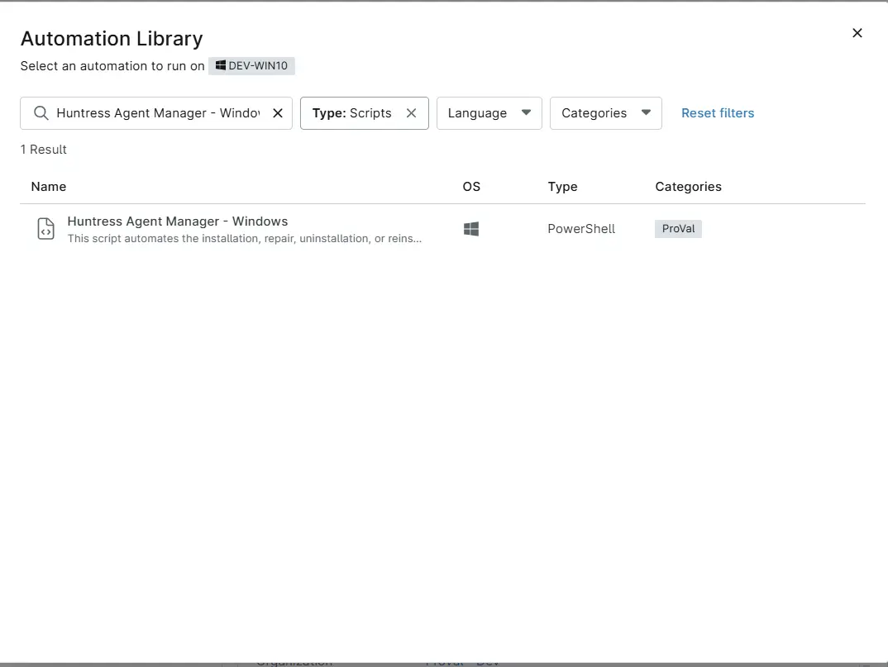
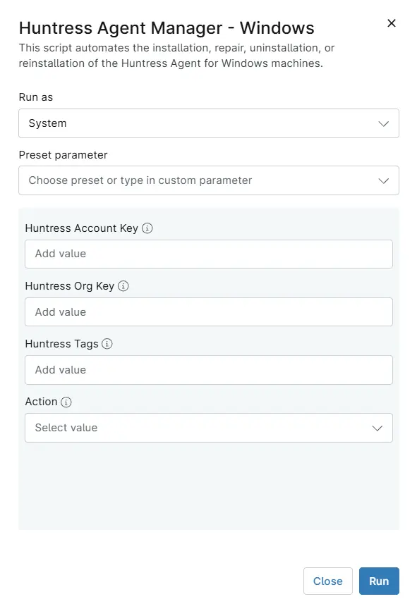

## Overview

This script automates the installation, repair, uninstallation, or reinstallation of the Huntress Agent for Windows machines.

## Sample Run

`Play Button` > `Run Automation` > `Script`  

Search and select `Huntress Agent Manager - Windows`

Set the required arguments and click the `Run` button to run the script.  
**Run As:** `System`  
**Preset Parameter:** `<Leave it Blank>`  
**Huntress Account Key:** `Leave it blank or set this variable to override the value stored in the organization-level custom field 'cPVAL Huntress Account Key'`  
**Huntress Org Key:** `Leave it blank or set this variable to override the value stored in the organization-level custom field 'cPVAL Huntress Org Key'`  
**Huntress Tags:**  `Leave it blank or set this variable to override the value stored in the organization-level custom field 'cPVAL Huntress Tags'`  
**Action:** `Install`  

**Run Automation:** `Yes`  

## Dependencies

- [Solution : Huntress Agent Deployment](/docs/e0ad73d2-fcab-43f0-9866-72a48623ef48)
- [cPVAL Huntress Account Key](/docs/2b62c710-cd01-4c0a-ab26-58f637e3226a)  
- [cPVAL Huntress org Key](/docs/a746555d-f311-449f-ace0-c8a3b67a2ba4)  
- [cPVAL Huntress Tags](/docs/ac9bd64b-0327-4879-931d-128936bc43a6)
- [InstallHuntress.powershellv2.ps1](https://raw.githubusercontent.com/huntresslabs/deployment-scripts/main/Powershell/InstallHuntress.powershellv2.ps1)

## Parameters

| Name | Required | Accepted Values | Default | Type | Description |
| ---- | -------- | --------------- | ------- | ---- | ----------- |
| Huntress Account Key | False | | | String/Text | Set this variable to override the value stored in the organization-level custom field [cPVAL Huntress Account Key](/docs/2b62c710-cd01-4c0a-ab26-58f637e3226a) |
| Huntress Org Key | False | | | String/Text | Set this variable to override the value stored in the organization-level custom field [cPVAL Huntress org Key](/docs/a746555d-f311-449f-ace0-c8a3b67a2ba4) |
| Huntress Tags | False | | | String/Text | Set this variable to override the value stored in the organization-level custom field [cPVAL Huntress Tags](/docs/ac9bd64b-0327-4879-931d-128936bc43a6) |
| Action | False | `Install`, `Reregister`, `Reinstall`, `Uninstall`, `Repair` | `Install` | Drop-Down | Choose the action to perform. By default, the script is set to perform installation |

## Automation Setup/Import

[Automation Configuration](https://github.com/ProVal-Tech/ninjarmm/blob/main/scripts/huntress-agent-manager-windows.ps1)

## Output

- Activity Details  

## Changelog

## 2026-05-27

- Fixed the powershell to not throw errors if account key is not provided in case of uninstallation.
- Renamed the script from 'Install Huntress Agent - Windows' to 'Huntress Agent Manager - Windows'
- Updated the documents as per our new template.

### 2025-05-30

- Uninstaller was not removing the entries from uninstall registry keys. Added a code-block at the end of the script to fix it.

### 2025-04-11

- Initial version of the document
