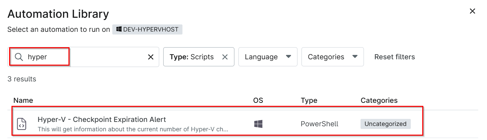
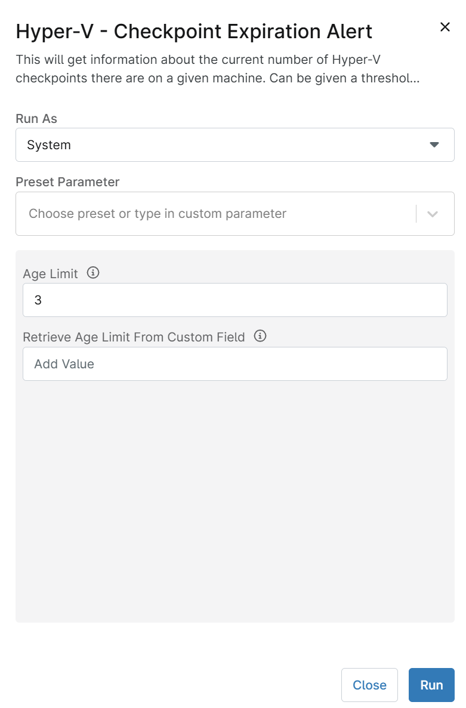
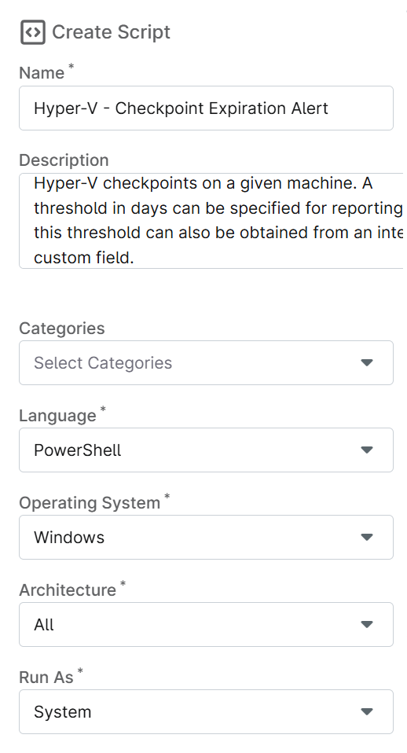
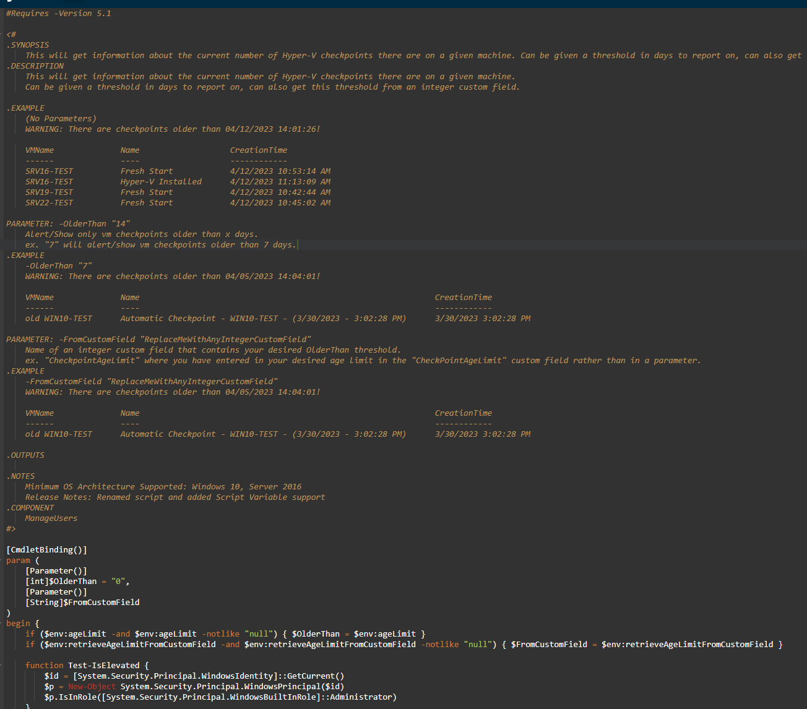
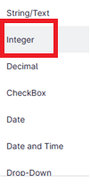
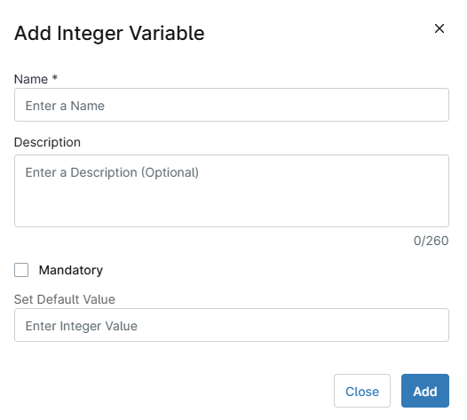
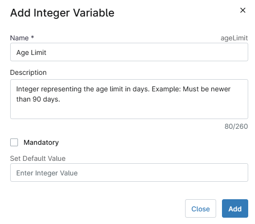
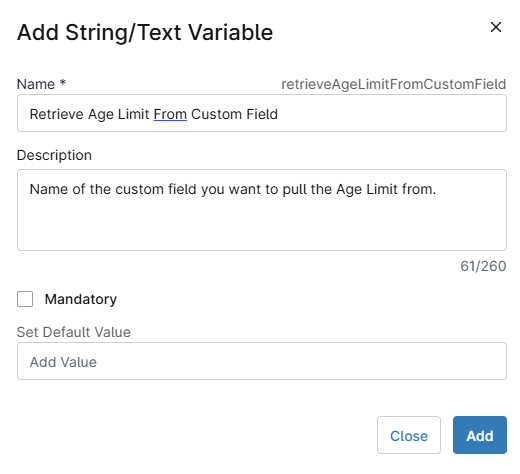
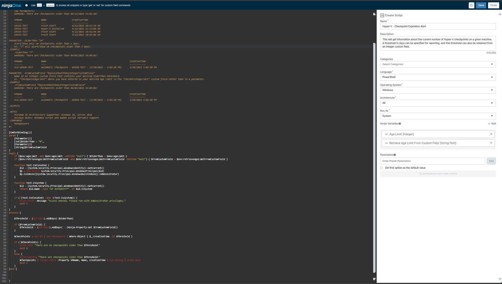

## Overview
This will get information about the current number of Hyper-V checkpoints on a given machine. A threshold in days can be specified for reporting, and this threshold can also be obtained from an integer custom field.

## Sample Run

`Play Button` > `Run Automation` > `Script`  


Search Hyper and select `Hyper-V - Checkpoint Expiration Alert`


Set the required arguments and click the `Run` button to run the script.  
- **Run As:** `System`  
- **Preset Parameter:** `<Leave it Blank>`  
- **Age Limit:** `3`  
- **Retrieve Age Limit From Custom Field:** `Leave it blank or provide the custom field name where the older than X days threshold is kept to override the value stored in the parameter "Age Limit" and click Run`  



**Run Automation:** `Yes`  


## Dependencies

[Solution - Hyper-V Checkpoint Expiration Alert](/docs/621e8dcc-3405-47e6-b1e6-d9190971e8ee)

## Parameters

| Name                                | Example                        | Accepted Values                     | Required | Default | Type         | Description                                                                                      |
|-------------------------------------|--------------------------------|-------------------------------------|----------|---------|--------------|--------------------------------------------------------------------------------------------------|
| Age Limit                           | 3                              | Any positive integer                | False    |         | Integer      | Specifies the number of days to check for expired Hyper-V checkpoints.                         |
| Retrieve Age Limit From Custom Field| pvalhypervcheckpointthreshold  | Name of a custom field (Integer)    | False    |         | String/Text  | Retrieves the threshold value from the specified custom field. The field must be of type Integer. |


## Automation Setup/Import

### Step 1

Navigate to `Administration` > `Library` > `Automation`  


### Step 2

Locate the `Add` button on the right-hand side of the screen, click on it and click the `New Script` button.  


The scripting window will open.  


### Step 3

Configure the `Create Script` section as follows:

- **Name:** `Hyper-V - Checkpoint Expiration Alert`  
- **Description:** `This will get information about the current number of Hyper-V checkpoints on a given machine. A threshold in days can be specified for reporting, and this threshold can also be obtained from an integer custom field.`  
- **Categories:** `<Leave it Blank>`  
- **Language:** `PowerShell`  
- **Operating System:** `Windows`  
- **Architecture:** `All`  
- **Run As:** `System`  


## Step 4

Paste the following powershell script in the scripting section:  

```PowerShell
#Requires -Version 5.1

<#
.SYNOPSIS
    This will get information about the current number of Hyper-V checkpoints there are on a given machine. Can be given a threshold in days to report on, can also get this threshold from an integer custom field.
.DESCRIPTION
    This will get information about the current number of Hyper-V checkpoints there are on a given machine. 
    Can be given a threshold in days to report on, can also get this threshold from an integer custom field.

.EXAMPLE 
    (No Parameters)
    WARNING: There are checkpoints older than 04/12/2023 14:01:26!

    VMName              Name                   CreationTime
    ------              ----                   ------------
    SRV16-TEST          Fresh Start            4/12/2023 10:53:14 AM
    SRV16-TEST          Hyper-V Installed      4/12/2023 11:13:09 AM
    SRV19-TEST          Fresh Start            4/12/2023 10:42:44 AM
    SRV22-TEST          Fresh Start            4/12/2023 10:45:02 AM

PARAMETER: -OlderThan "14"
    Alert/Show only vm checkpoints older than x days. 
    ex. "7" will alert/show vm checkpoints older than 7 days.
.EXAMPLE
    -OlderThan "7"
    WARNING: There are checkpoints older than 04/05/2023 14:04:01!
    
    VMName              Name                                                              CreationTime
    ------              ----                                                              ------------
    old WIN10-TEST      Automatic Checkpoint - WIN10-TEST - (3/30/2023 - 3:02:28 PM)      3/30/2023 3:02:28 PM 

PARAMETER: -FromCustomField "ReplaceMeWithAnyIntegerCustomField"
    Name of an integer custom field that contains your desired OlderThan threshold.
    ex. "CheckpointAgeLimit" where you have entered in your desired age limit in the "CheckPointAgeLimit" custom field rather than in a parameter.
.EXAMPLE
    -FromCustomField "ReplaceMeWithAnyIntegerCustomField"
    WARNING: There are checkpoints older than 04/05/2023 14:04:01!
    
    VMName              Name                                                              CreationTime
    ------              ----                                                              ------------
    old WIN10-TEST      Automatic Checkpoint - WIN10-TEST - (3/30/2023 - 3:02:28 PM)      3/30/2023 3:02:28 PM

.OUTPUTS
    
.NOTES
    Minimum OS Architecture Supported: Windows 10, Server 2016
    Release Notes: Renamed script and added Script Variable support
.COMPONENT
    ManageUsers
#>

[CmdletBinding()]
param (
    [Parameter()]
    [int]$OlderThan = "0",
    [Parameter()]
    [String]$FromCustomField
)
begin {
    if ($env:ageLimit -and $env:ageLimit -notlike "null") { $OlderThan = $env:ageLimit }
    if ($env:retrieveAgeLimitFromCustomField -and $env:retrieveAgeLimitFromCustomField -notlike "null") { $FromCustomField = $env:retrieveAgeLimitFromCustomField }

    function Test-IsElevated {
        $id = [System.Security.Principal.WindowsIdentity]::GetCurrent()
        $p = New-Object System.Security.Principal.WindowsPrincipal($id)
        $p.IsInRole([System.Security.Principal.WindowsBuiltInRole]::Administrator)
    }

    function Test-IsSystem {
        $id = [System.Security.Principal.WindowsIdentity]::GetCurrent()
        return $id.Name -like "NT AUTHORITY*" -or $id.IsSystem
    }

    if (!(Test-IsElevated) -and !(Test-IsSystem)) {
        Write-Error -Message "Access Denied. Please run with Administrator privileges."
        exit 1
    }
}
process {

    $Threshold = (Get-Date).AddDays(-$OlderThan)

    if ($FromCustomField) {
        $Threshold = (Get-Date).AddDays( - (Ninja-Property-Get $FromCustomField))
    }
    
    $CheckPoints = Get-VM | Get-VMSnapshot | Where-Object { $_.CreationTime -lt $Threshold }

    if (!$CheckPoints) {
        Write-Host "There are no checkpoints older than $Threshold!"
        exit 0
    }
    else {
        Write-Warning "There are checkpoints older than $Threshold!"
        $Checkpoints | Format-Table -Property VMName, Name, CreationTime | Out-String | Write-Host
        exit 1
    }
}end {
    
    
    
}
```



## Script Variables

### Age Limit

Click the `Add` button next to `Script Variables`.  


Select the `Integer` option.  


The `Add Integer Variable` window will open.  


In the box, fill in the following details and select `Add` to create the script variable.  

- **Name:** `Age Limit`  
- **Description:** `Integer representing the age limit in days. Example: Must be newer than 90 days.`  
- **Set Default Value:** `<Leave it blank>`



### Retrieve Age Limit From Custom Field

Click the `Add` button next to `Script Variables`.  


Select the `String/Text` option.  


The `Add String/Text Variable` window will open.  


In the box, fill in the following details and select `Add` to create the script variable.  

- **Name:** `Retrieve Age Limit From Custom Field`  
- **Description:** `Name of the custom field you want to pull the Age Limit from.`  
- **Mandatory:** `<Leave it Unchecked>`  
- **Set Default Value:** `<Leave it blank>`




## Saving the Automation

Click the Save button in the top-right corner of the screen to save your automation.  


You will be prompted to enter your MFA code. Provide the code and press the Continue button to finalize the process.  


## Completed Automation



## Output

- Activity Details 
- Ticket