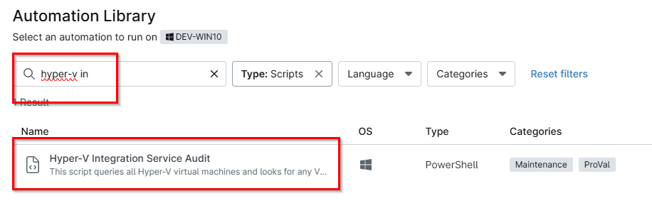
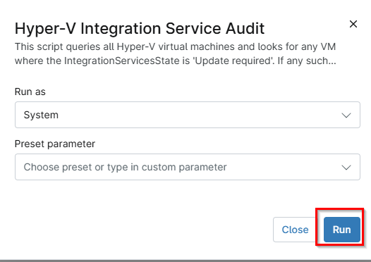

## Overview

This script queries all Hyper-V virtual machines and looks for any VM where the IntegrationServicesState is `Update required`. 
If any such VM is found, the script stores the VM details in the NinjaOne custom field `cpvalHyperVIntegrationServiceStatus` and exits with code 1. 
If no VMs require Integration Services updates, the script stores `UpToDate` and exits successfully with code 0.

## Sample Run

`Play Button` > `Run Automation` > `Script`  

Type Hyper-V Integration in the search box and select the `Hyper-V Integration Service Audit` script

Click Run

## Dependencies

- [Script - Hyper-V Integration Service Audit](/docs/1c8cf2c3-d470-4616-bc27-35e69f274202)
- [Solution - HyperV Replication Integration Alert](/docs/4deaf362-a762-4a05-9118-326edc7ff523)

## Automation Setup/Import

[Automation Configuration](https://github.com/ProVal-Tech/ninjarmm/blob/main/scripts/hyperv-integration-service-audit.ps1)

## Output

- Activity Details  
- Custom Field

## Changelog

### 2026-05-11

- Initial version of the document