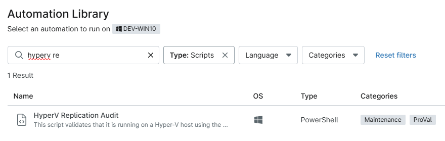
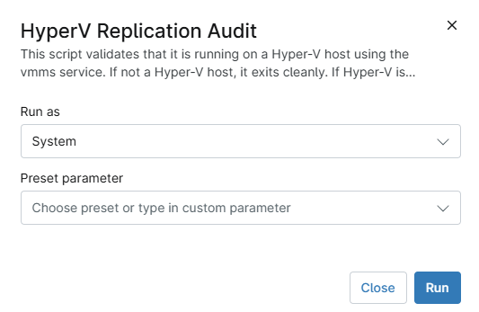

## Overview

This script validates that it is running on a Hyper-V host using the vmms service. If not a Hyper-V host, it exits cleanly. 
If Hyper-V is present, it checks replication health and flags `Critical` or `Warning` states.

## Sample Run

`Play Button` > `Run Automation` > `Script`  

Type HyperV Replication in the search box and select the `HyperV Replication Audit` script

Click Run

## Dependencies

- [Script - HyperV Replication Audit](/docs/d3e74048-d274-4fe7-8501-c826822707b2)
- [Solution - HyperV Replication Integration Alert](/docs/4deaf362-a762-4a05-9118-326edc7ff523)

## Automation Setup/Import

[Automation Configuration](https://github.com/ProVal-Tech/ninjarmm/blob/main/scripts/hyperv-replication-audit.ps1)

## Output

- Activity Details  
- Custom Field

## Changelog

### 2026-05-11

- Initial version of the document