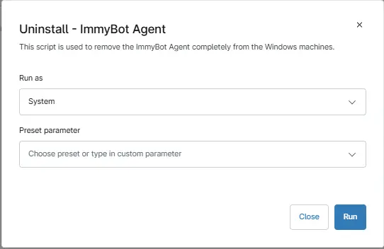

## Overview

This script is used to remove the Immybot Agent completely from the machines.
## Sample Run

`Play Button` > `Run Automation` > `Script`  

## Automation Setup/Import

[Automation Configuration](https://github.com/ProVal-Tech/ninjarmm/blob/main/scripts/immybot-agent-uninstall.ps1)

## Output

- Activity Details  

## Changelog

### 2026-05-13

Initial Version