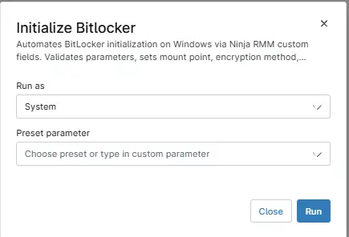

## Description

Automates BitLocker initialization on Windows via Ninja RMM custom fields. Validates parameters, sets mount point, encryption method, key protector, PIN/password, and AD/path, downloads a helper script, executes it, and logs output for auditing.

**Note:** `This is only compatible for Windows devices.`

## Requirements

- PowerShell v5
- Update the custom fields with the data so that script will use that settings.

## Sample Run

`Play Button` > `Run Automation` > `Script`  

## Dependencies

- [Custom Field - cPVAL Allow TPM Or Reboot](/docs/418f1b8b-14f8-492d-80fc-ea038cff6057)
- [Custom Field - cPVAL SkipHardwareTest](/docs/e22d7853-1e3c-403c-8ba9-b9b99ba31bac)
- [Custom Field - cPVAL BitLocker Enable](/docs/c959b82c-fc55-478b-87f1-b9d06cf5a29b)
- [Custom Field - cPVAL BitLocker Initialization](/docs/16881247-a7d2-477c-9215-2bd25a936641)
- [Custom Field - cPVAL EncryptionMethod](/docs/56fde7c8-f054-4b53-a3a9-d24134fb9cc0)
- [Custom Field - cPVAL KeyProtectorType](/docs/3378eace-ffba-4f7d-8e93-3cc37510a4ea)
- [Custom Field - cPVAL Mountpoint](/docs/4f9532e4-3d96-4e95-a6f5-b9a77d45c926)
- [Custom Field - cPVAL Path Or ADAccount](/docs/fb290c5b-cf73-4b7e-be34-ada7d3391e47)
- [Custom Field - cPVAL PIN Or Password](/docs/897971d9-4b4a-4554-8dd4-fc0bb324ed9b)
- [Agnostic - Initialize-BitLockerVolume](/docs/2ce835a2-3ac1-4291-baaf-8d3cac76869f)
- [Solution - Bitlocker Initialize - NinjaOne](/docs/2ebfabd5-05cf-4175-a513-2aa290eb26e8)

## Automation Setup/Import

[Automation Configuration](https://github.com/ProVal-Tech/ninjarmm/blob/main/scripts/initialize-bitlocker.ps1)

## Output

Activity Logs
- .\\Initialize-BitLockerVolume-log.txt
- .\\Initialize-BitLockerVolume-data.txt
- .\\Initialize-BitLockerVolume-error.txt