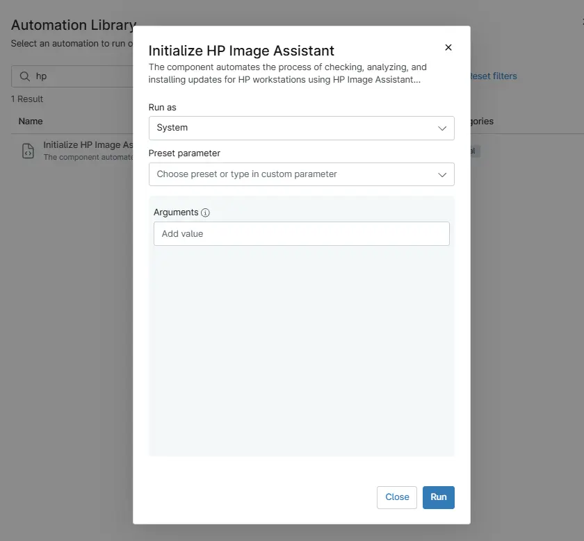
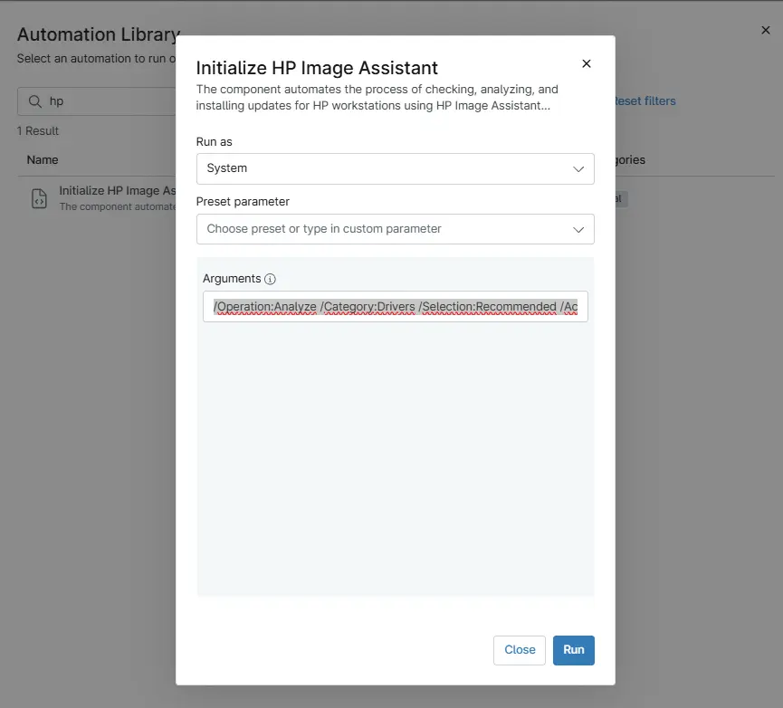
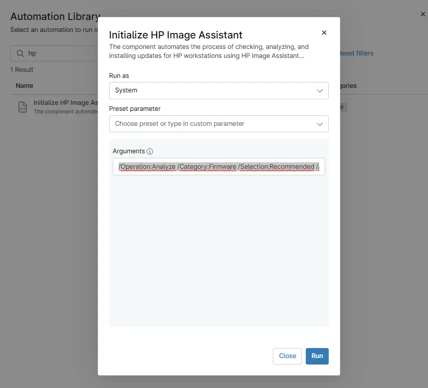
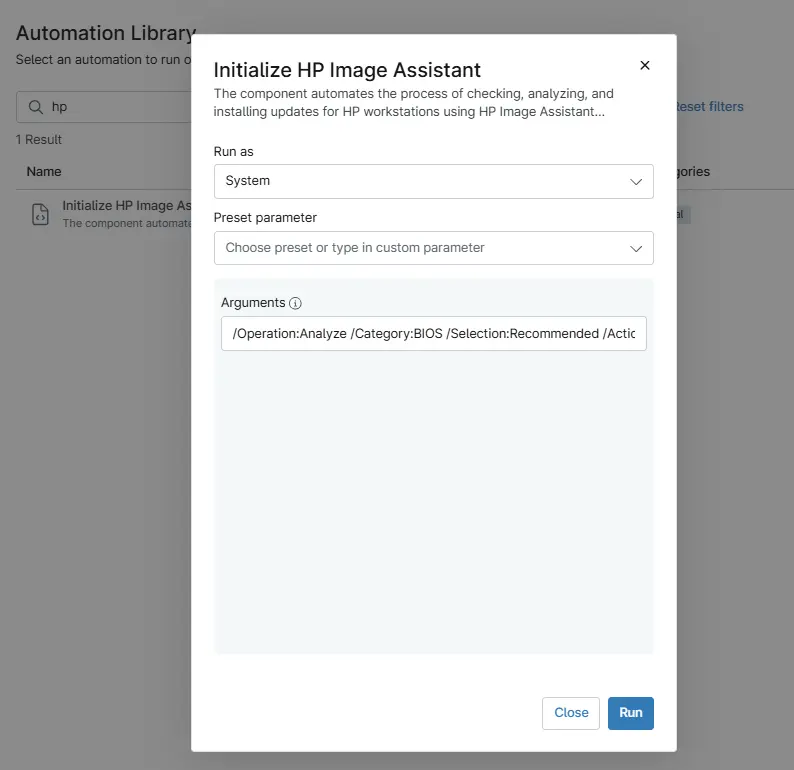
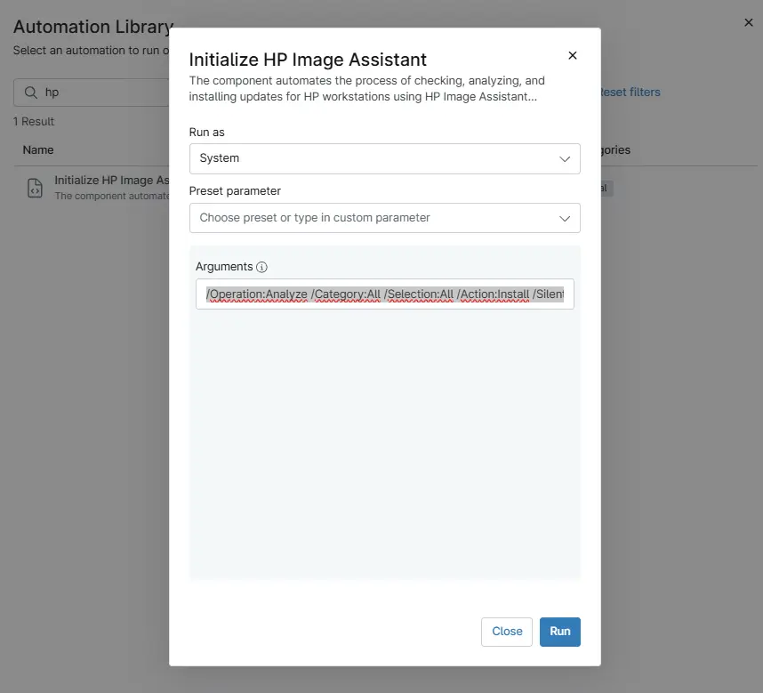
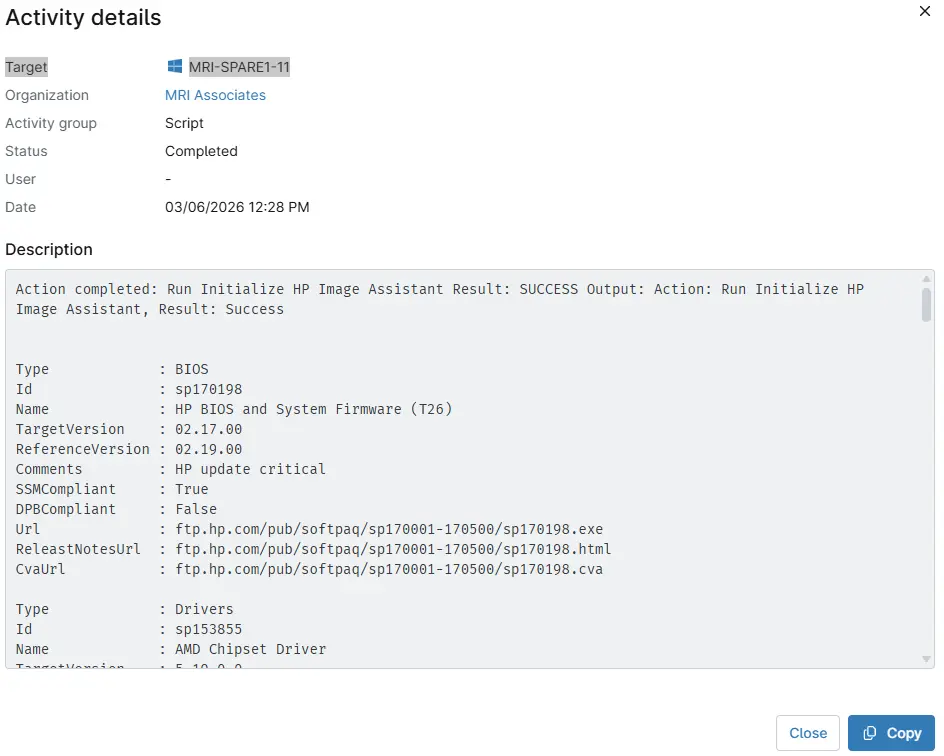

## Overview

This procedure deploys all updates including BIOS, firmware, and drivers to the endpoint HP workstations using HP Image Assistant (HPIA). It addresses the tedious, error-prone manual process of validating, acquiring, and installing driver, firmware, BIOS, and software updates on HP business PCs by fully automating:

- Environment and hardware validation
- Downloading and managing HP’s update tools
- Running update scans and applying updates
- Providing structured, human-readable reports

This tool is ideal for standardizing HP client environments, keeping endpoints secure, compliant, and up to date with minimal manual intervention.

For complete documentation on supported arguments, refer to: [HP Image Assistant User Guide](https://ftp.hp.com/pub/caps-softpaq/cmit/imagepal/userguide/936944-005.pdf)

## Sample Run

`Play Button` > `Run Automation` > `Script`  

## Dependencies

- [Agnostic script - Initialize-HPImageAssistant](/docs/92b749f0-2e30-4d4d-8916-fb5f30d85bff)

## Parameters

| Parameter | Required | Example | Type | Details | Description |
| --------- | -------- | ------- | ---- | ------- | ----------- |
| `Argument` | False | `/Operation:Analyze /Category:All /Selection:All /Action:Install /Silent /AutoCleanup /ReportFilePath:"C:\ProgramData\_Automation\App\HPImageAssistant\InstallReport"` | `String/Text` | HPIA arguments to execute. See the [HP Image Assistant User Guide](https://ftp.hp.com/pub/caps-softpaq/cmit/imagepal/userguide/936944-005.pdf) for supported parameters. | Executes HP Image Assistant to analyze the system and install applicable updates |

### Examples

1. **Default scan operation**: If executing the script without any arguments, it will only scan.

   

2. **Apply driver updates silently**: To perform an update action (for example, silent install of recommended driver updates):

   `/Operation:Analyze /Category:Drivers /Selection:Recommended /Action:Install /Silent /AutoCleanup /ReportFilePath:"C:\ProgramData\_Automation\App\HPImageAssistant\InstallReport"`

   

3. **Apply Firmware updates silently**: To perform an update action (for example, silent install of recommended firmware updates):

   `/Operation:Analyze /Category:Firmware /Selection:Recommended /Action:Install /Silent /AutoCleanup /ReportFilePath:"C:\ProgramData\_Automation\App\HPImageAssistant\InstallReport"`

   

4. **Apply BIOS updates silently**: To perform an update action (for example, silent install of recommended firmware updates):

   `/Operation:Analyze /Category:BIOS /Selection:Recommended /Action:Install /Silent /AutoCleanup /ReportFilePath:"C:\ProgramData\_Automation\App\HPImageAssistant\InstallReport"`

   

5. **Apply All updates silently** :To perform an update action (for example, silent install of all available updates):

    `/Operation:Analyze /Category:All /Selection:All /Action:Install /Silent /AutoCleanup /ReportFilePath:"C:\ProgramData\_Automation\App\HPImageAssistant\InstallReport"`

    

## Output

- Activity Details  

## Automation Setup/Import

- [Automation Configuration](https://github.com/ProVal-Tech/ninjarmm/blob/main/scripts/initialize-hp-image-assistant.ps1)

## Changelog

### 2026-03-06

- Initial version of the document
