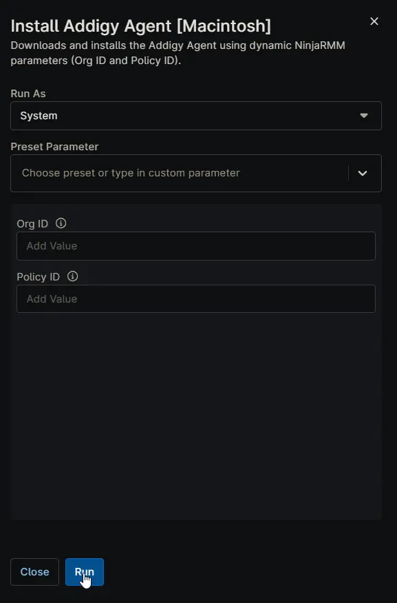

## Overview

Downloads and installs the Addigy Agent using dynamic NinjaRMM parameters (Org ID and Policy ID).

## Sample Run

## Dependencies

- [Custom Field: cPVAL Addigy Org ID](/docs/b3a99690-e1d2-40ad-8ee8-9c417330e2b9)
- [Custom Field: cPVAL Addigy Policy ID](/docs/7061a031-f078-4ee0-b87c-83595adf0a64)
- [Solution: Addigy Agent Deployment](/docs/1f1e6543-8ab7-4b30-adde-ac0f0b2f54a1)

## Custom Fields

| Name | Example | Level | Accepted Values | Required | Default | Type | Description |
| ---- | ------- | ----- | --------------- | -------- | ------- | ---- | ----------- |
| [cPVAL Addigy Org ID](/docs/b3a99690-e1d2-40ad-8ee8-9c417330e2b9) | 5d0cf821-3fbf-4ed1-9997-9f343a446cea | Organization | | Partially | | Text | Store the Addigy Organization ID here for automatic application to all devices. If not set, provide Org ID as a runtime variable when running the script. |
| [cPVAL Addigy Policy ID](/docs/7061a031-f078-4ee0-b87c-83595adf0a64) | 7ca7ebdd-2ee4-4e71-88a6-8bd633c74d5f | Organization | | Partially | | Text | Stores the Addigy Policy ID for this organization. Ensures all macOS devices report to the correct policy bucket in Addigy for proper management and compliance. If not set, provide Policy ID as a runtime variable when running the script. |

## Parameters

| Name | Example | Accepted Values | Required | Default | Type | Description |
| ---- | ------- | --------------- | -------- | ------- | ---- | ----------- |
| Org ID | 5d0cf821-3fbf-4ed1-9997-9f343a446cea | | Partially | | Text | The unique Organization ID from Addigy. Setting this variable overrides the [cPVAL Addigy Org ID](/docs/b3a99690-e1d2-40ad-8ee8-9c417330e2b9) custom field. |
| Policy ID | 7ca7ebdd-2ee4-4e71-88a6-8bd633c74d5f | | Partially | | Text |The specific Policy ID from Addigy. Setting this variable overrides the [cPVAL Addigy Policy ID](/docs/7061a031-f078-4ee0-b87c-83595adf0a64) custom field. |

## Automation Setup/Import

- s[Automation Configuration](https://github.com/ProVal-Tech/ninjarmm/blob/main/scripts/install-addigy-agent-macintosh.sh)

## Output

- Activity Details  
