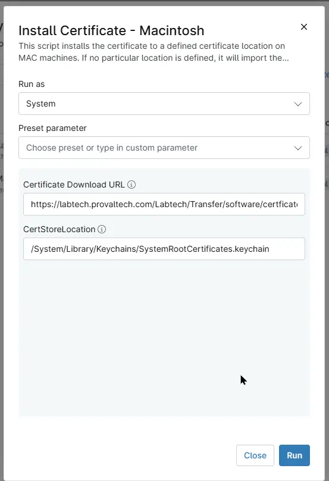

## Overview
This script installs the certificate to a defined certificate location on MAC machines. If no particular location is defined, it will import the certificate at the root location of the machine and apply it to the entire system.

## Sample Run

## Dependencies

- [Custom Field - cPVAL MAC Certificate Download URL](/docs/6771a3e9-b9e9-4347-afb7-68c5fc5cf740)
- [Custom Field - cPVAL MAC CertStoreLocation](/docs/fdaeb10a-efad-47d0-baf4-fd9ee6c074dc)
- [Solution - Install Certificates - Windows/Mac](/docs/12034de3-aa3a-4f6c-89da-a6f229e6fbec)

## Parameters

| Name | Example | Accepted Values | Required | Default | Type | Description |
| ---- | ------- | --------------- | -------- | ------- | ---- | ----------- |
|Certificate Download URL| `https://labtech.provaltech.com/Labtech/Transfer/software/certficates/DNSFilter.cer` | - | `False` | - | Text/String | Direct download URL of the certificate. Something like this: https://labtech.provaltech.com/Labtech/Transfer/software/certficates/DNSFilter.cer |
| CertStoreLocation | `/System/Library/Keychains/SystemRootCertificates.keychain` | - | `False` | - | Text/String | Particular keychain to import a certificate on a MAC machine. It could be something like /System/Library/Keychains/SystemRootCertificates.keychain, /Users/YourUsername/Library/Keychains/login.keychain, etc. If nothing is mentioned in the parameter, it will use the default system-wide keychain, applying trusted root certificates to the entire system, i.e., /Library/Keychains/System.keychain. |

## Custom Fields

| Field Name | Type | Mandatory | Scope | Description |
| ---------- | ---- | --------- | ----- | ----------- |
| [Custom Field - cPVAL MAC Certificate Download URL](/docs/6771a3e9-b9e9-4347-afb7-68c5fc5cf740) | Text | `False` | `Organization`, `Location`, `Device`  | Direct download URL of the certificate. Something like this: https://labtech.provaltech.com/Labtech/Transfer/software/certficates/DNSFilter.cer | 
| [Custom Field - cPVAL MAC CertStoreLocation](/docs/fdaeb10a-efad-47d0-baf4-fd9ee6c074dc) | Text | `False` | `Organization`, `Location`, `Device`  | Particular keychain to import a certificate on a MAC machine. Something like /System/Library/Keychains/SystemRootCertificates.keychain, /Users/YourUsername/Library/Keychains/login.keychain, etc. Default : /Library/Keychains/System.keychain | 

## Automation Setup/Import

[Automation Configuration](https://github.com/ProVal-Tech/ninjarmm/blob/main/scripts/install-certificate-macintosh.ps1)

## Output

- Activity Details  

## Changelog

### 2026-09-28

- Initial version of the document