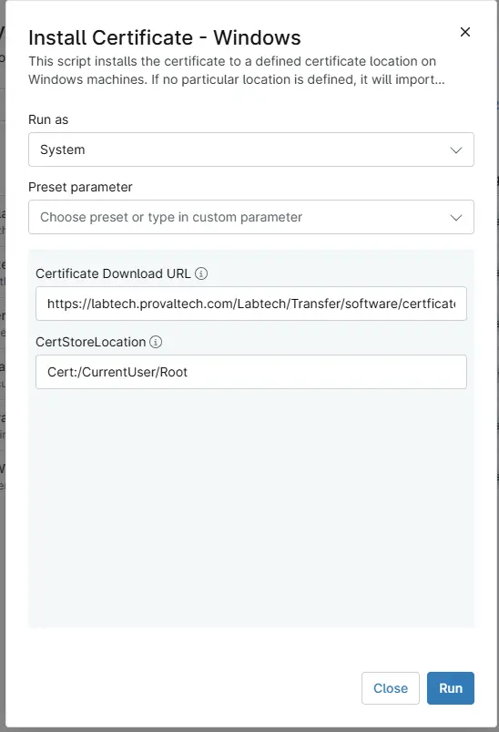

## Overview
This script installs the certificate to a defined certificate location on Windows machines. If no particular location is defined, it will import the certificate at the root location of the machine and apply it to the entire system.

## Sample Run

## Dependencies

- [Custom Field - cPVAL Win Certificate Download URL](/docs/1c5e34b8-839e-44b0-87ad-d2cb7e21bdd5)
- [Custom Field - cPVAL Win CertStoreLocation](/docs/73a3849d-464c-4bf1-ae15-a93a9bd54370)
- [Solution - Install Certificates - Windows/Mac](/docs/12034de3-aa3a-4f6c-89da-a6f229e6fbec)

## Parameters

| Name | Example | Accepted Values | Required | Default | Type | Description |
| ---- | ------- | --------------- | -------- | ------- | ---- | ----------- |
|Certificate Download URL| `https://labtech.provaltech.com/Labtech/Transfer/software/certficates/DNSFilter.cer` | - | `False` | - | Text/String | Direct download URL of the certificate. Something like this: https://labtech.provaltech.com/Labtech/Transfer/software/certficates/DNSFilter.cer |
| CertStoreLocation | `Cert:/CurrentUser/Root` | - | `False` | - | Text/String | A particular certificate store on a Windows system to import the certificate. It could be something like Cert:/CurrentUser/Root, Cert:/LocalMachine/My, etc. If nothing is mentioned in the parameter, it will use the default store location, i.e., Cert:/LocalMachine/Root. |

## Custom Fields

| Field Name | Type | Mandatory | Scope | Description |
| ---------- | ---- | --------- | ----- | ----------- |
| [Custom Field - cPVAL Win Certificate Download URL](/docs/c5e34b8-839e-44b0-87ad-d2cb7e21bdd5) | Text | `False` | `Organization`, `Location`, `Device`  | Direct download URL of the certificate. Something like this: https://labtech.provaltech.com/Labtech/Transfer/software/certficates/DNSFilter.cer | 
| [Custom Field - cPVAL Win CertStoreLocation](/docs/73a3849d-464c-4bf1-ae15-a93a9bd54370)| Text | `False` | `Organization`, `Location`, `Device`  | A particular certificate store on a Windows system to import the certificate. E.g. Cert:/CurrentUser/Root, Cert:/LocalMachine/My, etc. Default location :  'Cert:\LocalMachine\Root' | 

## Automation Setup/Import

[Automation Configuration](https://github.com/ProVal-Tech/ninjarmm/blob/main/scripts/install-certificate-windows.ps1)

## Output

- Activity Details  

## Changelog

### 2026-09-28

- Initial version of the document