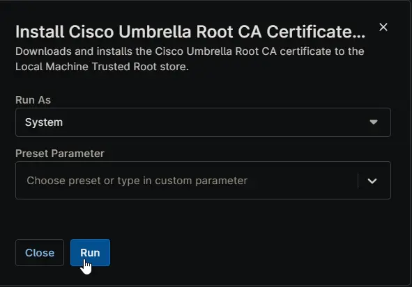

## Overview

Downloads and installs the Cisco Umbrella Root CA certificate to the Local Machine Trusted Root store for MacOS.

- **Cert Download Url:** `https://d36u8deuxga9bo.cloudfront.net/certificates/Cisco_Umbrella_Root_CA.cer`
- **Reference:** `https://docs.sse.cisco.com/sse-dns-guide/docs/install-the-cisco-umbrella-root-certificate`

## Sample Run

## Dependencies

- [Solution: Cisco Umbrella Root CA Certificate Installation](/docs/e1e5a6ab-f810-4e94-8b67-d32b626ab049)

## Automation Setup/Import

[Automation Configuration](https://github.com/ProVal-Tech/ninjarmm/blob/main/scripts/install-cisco-umbrella-root-ca-certificate-macintosh.sh)

## Output

- Activity Details  
