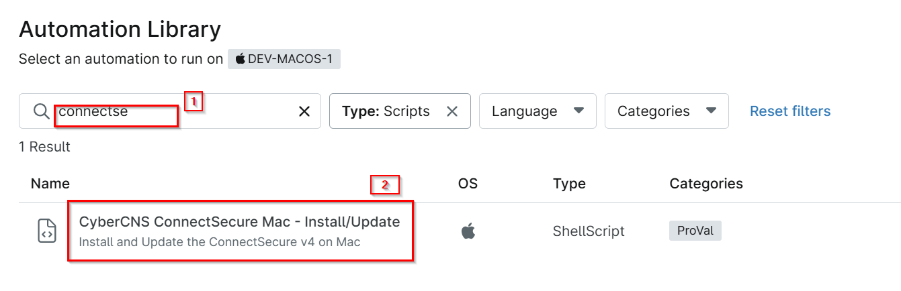
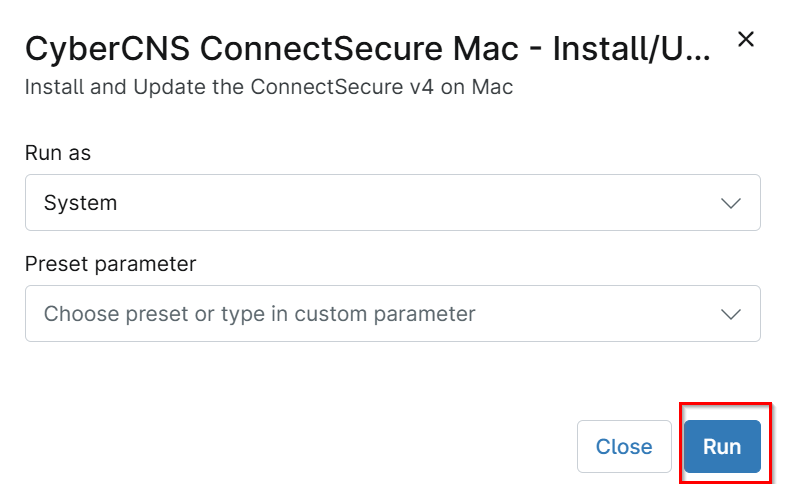
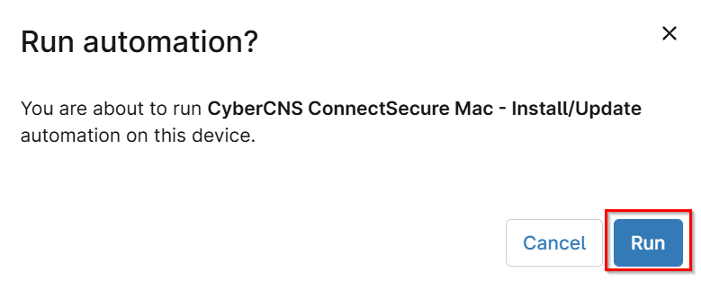
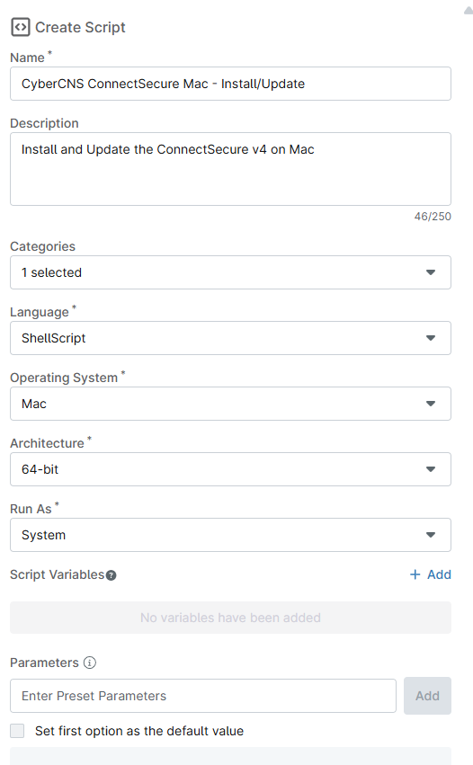
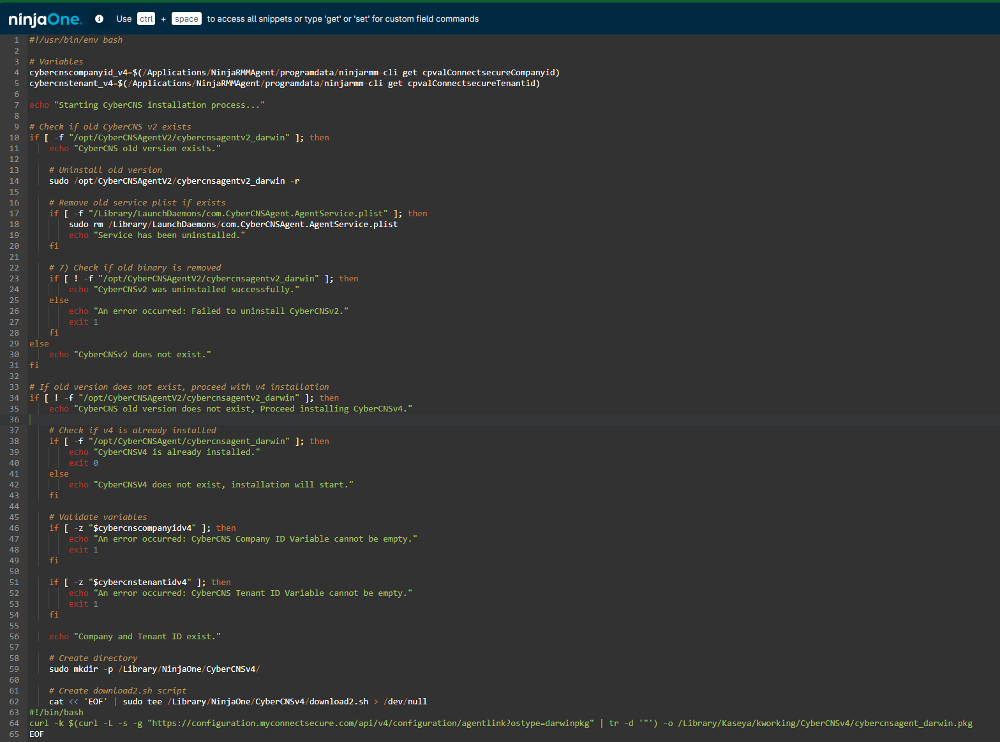
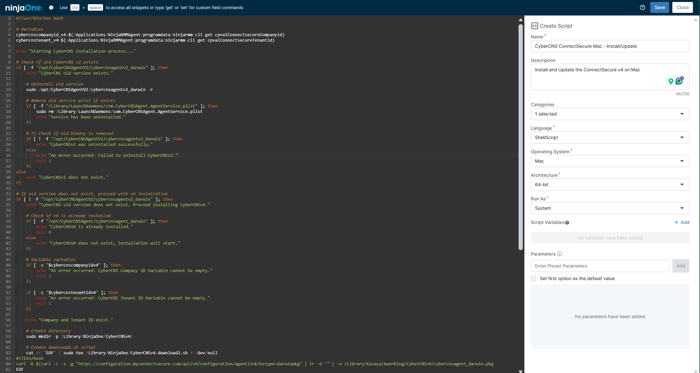

## Overview

Install and Update the ConnectSecure v4 on Mac

## Sample Run

`Play Button` > `Run Automation` > `Script`  








## Dependencies

[cpval ConnectSecure CompanyID](/docs/c104e227-d5f3-432b-90fa-f31186536181)
[cpval ConnectSecure TenantID](/docs/3d1a16b3-688c-4911-a92d-835a578254a9)
[cpval ConnectSecure Deployment](/docs/9065b847-eadf-4f4a-9021-28ef2fc0f6cf)


## Automation Setup/Import

### Step 1

Navigate to `Administration` > `Library` > `Automation`  


### Step 2

Locate the `Add` button on the right-hand side of the screen, click on it and click the `New Script` button.  


The scripting window will open.  


### Step 3

Configure the `Create Script` section as follows:

**Name:** `CyberCNS ConnectSecure Mac - Install/Update`  
**Description:** `Install and Update the ConnectSecure v4 on Mac`  
**Categories:** `ProVal`  
**Language:** `ShellScript`  
**Operating System:** `Mac`  
**Architecture:** `64-bit`  
**Run As:** `System`  


## Step 4

Paste the following Shell script in the scripting section:  

```bash
#!/usr/bin/env bash

# Variables
cybercnscompanyid_v4=$(/Applications/NinjaRMMAgent/programdata/ninjarmm-cli get cpvalConnectsecureCompanyid)
cybercnstenant_v4=$(/Applications/NinjaRMMAgent/programdata/ninjarmm-cli get cpvalConnectsecureTenantid)

echo "Starting CyberCNS installation process..."

# Check if old CyberCNS v2 exists
if [ -f "/opt/CyberCNSAgentV2/cybercnsagentv2_darwin" ]; then
    echo "CyberCNS old version exists."

    # Uninstall old version
    sudo /opt/CyberCNSAgentV2/cybercnsagentv2_darwin -r

    # Remove old service plist if exists
    if [ -f "/Library/LaunchDaemons/com.CyberCNSAgent.AgentService.plist" ]; then
        sudo rm /Library/LaunchDaemons/com.CyberCNSAgent.AgentService.plist
        echo "Service has been uninstalled."
    fi

    # 7) Check if old binary is removed
    if [ ! -f "/opt/CyberCNSAgentV2/cybercnsagentv2_darwin" ]; then
        echo "CyberCNSv2 was uninstalled successfully."
    else
        echo "An error occurred: Failed to uninstall CyberCNSv2."
        exit 1
    fi
else
    echo "CyberCNSv2 does not exist."
fi

# If old version does not exist, proceed with v4 installation
if [ ! -f "/opt/CyberCNSAgentV2/cybercnsagentv2_darwin" ]; then
    echo "CyberCNS old version does not exist, Proceed installing CyberCNSv4."

    # Check if v4 is already installed
    if [ -f "/opt/CyberCNSAgent/cybercnsagent_darwin" ]; then
        echo "CyberCNSV4 is already installed."
        exit 0
    else
        echo "CyberCNSV4 does not exist, installation will start."
    fi

    # Validate variables
    if [ -z "$cybercnscompanyidv4" ]; then
        echo "An error occurred: CyberCNS Company ID Variable cannot be empty."
        exit 1
    fi

    if [ -z "$cybercnstenantidv4" ]; then
        echo "An error occurred: CyberCNS Tenant ID Variable cannot be empty."
        exit 1
    fi

    echo "Company and Tenant ID exist."

    # Create directory
    sudo mkdir -p /Library/NinjaOne/CyberCNSv4/

    # Create download2.sh script
    cat << 'EOF' | sudo tee /Library/NinjaOne/CyberCNSv4/download2.sh > /dev/null
#!/bin/bash
curl -k $(curl -L -s -g "https://configuration.myconnectsecure.com/api/v4/configuration/agentlink?ostype=darwinpkg" | tr -d '"') -o /Library/Kaseya/kworking/CyberCNSv4/cybercnsagent_darwin.pkg
EOF

    # Make script executable
    sudo chmod +x /Library/NinjaOne/CyberCNSv4/download2.sh

    # Execute download script
    echo "Downloading CyberCNSV4 package..."
    sudo /Library/NinjaOne/CyberCNSv4/download2.sh

    # Sleep 10 seconds
    sleep 10

    # Install pkg
    echo "Installing CyberCNSV4 package..."
    sudo installer -pkg /Library/Kaseya/kworking/CyberCNSv4/cybercnsagent_darwin.pkg -target /

    # Sleep 10 seconds
    sleep 10

    # Run install.sh with parameters
    echo "Running CyberCNS installation script..."
    sudo /opt/install.sh -c "$cybercnscompanyid_v4" -e "$cybercnstenant_v4" -j 'fzIj2inbybSKEcIkb0ALcN6eP3igod3XjiAgQ8-M-mun-cIFWEtBeX_-xPyJmRzBR7l3KeymRjmoXyrUPkHXwHT5iUVF4q4EVz2nuw' -i
    
    echo "sudo /opt/install.sh -c \"$cybercnscompanyid_v4\" -e \"$cybercnstenant_v4\" -j 'fzIj2inbybSKEcIkb0ALcN6eP3igod3XjiAgQ8-M-mun-cIFWEtBeX_-xPyJmRzBR7l3KeymRjmoXyrUPkHXwHT5iUVF4q4EVz2nuw' -i"

    # Sleep 30 seconds
    sleep 30

    # Check if v4 installed
    if [ -f "/opt/CyberCNSAgent/cybercnsagent_darwin" ]; then
        echo "CyberCNSV4 installation is successful."
    else
        echo "CyberCNSV4 installation failed."
        exit 1
    fi
fi
```



## Saving the Automation

Click the `Save` button in the top-right corner of the screen to save your automation.  


You will be prompted to enter your MFA code. Provide the code and press the Continue button to finalize the process.  


## Completed Automation



## Output

- Activity Details  
- Custom Field
