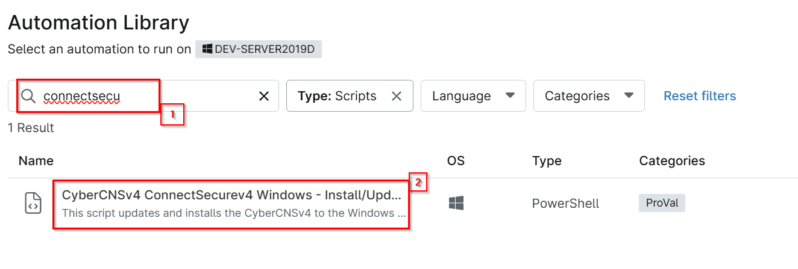
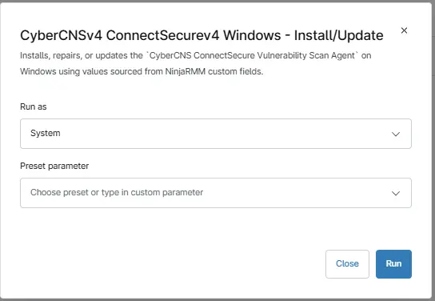
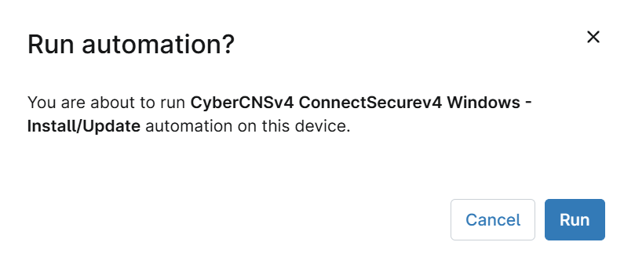

## Overview

Installs, repairs, or reinstalls the CyberCNS ConnectSecure agent on Windows targets using values sourced from NinjaRMM custom fields.

## Sample Run

`Play Button` > `Run Automation` > `Script`  

## Dependencies

[cpval ConnectSecure CompanyID](/docs/c104e227-d5f3-432b-90fa-f31186536181)
[cpval ConnectSecure TenantID](/docs/3d1a16b3-688c-4911-a92d-835a578254a9)
[cpval ConnectSecure Deployment](/docs/9065b847-eadf-4f4a-9021-28ef2fc0f6cf)

## Automation Setup/Import

[Automation Configuration](https://github.com/ProVal-Tech/ninjarmm/blob/main/scripts/install-connectsecure-windows.ps1)

## Output

- Activity Details  
- Custom Field
