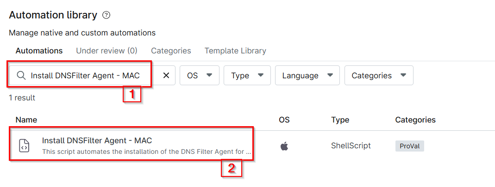
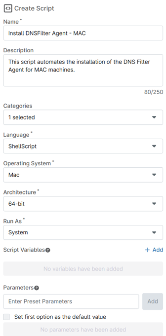
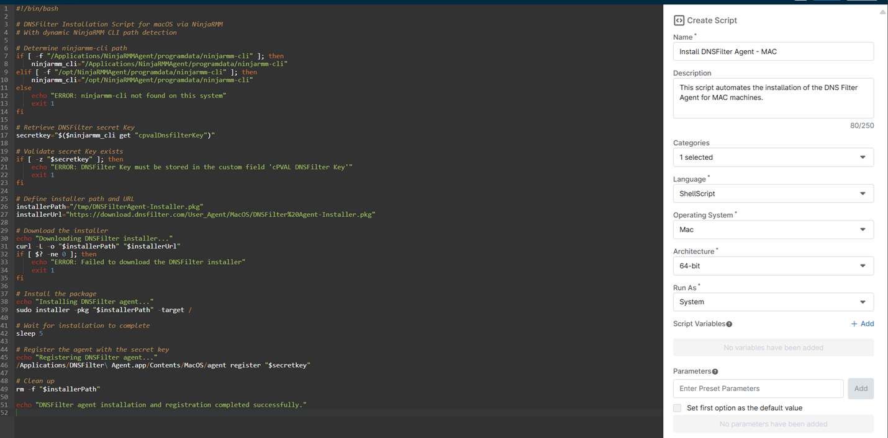

## Overview
DNSFilter Installation Script for macOS via NinjaRMM with dynamic NinjaRMM CLI path detection.

## Sample Run

`Play Button` > `Run Automation` > `Script`  


Search and select `Install DNSFilter Agent - Windows`


Set the required arguments and click the `Run` button to run the script. 

**Run Automation:** `Yes`  


## Dependencies
- [cPVAL DNSFilter Key](</docs/ea940639-c217-4f4d-ac31-b5767417691a>)
  
## Parameters

| Name | Required | Accepted Values | Default | Type | Description |
| ---- | -------- | --------------- | ------- | ---- | ----------- |
| cPVAL DNSFilter Key | True | | | Text | This key is required for deploying the DNSFilter Agent [cPVAL DNSFilter Key](</docs/ea940639-c217-4f4d-ac31-b5767417691a>) |

## Automation Setup/Import

### Step 1

Navigate to `Administration` > `Library` > `Automation`  


### Step 2

Locate the `Add` button on the right-hand side of the screen, click on it and click the `New Script` button.  


The scripting window will open.  


### Step 3

Configure the `Create Script` section as follows:

- **Name:** `Install DNSFilter Agent - MAC`
- **Description:** `This script automates the installation of the DNS Filter Agent for MAC machines.`
- **Categories:** `ProVal`  
- **Language:**  `ShellScript`
- **Operating System:**  `Mac`
- **Architecture:** `64-bit`
- **Run As:** `System`



## Step 4

Paste the following powershell script in the scripting section:  

```bash
#!/bin/bash

# DNSFilter Installation Script for macOS via NinjaRMM
# With dynamic NinjaRMM CLI path detection

# Determine ninjarmm-cli path
if [ -f "/Applications/NinjaRMMAgent/programdata/ninjarmm-cli" ]; then
    ninjarmm_cli="/Applications/NinjaRMMAgent/programdata/ninjarmm-cli"
elif [ -f "/opt/NinjaRMMAgent/programdata/ninjarmm-cli" ]; then
    ninjarmm_cli="/opt/NinjaRMMAgent/programdata/ninjarmm-cli"
else
    echo "ERROR: ninjarmm-cli not found on this system"
    exit 1
fi

# Retrieve DNSFilter secret Key
secretkey="$($ninjarmm_cli get "cpvalDnsfilterKey")"

# Validate secret Key exists
if [ -z "$secretkey" ]; then
    echo "ERROR: DNSFilter Key must be stored in the custom field 'cPVAL DNSFilter Key'"
    exit 1
fi

# Define installer path and URL
installerPath="/tmp/DNSFilterAgent-Installer.pkg"
installerUrl="https://download.dnsfilter.com/User_Agent/MacOS/DNSFilter%20Agent-Installer.pkg"

# Download the installer
echo "Downloading DNSFilter installer..."
curl -L -o "$installerPath" "$installerUrl"
if [ $? -ne 0 ]; then
    echo "ERROR: Failed to download the DNSFilter installer"
    exit 1
fi

# Install the package
echo "Installing DNSFilter agent..."
sudo installer -pkg "$installerPath" -target /

# Wait for installation to complete
sleep 5

# Register the agent with the secret key
echo "Registering DNSFilter agent..."
/Applications/DNSFilter\ Agent.app/Contents/MacOS/agent register "$secretkey"

# Clean up
rm -f "$installerPath"

echo "DNSFilter agent installation and registration completed successfully."
```

## Saving the Automation

Click the Save button in the top-right corner of the screen to save your automation.  


You will be prompted to enter your MFA code. Provide the code and press the Continue button to finalize the process.  


## Completed Automation



## Output

- Activity Details  
- Custom Field