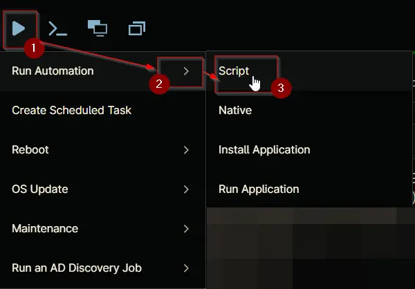

## Overview
Automates the deployment of the DNSFilter Agent via NinjaRMM.
This script performs a secure, automated installation of the DNSFilter Agent using NinjaRMM custom fields for configuration. It ensures a clean environment, retrieves the required DNSFilter Key, downloads the latest agent installer, and executes the installation with appropriate parameters.

## Sample Run

`Play Button` > `Run Automation` > `Script`  


Search and select `Install DNSFilter Agent - Windows`


Set the required arguments and click the `Run` button to run the script. 

**Run Automation:** `Yes`  


## Dependencies
- [cPVAL DNSFilter Key]
  
## Parameters

| Name | Required | Accepted Values | Default | Type | Description |
| ---- | -------- | --------------- | ------- | ---- | ----------- |
| cPVAL DNSFilter Key | True | | | Text | This key is required for deploying the DNSFilter Agent [cPVAL DNSFilter Key] |

## Automation Setup/Import

### Step 1

Navigate to `Administration` > `Library` > `Automation`  


### Step 2

Locate the `Add` button on the right-hand side of the screen, click on it and click the `New Script` button.  


The scripting window will open.  


### Step 3

Configure the `Create Script` section as follows:

- **Name:** `Install DNSFilter Agent - Windows`
- **Description:** `This script automates the installation of the DNS Filter Agent for Windows machines.`
- **Categories:** `ProVal`  
- **Language:**  `PowerShell`
- **Operating System:**  `Windows`
- **Architecture:** `All`
- **Run As:** `System`


## Step 4

Paste the following powershell script in the scripting section:  

```PowerShell
#requires -RunAsAdministrator
#requires -Version 5.1
<#
.SYNOPSIS
Automates the deployment of the DNSFilter Agent via NinjaRMM.

.DESCRIPTION
This script performs a secure, automated installation of the DNSFilter Agent using NinjaRMM custom fields for configuration. It ensures a clean environment, retrieves the required DNSFilter Key, downloads the latest agent installer, and executes the installation with appropriate parameters.

1. **Set Up Environment**:
   - Configures PowerShell preferences for silent progress and confirmation.
   - Sets TLS 1.2 for secure downloads.
   - Defines working directory, download URL, and custom field names.

2. **Prepare Working Directory**:
   - Removes any existing working directory for a clean setup.
   - Creates `C:\ProgramData\_Automation\Script\DNSFilter`.
   - Sets FullControl permissions for the `Everyone` group.

3. **Set Parameters**:
   - Retrieves the DNSFilter Key (`secretKey`) from the NinjaRMM custom field `cPVAL DNSFilter Key`.
   - Throws an error if the key is missing.

4. **Download the DNSFilter Agent Script**:
   - Downloads the DNSFilter installer from the official site.
   - Saves it to the working directory.
   - Throws an error if download fails.

5. **Execute the DNSFilter Installation Script**:
   - Installs the DNSFilter Agent using the retrieved key and MSI installer.

.NOTES
- Requires administrative privileges.
- Ensure the DNSFilter Key is set in the NinjaRMM custom field `cPVAL DNSFilter Key`.
- Outputs logs and errors to the working directory.

.EXAMPLE
# Example: Install the DNSFilter Agent
.\Install-DNSFilter.ps1

.OUTPUT
# .\Install-DNSFilter-log.txt
# .\Install-DNSFilter-error.txt
#>

# Begin block: Initialization and setup
Begin {
    $ErrorActionPreference = 'Stop'
    $WorkingDirectory = 'C:\ProgramData\_Automation\Script\DNSFilter'
    # NinjaRMM custom field names for configuration lookup
    $acctKeyCustomField = 'cpvalDnsfilterKey'
    #endRegion
    $cfAcctKey = Ninja-Property-Get $acctKeyCustomField
    if (-not [string]::IsNullOrEmpty($cfAcctKey)) {
        $secretKey = $cfAcctKey
    }
    else {
        throw 'An error occurred: DNSFilter Key is missing. Please set the DNSFilter Key in the custom field cPVAL DNSFilter Key .'
    }
    ### Region Strapper ###
    $ProgressPreference = 'SilentlyContinue'
    [Net.ServicePointManager]::SecurityProtocol = [Enum]::ToObject([Net.SecurityProtocolType], 3072)
    Get-PackageProvider -Name NuGet -ForceBootstrap | Out-Null
    Set-PSRepository -Name PSGallery -InstallationPolicy Trusted
    try {
        Update-Module -Name Strapper -ErrorAction Stop
    }
    catch {
        Install-Module -Name Strapper -Repository PSGallery -SkipPublisherCheck -Force
        Get-Module -Name Strapper -ListAvailable | Where-Object { $_.Version -ne (Get-InstalledModule -Name Strapper).Version } | ForEach-Object { Uninstall-Module -Name Strapper -MaximumVersion $_.Version }
    }
    (Import-Module -Name 'Strapper') 3>&1 2>&1 1>$null
    Set-StrapperEnvironment

    ### Process ###

    #region Setup - Folder Structure
    if (!(Test-Path $WorkingDirectory)) {
        try {
            New-Item -Path $WorkingDirectory -ItemType Directory -Force | Out-Null
            Write-Log -Text "Created directory: $WorkingDirectory"
        }
        catch {
            Write-Log -Text "An error occurred: Failed to create $WorkingDirectory. Reason: $($_.Exception.Message)" -Level Error
            return
        }
    }

    try {
        $acl = Get-Acl $WorkingDirectory
        if (-not ($acl.Access | Where-Object { $_.IdentityReference -match 'Everyone' -and $_.FileSystemRights -match 'FullControl' })) {
            $accessRule = New-Object System.Security.AccessControl.FileSystemAccessRule('Everyone', 'FullControl', 'ContainerInherit, ObjectInherit', 'None', 'Allow')
            $acl.AddAccessRule($accessRule)
            Set-Acl $WorkingDirectory $acl
            Write-Log -Text "Set FullControl permissions for Everyone on $WorkingDirectory" -Level Information
        }
    }
    catch {
        Write-Log -Text "An error occurred: Failed to set permissions. Reason: $($_.Exception.Message)" -Level Error
        return
    }

    #endregion
}

# Process block: Execute the downloaded script with the specified parameters
Process {
    # Download and extract version
    $url = "https://download.dnsfilter.com/User_Agent/Windows/DNSFilter_Agent_Setup.msi"
    $MSIPath = "$WorkingDirectory\DNSFilter_Agent_Setup.msi"

    try {
        Invoke-WebRequest -Uri $url -OutFile $MSIPath
        Write-Log -Text 'Downloaded DNSFilter Agent MSI' -Level Information
    }
    catch {
        Write-Log -Text "An error occurred: Failed to download MSI. Reason: $($_.Exception.Message)" -Level Error
        return
    }

    try {
        $installer = New-Object -ComObject WindowsInstaller.Installer
        $database = $installer.GetType().InvokeMember("OpenDatabase", "InvokeMethod", $null, $installer, @($tempFile, 0))
        $query = "SELECT `Value` FROM `Property` WHERE `Property` = 'ProductVersion'"
        $view = $database.OpenView($query)
        $view.Execute()
        $record = $view.Fetch()
        $latestVersion = $record.StringData(1)
        Write-Log -Text "Latest DNSFilter Agent version: $latestVersion" -Level Information
    }
    catch {
        Write-Log -Text "An error occurred: Failed to read MSI version. Reason: $($_.Exception.Message)" -Level Error
        return
    }

    # Check existing application and version
    $dnsFilterApp = Get-ChildItem -Path HKLM:\SOFTWARE\Microsoft\Windows\CurrentVersion\Uninstall, HKLM:\SOFTWARE\Wow6432Node\Microsoft\Windows\CurrentVersion\Uninstall | Get-ItemProperty | Where-Object { $_.DisplayName -match 'DNSFilter' } | Select-Object -First 1
    if ($dnsFilterApp) {
        $installedVersion = $dnsFilterApp.DisplayVersion
        Write-Log -Text "Installed DNSFilter Agent version: $installedVersion" -Level Information

        if ($installedVersion -eq $latestVersion) {
            Write-Log -Text 'DNSFilter Agent is up to date.' -Level Information
            Remove-Item -Path $WorkingDirectory -Recurse -Force
            return
        }
    }
    else {
        Write-Log -Text 'DNSFilter Agent not found in uninstall registry keys.' -Level  Warning
    }

    # Execute installation
    try {
        Start-Process -FilePath "msiexec.exe" -ArgumentList "/qn /i `"$tempFile`" NKEY=`"$secretKey`"" -Wait -NoNewWindow
        Write-Log -Text 'DNSFilter Agent installed successfully.' -Level Information
    }
    catch {
        Write-Log -Text "An error occurred: Installation failed. Reason: $($_.Exception.Message)" -Level Error
        return
    }
}
# End block: Final cleanup or additional actions (if needed)
End {}

```

## Saving the Automation

Click the Save button in the top-right corner of the screen to save your automation.  


You will be prompted to enter your MFA code. Provide the code and press the Continue button to finalize the process.  


## Completed Automation


## Output

- Activity Details  
- Custom Field