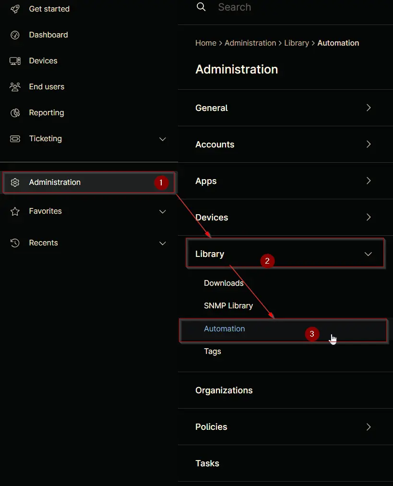
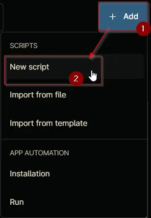
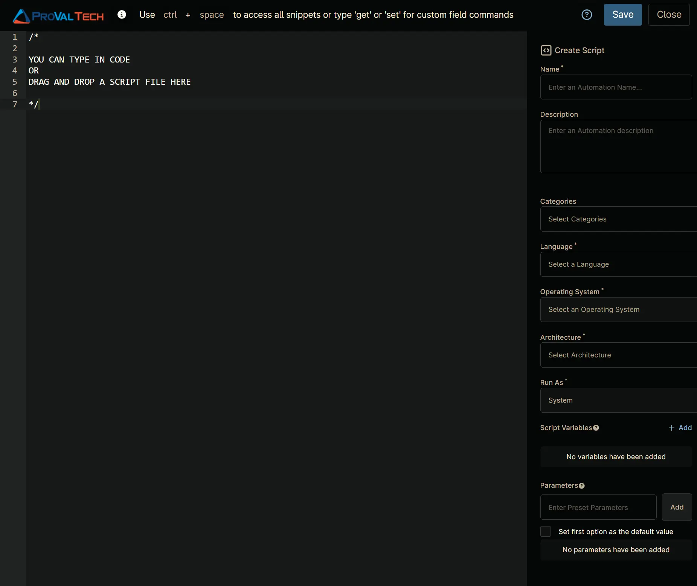
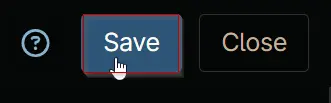
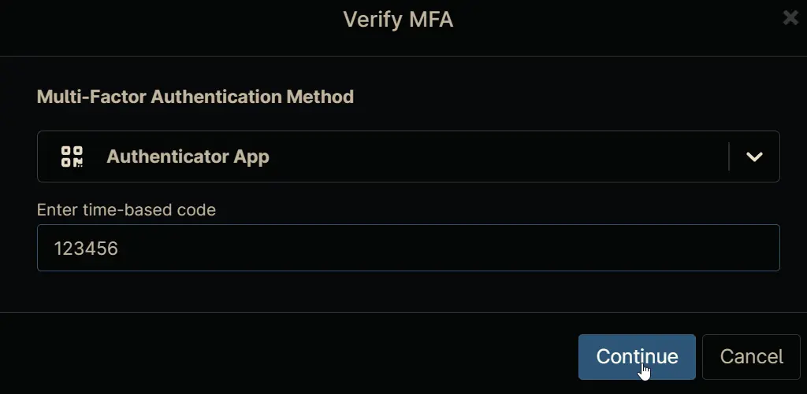

## Overview

Automates the installation of the [Granola](https://www.granola.ai/) AI meeting notes application on Windows devices. The script performs a version check before installing to avoid unnecessary downloads and re-installations:

1. **Version Detection**: Sends a lightweight `HEAD` request to the Granola download endpoint and parses the latest version number from the `Content-Disposition` response header (e.g. `Granola-7.80.0-win-x64.exe`).
2. **Installed Version Check**: Queries the Windows registry for an existing Granola installation and compares its version against the latest available version.
3. **Conditional Install**: Skips installation if the latest version is already present; otherwise downloads the installer and performs a silent installation.
4. **Fallback Version Parse**: If the version cannot be determined from the response header, the script downloads the installer and reads the version directly from the file's embedded metadata.

## Sample Run

`Play Button` > `Run Automation` > `Script`  


Search and select `Install Granola - Windows`

Set the required arguments and click the `Run` button to run the script.

- **Run As:** `System`
- **Preset Parameter:** `<Leave it Blank>`

**Run Automation:** `Yes`  


## Automation Setup/Import

### Step 1

Navigate to `Administration` > `Library` > `Automation`  


### Step 2

Locate the `Add` button on the right-hand side of the screen, click on it and click the `New Script` button.  


The scripting window will open.  


### Step 3

Configure the `Create Script` section as follows:

- **Name:** `Install Granola - Windows`
- **Description:** `Installs or updates the Granola AI meeting notes application on Windows, parsing the latest version from the installer prior to installation to avoid redundant upgrades.`
- **Categories:** `ProVal`
- **Language:** `PowerShell`
- **Operating System:** `Windows`
- **Architecture:** `All`
- **Run As:** `System`

### Step 4

Paste the following PowerShell script in the scripting section:

```PowerShell
#requires -Version 5.1
<#
.SYNOPSIS
    Installs or updates the Granola AI meeting notes application on Windows.

.DESCRIPTION
    This script automates the deployment of Granola on Windows devices. It performs
    the following tasks:

    1. Set Up Environment:
       - Configures PowerShell preferences for silent progress and confirmations.
       - Enforces TLS 1.2 for secure communications.
       - Creates a working directory at C:\ProgramData\_Automation\Script\Install-Granola.

    2. Version Detection:
       - Sends a HEAD request to the Granola download URL and parses the latest
         version from the Content-Disposition header filename
         (e.g. Granola-7.80.0-win-x64.exe).

    3. Installed Version Check:
       - Searches HKLM and HKCU uninstall registry keys for an existing Granola
         installation.
       - Exits without installing if the latest version is already present.

    4. Download and Install:
       - Downloads the installer to the working directory.
       - If the version was not determined from the header, extracts it from the
         downloaded file's embedded version metadata as a fallback.
       - Executes a silent installation.

    5. Verify:
       - Confirms the installation by re-querying the registry.

.NOTES
    - PowerShell 5.1 or later required.
    - Administrative privileges are required for system-wide installation.
    - Granola may install per-user (HKCU) depending on the device configuration.
#>

Begin {
    $ProgressPreference = 'SilentlyContinue'
    $ConfirmPreference = 'None'
    [Net.ServicePointManager]::SecurityProtocol = [Enum]::ToObject([Net.SecurityProtocolType], 3072)

    $url = 'https://api.granola.ai/v1/download-latest-windows'
    $WorkingDirectory = 'C:\ProgramData\_Automation\Script\Install-Granola'

    ### Region Strapper ###
    Get-PackageProvider -Name NuGet -ForceBootstrap | Out-Null
    Set-PSRepository -Name PSGallery -InstallationPolicy Trusted
    try {
        Update-Module -Name Strapper -ErrorAction Stop
    } catch {
        Install-Module -Name Strapper -Repository PSGallery -SkipPublisherCheck -Force
        Get-Module -Name Strapper -ListAvailable |
            Where-Object { $_.Version -ne (Get-InstalledModule -Name Strapper).Version } |
            ForEach-Object { Uninstall-Module -Name Strapper -MaximumVersion $_.Version }
    }
    (Import-Module -Name 'Strapper') 3>&1 2>&1 1>$null
    Set-StrapperEnvironment
    ### EndRegion ###

    # Prepare working directory
    Remove-Item -Path $WorkingDirectory -Recurse -Force -ErrorAction SilentlyContinue
    try {
        New-Item -Path $WorkingDirectory -ItemType Directory -Force -ErrorAction Stop | Out-Null
    } catch {
        Write-Log -Text "Failed to create working directory '$WorkingDirectory'. Reason: $($_.Exception.Message)" -Level Error
        return
    }

    $acl = Get-Acl $WorkingDirectory
    $accessRule = New-Object System.Security.AccessControl.FileSystemAccessRule(
        'Everyone', 'FullControl', 'ContainerInherit, ObjectInherit', 'None', 'Allow'
    )
    $acl.AddAccessRule($accessRule)
    Set-Acl $WorkingDirectory $acl -ErrorAction SilentlyContinue
}

Process {
    $registryPaths = @(
        'HKLM:\SOFTWARE\Microsoft\Windows\CurrentVersion\Uninstall',
        'HKLM:\SOFTWARE\Wow6432Node\Microsoft\Windows\CurrentVersion\Uninstall',
        'HKCU:\SOFTWARE\Microsoft\Windows\CurrentVersion\Uninstall'
    )

    #region Step 1 - Determine the latest available version via HEAD request
    $latestVersion = $null
    try {
        $headResponse = Invoke-WebRequest -Uri $url -Method Head -UseBasicParsing -MaximumRedirection 10 -ErrorAction Stop
        $contentDisposition = $headResponse.Headers['Content-Disposition']
        if ($contentDisposition -match 'Granola-(\d+\.\d+\.\d+)-win-x64\.exe') {
            $latestVersion = $matches[1]
            Write-Log -Text "Latest Granola version (from response header): $latestVersion" -Level Information
        } else {
            Write-Log -Text 'Could not parse version from Content-Disposition header. Will fall back to file metadata after download.' -Level Warning
        }
    } catch {
        Write-Log -Text "HEAD request failed. Will fall back to file metadata after download. Reason: $($_.Exception.Message)" -Level Warning
    }
    #endregion

    #region Step 2 - Check for an existing installation
    $granolaApp = Get-ChildItem -Path $registryPaths -ErrorAction SilentlyContinue |
        Get-ItemProperty -ErrorAction SilentlyContinue |
        Where-Object { $_.DisplayName -match 'Granola' } |
        Select-Object -First 1

    if ($granolaApp) {
        $installedVersion = $granolaApp.DisplayVersion
        Write-Log -Text "Installed Granola version: $installedVersion" -Level Information

        if ($latestVersion -and ($installedVersion -eq $latestVersion)) {
            Write-Log -Text "Granola $installedVersion is already up to date. No installation required." -Level Information
            Remove-Item -Path $WorkingDirectory -Recurse -Force -ErrorAction SilentlyContinue
            return
        }
    } else {
        Write-Log -Text 'Granola is not currently installed.' -Level Information
    }
    #endregion

    #region Step 3 - Download the installer
    $installerPath = "$WorkingDirectory\Granola-Latest.exe"
    try {
        Invoke-WebRequest -Uri $url -OutFile $installerPath -UseBasicParsing -ErrorAction Stop
        Write-Log -Text "Granola installer downloaded to '$installerPath'." -Level Information
    } catch {
        Write-Log -Text "Failed to download Granola installer. Reason: $($_.Exception.Message)" -Level Error
        return
    }

    # Fallback: extract version from the downloaded file's embedded metadata
    if (-not $latestVersion) {
        $fileVersion = (Get-Item $installerPath -ErrorAction SilentlyContinue).VersionInfo.ProductVersion
        if ($fileVersion) {
            $latestVersion = $fileVersion
            Write-Log -Text "Latest Granola version (from installer metadata): $latestVersion" -Level Information

            # Re-check installed version now that we have the latest version
            if ($granolaApp -and ($granolaApp.DisplayVersion -eq $latestVersion)) {
                Write-Log -Text "Granola $latestVersion is already installed and up to date. No installation required." -Level Information
                Remove-Item -Path $WorkingDirectory -Recurse -Force -ErrorAction SilentlyContinue
                return
            }
        } else {
            Write-Log -Text 'Could not determine version from installer metadata. Proceeding with installation.' -Level Warning
        }
    }
    #endregion

    #region Step 4 - Silent installation
    try {
        Start-Process -FilePath $installerPath -ArgumentList '--silent' -Wait -NoNewWindow -ErrorAction Stop
        Write-Log -Text 'Granola installation completed.' -Level Information
    } catch {
        Write-Log -Text "Granola installation failed. Reason: $($_.Exception.Message)" -Level Error
        return
    }
    #endregion

    #region Step 5 - Verify installation
    $verifyApp = Get-ChildItem -Path $registryPaths -ErrorAction SilentlyContinue |
        Get-ItemProperty -ErrorAction SilentlyContinue |
        Where-Object { $_.DisplayName -match 'Granola' } |
        Select-Object -First 1

    if ($verifyApp) {
        Write-Log -Text "Granola $($verifyApp.DisplayVersion) is now installed." -Level Information
    } else {
        Write-Log -Text 'Granola installation could not be verified in the registry. The application may have installed to a user profile or non-standard location.' -Level Warning
    }
    #endregion
}

End {
    Remove-Item -Path $WorkingDirectory -Recurse -Force -ErrorAction SilentlyContinue
}
```

## Saving the Automation

Click the `Save` button in the top-right corner of the screen to save your automation.  


You will be prompted to enter your MFA code. Provide the code and press the `Continue` button to finalize the process.  


## Output

- Activity Details

## Changelog

### 2026-03-19

- Initial version of the document
