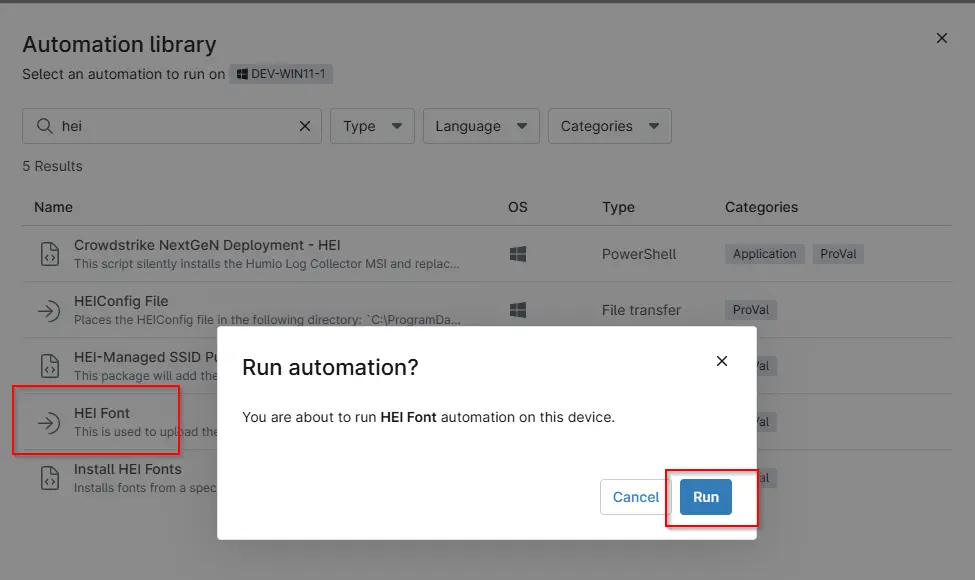
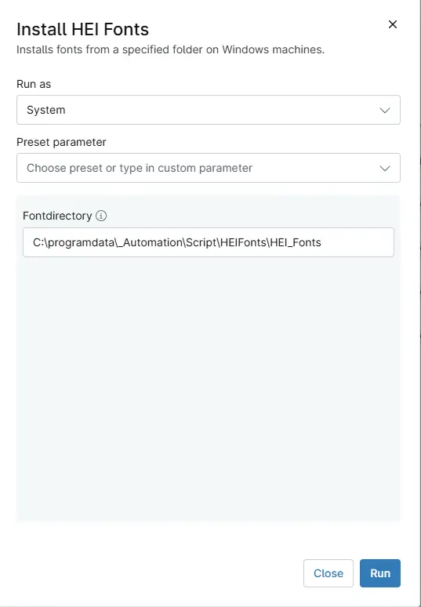

## Overview

This script runs `[Agnostic script - Install-Font](/docs/2520190e-2751-45f1-8d60-501027004938)` from the content repository. The HEI font ZIP file is first transferred to a specified folder on the target machine using the File Transfer option. The path of this folder is then provided to the script as a parameter, and the script uses this path to locate and install the font.

## Sample Run

`Play Button` > `Run Automation` > `Script`  

## Dependencies

- File Transfer - `HEI Font`
- [Agnostic script - Install-Font](/docs/2520190e-2751-45f1-8d60-501027004938)
- [Solution - Install Hei Fonts](/docs/f81e8a64-f17b-4f0f-ba46-be61933e0582)

## Parameters

| Name | Example | Accepted Values | Required | Default | Type | Description |
| ---- | ------- | --------------- | -------- | ------- | ---- | ----------- |
| `Fontdirectory` | -- | -- | True | C:\programdata\_Automation\Script\HEIFonts\HEI_Fonts | `string/text` | Specifies the folder path containing the transferred font files that will be installed by the script. |

## Automation Setup/Import

[Automation Configuration](https://github.com/ProVal-Tech/ninjarmm/blob/main/scripts/install-hei-font.ps1)

## Output

- Activity Details  

## Changelog

### 2026-09-25

- Initial version of the document