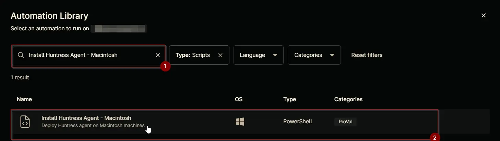
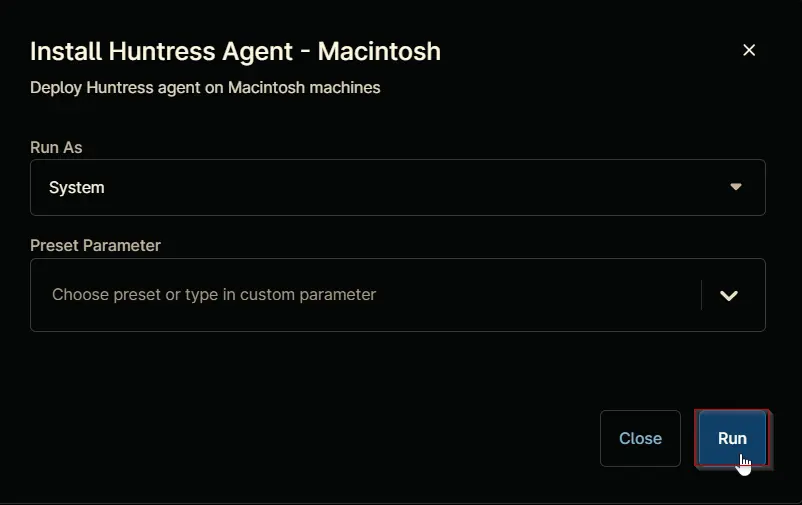
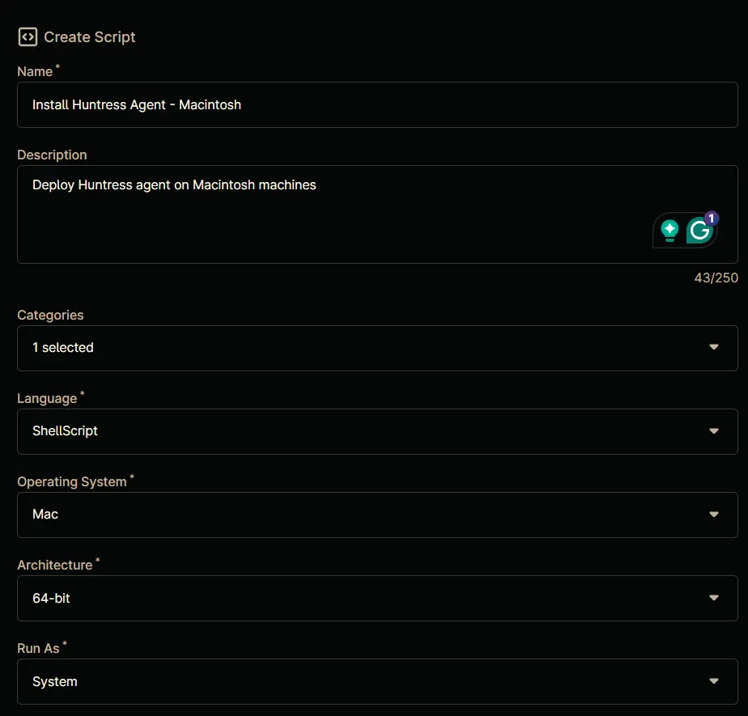
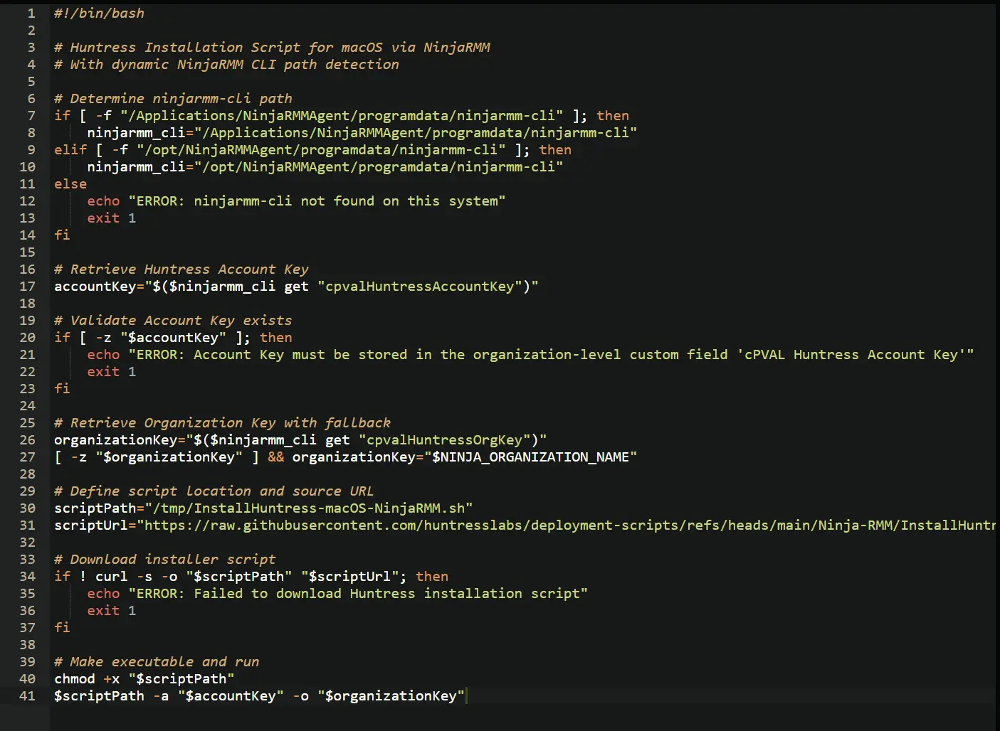
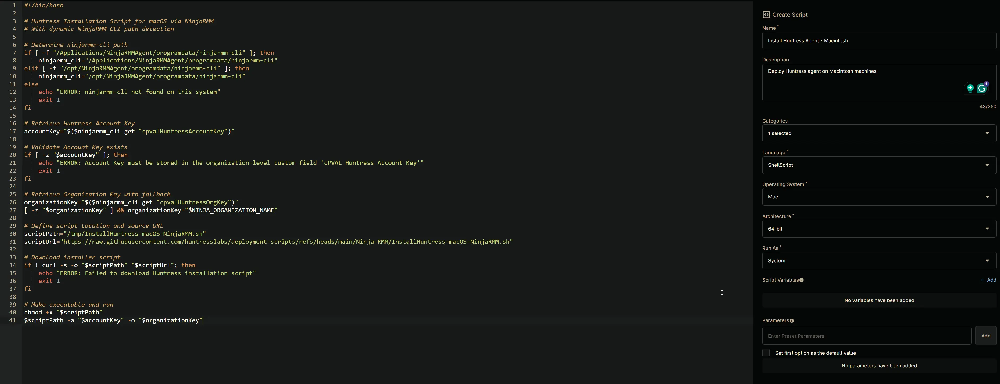

## Overview

Deploy Huntress agent on Macintosh machines

## Sample Run

`Play Button` > `Run Automation` > `Script`  


Search and select `Install Huntress Agent - Macintosh`


Click the `Run` button to run the script.  
**Run As:** `System`  
**Preset Parameter:** `<Leave it Blank>`  


**Run Automation:** `Yes`  


## Dependencies

- [cPVAl Huntress Account Key](/docs/2b62c710-cd01-4c0a-ab26-58f637e3226a)  
- [cPVAl Huntress org Key](/docs/a746555d-f311-449f-ace0-c8a3b67a2ba4)  
- [cPVAl Huntress Tags](/docs/ac9bd64b-0327-4879-931d-128936bc43a6)
- [InstallHuntress-macOS-NinjaRMM.sh](https://raw.githubusercontent.com/huntresslabs/deployment-scripts/main/Powershell/InstallHuntress.powershellv2.ps1)

## Automation Setup/Import

### Step 1

Navigate to `Administration` > `Library` > `Automation`  


### Step 2

Locate the `Add` button on the right-hand side of the screen, click on it and click the `New Script` button.  


The scripting window will open.  


### Step 3

Configure the `Create Script` section as follows:

**Name:** `Install Huntress Agent - Macintosh`  
**Description:** `Deploy Huntress agent on Macintosh machines`  
**Categories:** `ProVal`  
**Language:** `ShellScript`  
**Operating System:** `Mac`  
**Architecture:** `64-bit`  
**Run As:** `System`  


## Step 4

Paste the following Shell script in the scripting section:  

```bash
#!/bin/bash

# Huntress Installation Script for macOS via NinjaRMM
# With dynamic NinjaRMM CLI path detection

# Determine ninjarmm-cli path
if [ -f "/Applications/NinjaRMMAgent/programdata/ninjarmm-cli" ]; then
    ninjarmm_cli="/Applications/NinjaRMMAgent/programdata/ninjarmm-cli"
elif [ -f "/opt/NinjaRMMAgent/programdata/ninjarmm-cli" ]; then
    ninjarmm_cli="/opt/NinjaRMMAgent/programdata/ninjarmm-cli"
else
    echo "ERROR: ninjarmm-cli not found on this system"
    exit 1
fi

# Retrieve Huntress Account Key
accountKey="$($ninjarmm_cli get "cpvalHuntressAccountKey")"

# Validate Account Key exists
if [ -z "$accountKey" ]; then
    echo "ERROR: Account Key must be stored in the organization-level custom field 'cPVAL Huntress Account Key'"
    exit 1
fi

# Retrieve Organization Key with fallback
organizationKey="$($ninjarmm_cli get "cpvalHuntressOrgKey")"
[ -z "$organizationKey" ] && organizationKey="$NINJA_ORGANIZATION_NAME"

# Define script location and source URL
scriptPath="/tmp/InstallHuntress-macOS-NinjaRMM.sh"
scriptUrl="https://raw.githubusercontent.com/huntresslabs/deployment-scripts/refs/heads/main/Ninja-RMM/InstallHuntress-macOS-NinjaRMM.sh"

# Download installer script
if ! curl -s -o "$scriptPath" "$scriptUrl"; then
    echo "ERROR: Failed to download Huntress installation script"
    exit 1
fi

# Make executable and run
chmod +x "$scriptPath"
$scriptPath -a "$accountKey" -o "$organizationKey"
```



## Saving the Automation

Click the `Save` button in the top-right corner of the screen to save your automation.  


You will be prompted to enter your MFA code. Provide the code and press the Continue button to finalize the process.  


## Completed Automation



## Output

- Activity Details