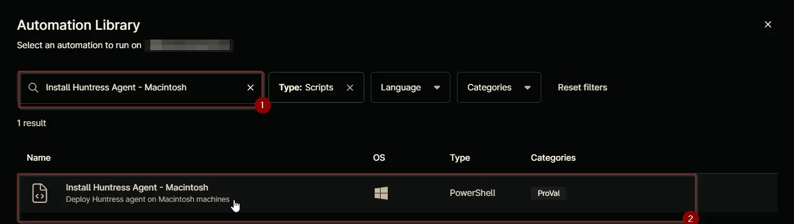
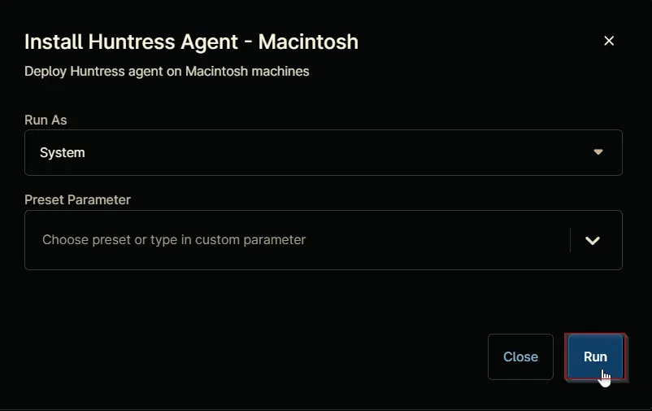

## Overview

Deploy Huntress agent on Macintosh machines

## Sample Run

`Play Button` > `Run Automation` > `Script`  

Search and select `Install Huntress Agent - Macintosh`

Click the `Run` button to run the script.  
**Run As:** `System`  
**Preset Parameter:** `<Leave it Blank>`  

**Run Automation:** `Yes`  

## Dependencies

- [Solution : Huntress Agent Deployment](/docs/e0ad73d2-fcab-43f0-9866-72a48623ef48)
- [cPVAl Huntress Account Key](/docs/2b62c710-cd01-4c0a-ab26-58f637e3226a)  
- [cPVAl Huntress org Key](/docs/a746555d-f311-449f-ace0-c8a3b67a2ba4)  
- [cPVAl Huntress Tags](/docs/ac9bd64b-0327-4879-931d-128936bc43a6)
- [InstallHuntress-macOS-NinjaRMM.sh](https://raw.githubusercontent.com/huntresslabs/deployment-scripts/main/Powershell/InstallHuntress.powershellv2.ps1)

## Automation Setup/Import

[Automation Configuration](https://github.com/ProVal-Tech/ninjarmm/blob/main/scripts/install-huntress-agent-macintosh.ps1)

## Output

- Activity Details

## Changelog

## 2026-05-27

- Updated the documents as per our new template.

### 2025-04-11

- Initial version of the document
