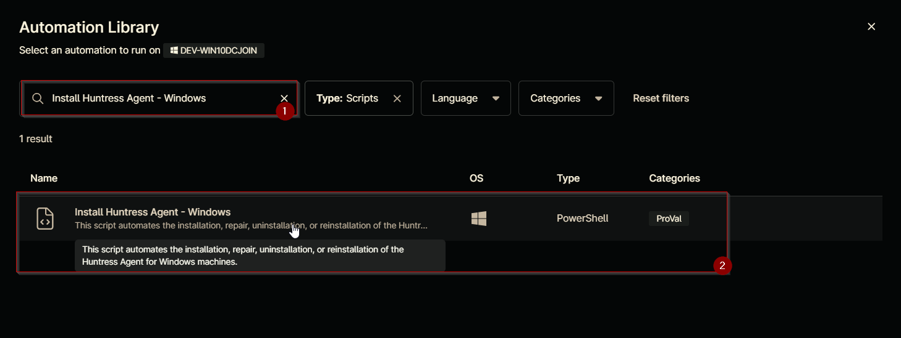
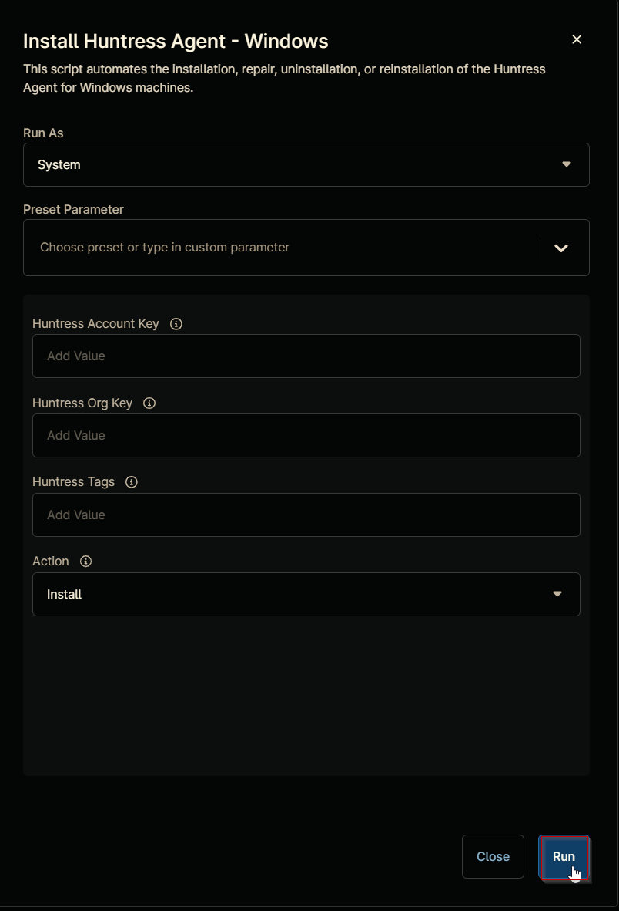
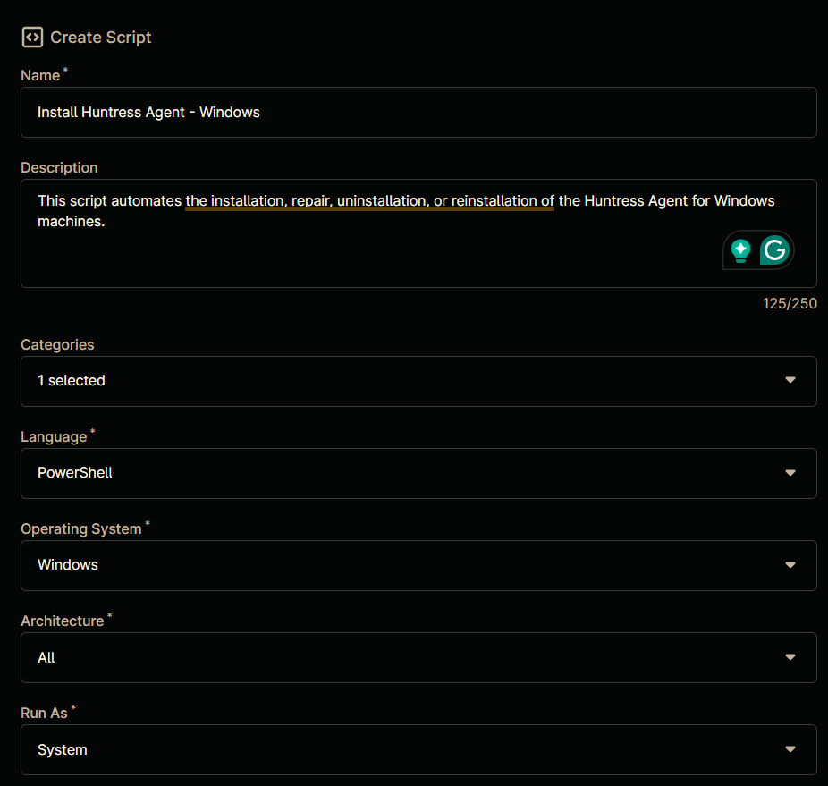
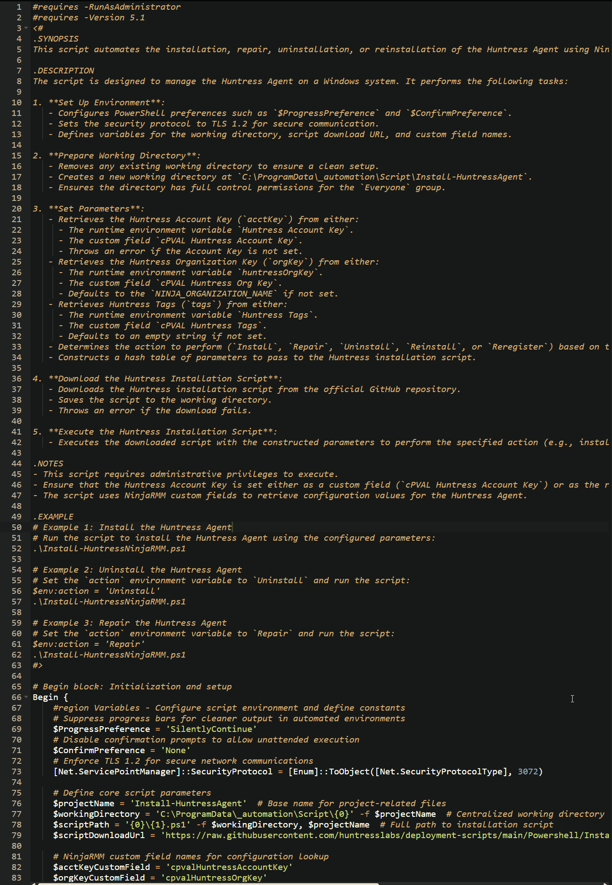
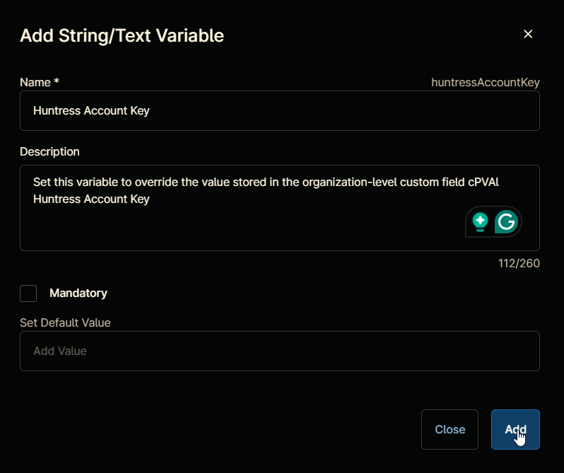
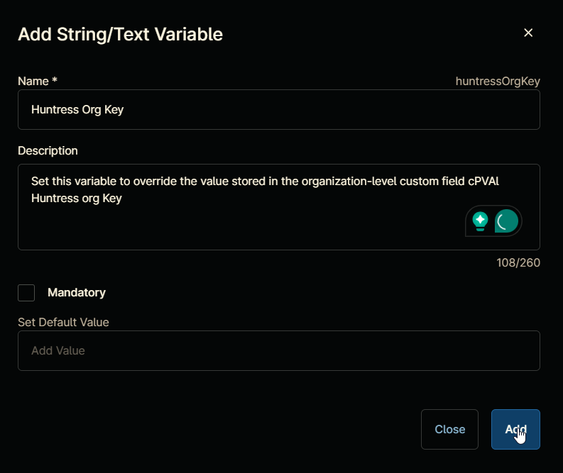
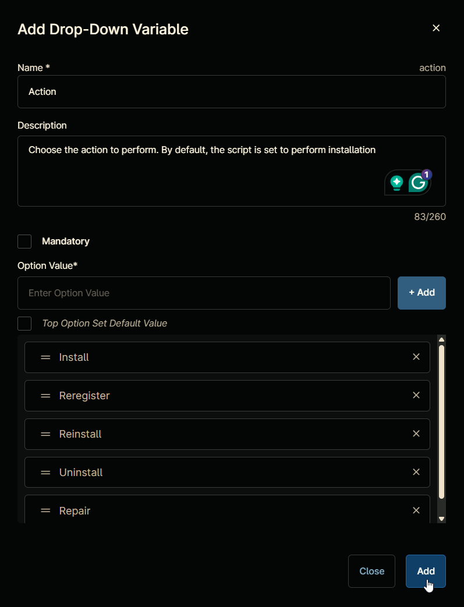
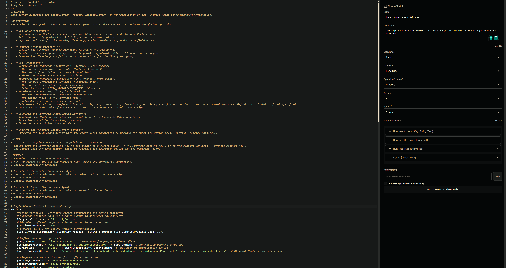

## Overview

This script automates the installation, repair, uninstallation, or reinstallation of the Huntress Agent for Windows machines.

## Sample Run

`Play Button` > `Run Automation` > `Script`  


Search and select `Install Huntress Agent - Windows`


Set the required arguments and click the `Run` button to run the script.  
**Run As:** `System`  
**Preset Parameter:** `<Leave it Blank>`  
**Huntress Account Key:** `Leave it blank or set this variable to override the value stored in the organization-level custom field 'cPVAL Huntress Account Key'`  
**Huntress Org Key:** `Leave it blank or set this variable to override the value stored in the organization-level custom field 'cPVAL Huntress Org Key'`  
**Huntress Tags:**  `Leave it blank or set this variable to override the value stored in the organization-level custom field 'cPVAL Huntress Tags'`  
**Action:** `Install`  


**Run Automation:** `Yes`  


## Dependencies

- [cPVAL Huntress Account Key](/docs/2b62c710-cd01-4c0a-ab26-58f637e3226a)  
- [cPVAL Huntress org Key](/docs/a746555d-f311-449f-ace0-c8a3b67a2ba4)  
- [cPVAL Huntress Tags](/docs/ac9bd64b-0327-4879-931d-128936bc43a6)
- [InstallHuntress.powershellv2.ps1](https://raw.githubusercontent.com/huntresslabs/deployment-scripts/main/Powershell/InstallHuntress.powershellv2.ps1)

## Parameters

| Name | Required | Accepted Values | Default | Type | Description |
| ---- | -------- | --------------- | ------- | ---- | ----------- |
| Huntress Account Key | False | | | String/Text | Set this variable to override the value stored in the organization-level custom field [cPVAL Huntress Account Key](/docs/2b62c710-cd01-4c0a-ab26-58f637e3226a) |
| Huntress Org Key | False | | | String/Text | Set this variable to override the value stored in the organization-level custom field [cPVAL Huntress org Key](/docs/a746555d-f311-449f-ace0-c8a3b67a2ba4) |
| Huntress Tags | False | | | String/Text | Set this variable to override the value stored in the organization-level custom field [cPVAL Huntress Tags](/docs/ac9bd64b-0327-4879-931d-128936bc43a6) |
| Action | False | `Install`, `Reregister`, `Reinstall`, `Uninstall`, `Repair` | `Install` | Drop-Down | Choose the action to perform. By default, the script is set to perform installation |

## Automation Setup/Import

### Step 1

Navigate to `Administration` > `Library` > `Automation`  


### Step 2

Locate the `Add` button on the right-hand side of the screen, click on it and click the `New Script` button.  


The scripting window will open.  


### Step 3

Configure the `Create Script` section as follows:

**Name:** `Install Huntress Agent - Windows`  
**Description:** `This script automates the installation, repair, uninstallation, or reinstallation of the Huntress Agent for Windows machines.`  
**Categories:** `ProVal`  
**Language:** `PowerShell`  
**Operating System:** `Windows`  
**Architecture:** `All`  
**Run As:** `System`  


## Step 4

Paste the following powershell script in the scripting section:  

```PowerShell
#requires -RunAsAdministrator
#requires -Version 5.1
<#
.SYNOPSIS
This script automates the installation, repair, uninstallation, or reinstallation of the Huntress Agent using NinjaRMM integration.

.DESCRIPTION
The script is designed to manage the Huntress Agent on a Windows system. It performs the following tasks:

1. **Set Up Environment**:
   - Configures PowerShell preferences such as `$ProgressPreference` and `$ConfirmPreference`.
   - Sets the security protocol to TLS 1.2 for secure communication.
   - Defines variables for the working directory, script download URL, and custom field names.

2. **Prepare Working Directory**:
   - Removes any existing working directory to ensure a clean setup.
   - Creates a new working directory at `C:\ProgramData\_automation\Script\Install-HuntressAgent`.
   - Ensures the directory has full control permissions for the `Everyone` group.

3. **Set Parameters**:
   - Retrieves the Huntress Account Key (`acctKey`) from either:
     - The runtime environment variable `Huntress Account Key`.
     - The custom field `cPVAL Huntress Account Key`.
     - Throws an error if the Account Key is not set.
   - Retrieves the Huntress Organization Key (`orgKey`) from either:
     - The runtime environment variable `huntressOrgKey`.
     - The custom field `cPVAL Huntress Org Key`.
     - Defaults to the `NINJA_ORGANIZATION_NAME` if not set.
   - Retrieves Huntress Tags (`tags`) from either:
     - The runtime environment variable `Huntress Tags`.
     - The custom field `cPVAL Huntress Tags`.
     - Defaults to an empty string if not set.
   - Determines the action to perform (`Install`, `Repair`, `Uninstall`, `Reinstall`, or `Reregister`) based on the `action` environment variable. Defaults to `Install` if not specified.
   - Constructs a hash table of parameters to pass to the Huntress installation script.

4. **Download the Huntress Installation Script**:
   - Downloads the Huntress installation script from the official GitHub repository.
   - Saves the script to the working directory.
   - Throws an error if the download fails.

5. **Execute the Huntress Installation Script**:
   - Executes the downloaded script with the constructed parameters to perform the specified action (e.g., install, repair, uninstall).

.NOTES
- This script requires administrative privileges to execute.
- Ensure that the Huntress Account Key is set either as a custom field (`cPVAL Huntress Account Key`) or as the runtime variable (`Huntress Account Key`).
- The script uses NinjaRMM custom fields to retrieve configuration values for the Huntress Agent.

.EXAMPLE
# Example 1: Install the Huntress Agent
# Run the script to install the Huntress Agent using the configured parameters:
.\Install-HuntressNinjaRMM.ps1

# Example 2: Uninstall the Huntress Agent
# Set the `action` environment variable to `Uninstall` and run the script:
$env:action = 'Uninstall'
.\Install-HuntressNinjaRMM.ps1

# Example 3: Repair the Huntress Agent
# Set the `action` environment variable to `Repair` and run the script:
$env:action = 'Repair'
.\Install-HuntressNinjaRMM.ps1
#>

# Begin block: Initialization and setup
Begin {
    #region Variables - Configure script environment and define constants
    # Suppress progress bars for cleaner output in automated environments
    $ProgressPreference = 'SilentlyContinue'
    # Disable confirmation prompts to allow unattended execution
    $ConfirmPreference = 'None'
    # Enforce TLS 1.2 for secure network communications
    [Net.ServicePointManager]::SecurityProtocol = [Enum]::ToObject([Net.SecurityProtocolType], 3072)

    # Define core script parameters
    $projectName = 'Install-HuntressAgent'  # Base name for project-related files
    $workingDirectory = 'C:\ProgramData\_automation\Script\{0}' -f $projectName  # Centralized working directory
    $scriptPath = '{0}\{1}.ps1' -f $workingDirectory, $projectName  # Full path to installation script
    $scriptDownloadUrl = 'https://raw.githubusercontent.com/huntresslabs/deployment-scripts/main/Powershell/InstallHuntress.powershellv2.ps1'  # Official Huntress installer source

    # NinjaRMM custom field names for configuration lookup
    $acctKeyCustomField = 'cpvalHuntressAccountKey'
    $orgKeyCustomField = 'cpvalHuntressOrgKey'
    $tagsCustomField = 'cpvalHuntressTags'
    #endRegion

    #region workingDirectory - Prepare clean execution environment
    # Remove existing directory to prevent file conflicts
    Remove-Item -Path $workingDirectory -Recurse -Force -ErrorAction SilentlyContinue

    # Create fresh working directory with error handling
    if (-not (Test-Path $WorkingDirectory)) {
        try {
            New-Item -Path $WorkingDirectory -ItemType Directory -Force -ErrorAction Stop | Out-Null
        } catch {
            throw "Error: Failed to Create $WorkingDirectory. Reason: $($Error[0].Exception.Message)"
        }
    }

    # Ensure full permissions for automated operations
    if (-not ( ( ( Get-Acl $WorkingDirectory ).Access | Where-Object { $_.IdentityReference -Match 'EveryOne' } ).FileSystemRights -Match 'FullControl' )) {
        $Acl = Get-Acl $WorkingDirectory
        $AccessRule = New-Object System.Security.AccessControl.FileSystemAccessRule('Everyone', 'FullControl', 'ContainerInherit, ObjectInherit', 'none', 'Allow')
        $Acl.AddAccessRule($AccessRule)
        Set-Acl  $WorkingDirectory $Acl -ErrorAction SilentlyContinue
    }
    #endRegion

    #region Set Parameters - Configure Huntress deployment parameters
    $parameters = @{}  # Initialize parameter hash for installer

    # Account Key Configuration (Highest Priority: Runtime Variable > Custom Field)
    $cfAcctKey = Ninja-Property-Get $acctKeyCustomField  # Get custom field value
    if (-not [string]::IsNullOrEmpty($env:huntressAccountKey)) {
        $acctKey = $env:huntressAccountKey  # Prefer runtime environment variable
    } elseif (-not [string]::IsNullOrEmpty($cfAcctKey)) {
        $acctKey = $cfAcctKey  # Fallback to NinjaRMM custom field
    } else {
        throw 'Error: Account Key is missing. Please set the Huntress Account Key in the custom field ''cPVAL Huntress Account Key'' or as the runtime variable ''Huntress Account Key''.'
    }

    # Organization Key Configuration (Runtime Variable > Custom Field > Ninja Org Name)
    $cfOrgKey = Ninja-Property-Get $orgKeyCustomField
    if (-not [string]::IsNullOrEmpty($env:huntressOrgKey)) {
        $orgKey = $env:huntressOrgKey
    } elseif (-not [string]::IsNullOrEmpty($cfOrgKey)) {
        $orgKey = $cfOrgKey
    } else {
        $orgKey = $env:NINJA_ORGANIZATION_NAME  # Ultimate fallback to NinjaRMM organization
    }

    # Tag Configuration (Runtime Variable > Custom Field)
    $cfgTags = Ninja-Property-Get $tagsCustomField
    if (-not [string]::IsNullOrEmpty($env:huntressTags)) {
        $tags = $env:huntressTags
    } elseif (-not [string]::IsNullOrEmpty($cfOrgKey)) {  # Note: Possible typo (cfOrgKey vs cfgTags)
        $tags = $cfgTags  # Uses tags custom field if organization key field has value
    } else {
        $tags = ''  # Allow empty tags parameter
    }

    # Action Configuration (Default: Install)
    if (-not [string]::IsNullOrEmpty($env:action)) {
        $action = $env:action  # Accept valid actions: Install/Repair/Uninstall/Reinstall/Reregister
    } else {
        $action = 'Install'  # Default behavior
    }

    # Build parameter hash for installer script
    $parameters.Add('acctKey', $acctKey)  # Mandatory account identifier
    $parameters.Add('orgKey', $orgKey)  # Organization identifier
    if (-not [string]::IsNullOrEmpty($tags)) {
        $parameters.Add('tags', $tags)  # Optional device grouping tags
    }

    # Map action to installer parameters
    switch ($action) {
        'Repair' { $parameters.Add('repair', $true) }  # Trigger repair routine
        'Uninstall' { $parameters.Add('uninstall', $true) }  # Full removal
        'Reinstall' { $parameters.Add('reinstall', $true) }  # Uninstall + fresh install
        'Reregister' { $parameters.Add('reregister', $true) }  # Re-register existing agent
        Default {}  # No extra parameters needed for install
    }
    #endRegion

    #region Download Script - Retrieve latest installer from Huntress
    try {
        Invoke-WebRequest -Uri $scriptDownloadUrl -OutFile $scriptPath -UseBasicParsing -ErrorAction Stop
    } catch {
        throw 'Error: Failed to download driver. Reason: {0}' -f $Error[0].Exception.Message
    }
    #endRegion
}

# Process block: Execute the downloaded script with the specified parameters
Process {
    #region Execute Script - Run installer with configured parameters
    # Splat parameter hash for clean execution
    $Parameters  # Launch Huntress installer script with all parameters
    #endRegion
}

# End block: Final cleanup or additional actions (if needed)
End {}
```



## Script Variables

### Huntress Account Key

Click the `Add` button next to `Script Variables`.  


Select the `String/Text` option.  


The `Add String/Text Variable` window will open.  


In the box, fill in the following details and select `Add` to create the script variable.  

**Name:** `Huntress Account Key`  
**Description:** `Set this variable to override the value stored in the organization-level custom field cPVAL Huntress Account Key`  
**Mandatory:** `<Leave it Unchecked>`  
**Set Default Value:** `<Leave it blank>`



### Huntress Org Key

Click the `Add` button next to `Script Variables`.  


Select the `String/Text` option.  


The `Add String/Text Variable` window will open.  


In the box, fill in the following details and select `Add` to create the script variable.  

**Name:** `Huntress Org Key`  
**Description:** `Set this variable to override the value stored in the organization-level custom field cPVAL Huntress Org Key`  
**Mandatory:** `<Leave it Unchecked>`  
**Set Default Value:** `<Leave it blank>`



### Huntress Tags

Click the `Add` button next to `Script Variables`.  


Select the `String/Text` option.  


The `Add String/Text Variable` window will open.  


In the box, fill in the following details and select `Add` to create the script variable.  

**Name:** `Huntress Tags`  
**Description:** `Set this variable to override the value stored in the organization-level custom field cPVAL Huntress Tags`  
**Mandatory:** `<Leave it Unchecked>`  
**Set Default Value:** `<Leave it blank>`


### Action

Click the `Add` button next to `Script Variables`.  


Select the `Drop-Down` option.  


The `Add Drop-Down Variable` window will open.  


In the box, fill in the following details and select `Add` to create the script variable.

**Name:** `Action`  
**Description:** `Choose the action to perform. By default, the script is set to perform installation`  
**Mandatory:** `<Leave it Unchecked>`  

**Option Value:** Configure the following options in the specified order. To add an option, paste it and click the `Add` button:

- `Install`
- `Reregister`
- `Reinstall`
- `Uninstall`
- `Repair`

**Top Option Set Default Value:** `True`



## Saving the Automation

Click the `Save` button in the top-right corner of the screen to save your automation.  


You will be prompted to enter your MFA code. Provide the code and press the Continue button to finalize the process.  


## Completed Automation



## Output

- Activity Details
