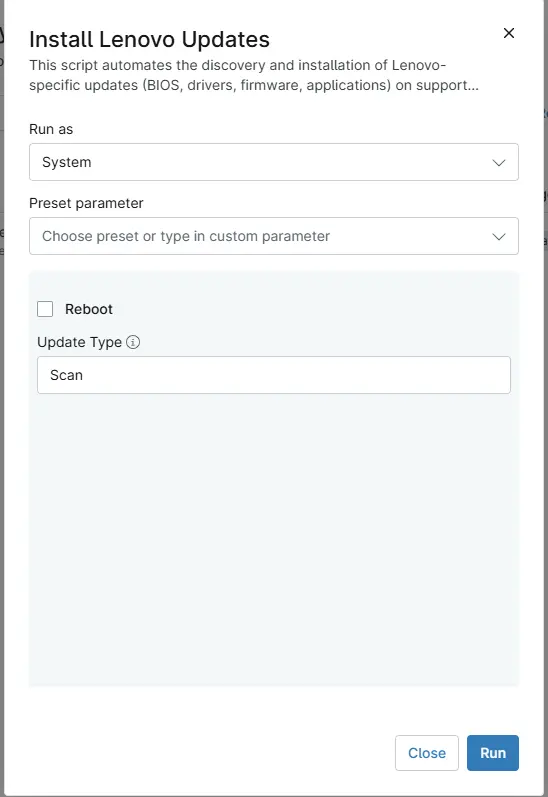

## Overview
This script automates the discovery and installation of Lenovo-specific updates (BIOS, drivers, firmware, applications) on supported workstations. 

## Sample Run

`Play Button` > `Run Automation` > `Script`  

## Dependencies

- [Agnostic - Install-LenovoUpdates](/docs/3640e534-d089-4304-89ba-68d3bc113978/)
## Parameters

| Name | Example | Accepted Values | Required | Default | Type | Description |
|---------|-----|-----|------|-------|-------|----|
| Reboot |  |  | False |  | Checkbox | Select it to reboot the machine after installing the updates. |
| Update Type |  <ul><li>Scan</li><li>All</li><li>Bios,Firmware</li></ul>  | <ul><li>Scan</li><li>All</li><li>Bios</li><li>Firmware</li><li>Driver</li><li>Application</li></ul>  | False | Scan | String | Define the type of update to install on the Lenovo machine. Setting it to `Scan` will scan the updates. `All` will install all the updates. Define multiple updates by separating them with a comma i.e `bios,firmware,application`. |

## Automation Setup/Import

[Automation Configuration](https://github.com/ProVal-Tech/ninjarmm/blob/main/scripts/install-lenovo-updates.ps1)

## Output

- Activity Log

## Changelog

### 2026-04-28

- Initial version of the document
