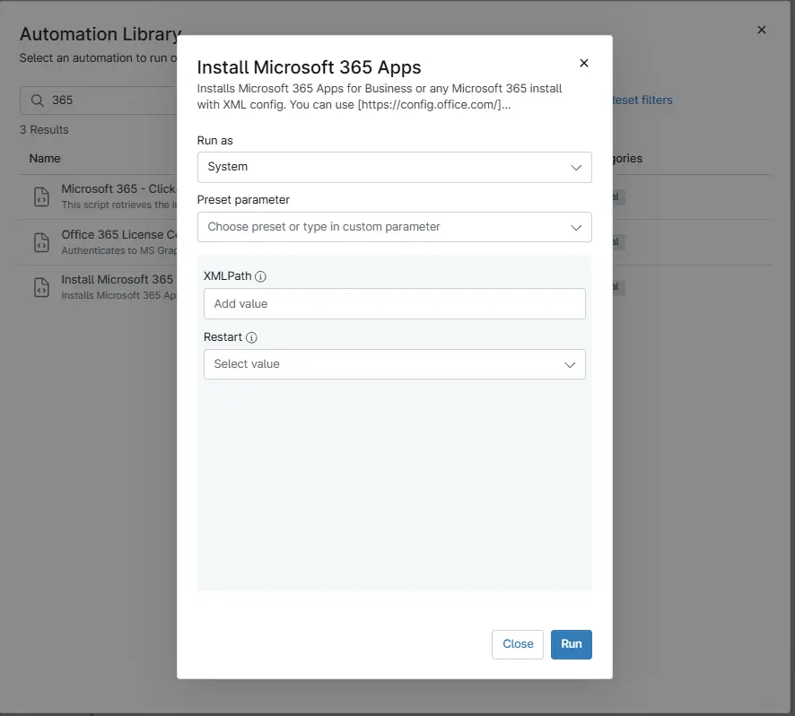

## Overview

This guide explains how to install Microsoft 365 Apps for Business or any Microsoft 365 installation using XML configuration. You can use [https://config.office.com/](https://config.office.com/) to help build the configuration file. If no XML is provided, Microsoft 365 Apps for Business will install with a default configuration. XML settings include: 64-bit, Current Channel, Updates Enabled, Exclude Groove/Skype for Business, English, Silent, AcceptEULA.

## Sample Run

`Play Button` > `Run Automation` > `Script`  

## Dependencies

- [Install-Microsoft365](/docs/b91e0ebd-2946-4030-bc43-a8eda4d885b1)

## User Parameters

| Name | Example | Required | Type | Description |
| ---- | ------- | -------- | ---- | ----------- |
| `XMLPath` | `https://pathtoxml.com` `C:\Temp\FileName.xml` | False | Text String | Installs Microsoft 365 using the specified XML configuration file. Supports both a local file path or a URL. If not provided, a default configuration is used. |
| `Restart` | `0 - 1` | False | Flag | Optional. Performs a system restart after installation. |

## Automation Setup/Import

- [Automation Configuration](https://github.com/ProVal-Tech/ninjarmm/blob/main/scripts/install-microsoft-365-apps.ps1)

## Output

- Activity Details

## Changelog

### 2026-03-06

- Initial version of the document
