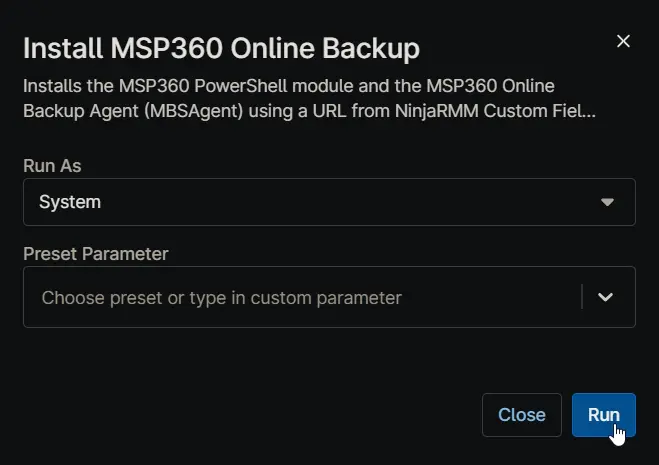

## Overview

Installs the MSP360 PowerShell module and the MSP360 Online Backup Agent (MBSAgent) using a URL from NinjaRMM Custom Field [cPVAL MSP 360 Url](/docs/7e18083b-6a0e-49da-8a08-cfe9c7fa3378).

## Sample Run

## Dependencies

- [cPVAL MSP 360 Url](/docs/7e18083b-6a0e-49da-8a08-cfe9c7fa3378)
- [MSP360 Online Backup Deployment](2f783bba-4022-43d3-8bb4-a768f68fe8c2)

## Custom Fields

| Name | Example | Level | Required | Type | Description |
| ---- | ------- | ----- | -------- | ---- | ----------- |
| [cPVAL MSP 360 Url](/docs/7e18083b-6a0e-49da-8a08-cfe9c7fa3378) | `https://console.msp360.com/api/build/download?urlParams=RXZLSnVUWjd6eVFoT0xYTkl1VGliMitrKzRITFdZRyswQm5BaVpFSzJHYmhFOXZ3NmZ3RXVtSFNnUWdNa1pPL1p6UnRldlMxT3FxdUlRZENSaXJCdjM4TzdwdWxkclRqMHhOQ1BGTFFzeDZYd0hXNXZpcEFPMWM5ZjFCdDc2UFg0a01RSjF5QmJkbGFLcDFzL1NXNVhZT05RYytrRE5TekE3akZEa1RMZ2p6Z0haWnI0L29nR3hFbVNFbkpqczZucnBFY09tL3ZoWkFJL2M1ajZoQ1dEdz09&companyId=edddd66c-9de2-49b6-9577-c57e657806f3` | Organization | Yes | Text | MBS backup agent URL. Copy the link from MBS portal in Downloads section. |

## Automation Setup/Import

[Automation Configuration](https://github.com/ProVal-Tech/ninjarmm/blob/main/scripts/install-msp36-online-backup.ps1)

## Output

- Activity Details  
- Custom Field
