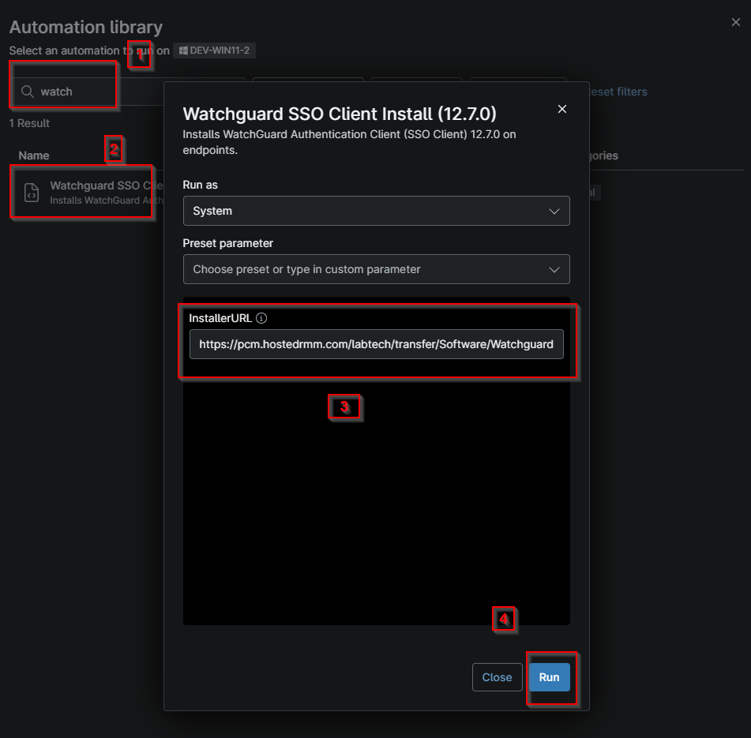
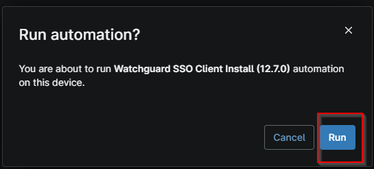

## Overview

Installs WatchGuard Authentication Client (SSO Client) on endpoints.

## Sample Run

- Search for WatchGuard
- Select the actual script "WatchGuard SSO Client Install
- Provide the InstallerURL
- Click Run

- Again click Run

## Dependencies

- [Solution - Install WatchGuard Authentication Client](/docs/27fd43e4-e9f8-4e02-a2ae-1a7b0e2b12f7)

## Parameters

| Name | Example | Accepted Values | Required | Default | Type | Description |
| ---- | ------- | --------------- | -------- | ------- | ---- | ----------- |
| InstallerURL | https://cdn.watchguard.com/SoftwareCenter/Files/SSO_AGENT_CLIENT/12_7/WG-Authentication-Client_12_7.msi | MSI direct downloader link | True | false | Text | Provide the installer URL or set it as the default to be used to download the MSI directly for the installation of the application. |

## Custom Fields

| Field Name | Type | Mandatory | Scope | Description |
| ---------- | ---- | --------- | ----- | ----------- |
| cPVAL Needs WatchGuard SSO | Drop-down | true | `Organization` | This custom field needed to be selected for the installation of the WatchGuard SSO Client on Windows workstations or Windows Server. |

## Automation Setup/Import

[Automation Configuration](https://github.com/ProVal-Tech/ninjarmm/blob/main/scripts/install-watchguard-sso-client.ps1)

## Output

- Activity Details  

## Changelog

### 2026-10-05

- Initial version of the document