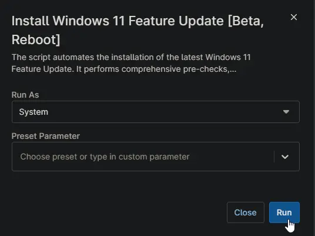

## Overview

The script automates the installation of the latest Windows 11 Feature Update on Windows 11 and Windows 10 machines. It performs comprehensive pre-checks, maintenance, and validation to ensure a smooth upgrade process.

## Cautions

- The machine may restart up to 7 times to complete the upgrade process.
- Be aware of [known issues](https://learn.microsoft.com/en-us/windows/release-health/status-windows-11-24h2) with the feature update 24H2 before using the script.
- Even with the `-NoReboot` parameter, the computer may still restart due to firmware, BIOS, driver updates, or the feature update itself.

## Sample Run

`Play Button` > `Run Automation` > `Script`  


Search and select `Install Huntress Agent - Windows`


Set the required arguments and click the `Run` button to run the script.  
**Run As:** `System`  
**Preset Parameter:** `<Leave it Blank>`  
**NoReboot:** `Prevents automatic reboots, allowing manual control over restarts. Even with the '-NoReboot' parameter, the computer may still restart due to firmware, BIOS, driver updates, or the feature update itself.`  


**Run Automation:** `Yes`  


## Dependencies

[Install-Windows11FeatureUpdate](/docs/837e00a9-4fde-4457-9516-591da7ba4da0)

## Parameters

| Name | Example | Accepted Values | Required | Default | Type | Description |
| ---- | ------- | --------------- | -------- | ------- | ---- | ----------- |
| `NoReboot` | | | `False` | `False` | `CheckBox`  | `Prevents automatic reboots, allowing manual control over restarts.` |

## Automation Setup/Import

### Step 1

Navigate to `Administration` > `Library` > `Automation`  


### Step 2

Locate the `Add` button on the right-hand side of the screen, click on it and click the `New Script` button.  


The scripting window will open.  


### Step 3

Configure the `Create Script` section as follows:

**Name:** `Install Windows 11 Feature Update [Beta, Reboot]`  
**Description:** `The script automates the installation of the latest Windows 11 Feature Update. It performs comprehensive pre-checks, maintenance, and validation to ensure a smooth upgrade process. The script can restart the computer up to seven times.`  
**Categories:** `ProVal`  
**Language:** `PowerShell`  
**Operating System:** `Windows`  
**Architecture:** `All`  
**Run As:** `System`  


## Step 4

Paste the following powershell script in the scripting section:  

```PowerShell
Begin {
    #region Parameters
    if ( $env:noreboot -match '1|Yes|True') {
        $Parameters = @{
            NoReboot = $true
        }
    }
    #endregion
}
Process {
    #region OS verification
    if ((Get-CimInstance -ClassName Win32_OperatingSystem).Caption -notmatch 'Windows 1[01]') {
        throw 'Unsupported Operating System'
    }
    #endRegion
    #region Setup - Variables
    $ProjectName = 'Install-Windows11FeatureUpdate'
    [Net.ServicePointManager]::SecurityProtocol = [enum]::ToObject([Net.SecurityProtocolType], 3072)
    Set-ExecutionPolicy -ExecutionPolicy Bypass -Scope Process -Force -Confirm:$false -ErrorAction SilentlyContinue -WarningAction SilentlyContinue
    $BaseURL = 'https://file.provaltech.com/repo'
    $PS1URL = "$BaseURL/script/$ProjectName.ps1"
    $WorkingDirectory = "C:\ProgramData\_automation\script\$ProjectName"
    $PS1Path = "$WorkingDirectory\$ProjectName.ps1"
    $WorkingPath = $WorkingDirectory
    $LogPath = "$WorkingDirectory\$ProjectName-log.txt"
    $ErrorLogPath = "$WorkingDirectory\$ProjectName-Error.txt"
    #endregion
    #region Setup - Folder Structure
    Remove-Item -Path $WorkingDirectory -Force -Confirm:$false -ErrorAction SilentlyContinue
    New-Item -Path $WorkingDirectory -ItemType Directory -ErrorAction SilentlyContinue | Out-Null
    $response = Invoke-WebRequest -Uri $PS1URL -UseBasicParsing
    if (($response.StatusCode -ne 200) -and (!(Test-Path -Path $PS1Path))) {
        throw "No pre-downloaded script exists and the script '$PS1URL' failed to download. Exiting."
    } elseif ($response.StatusCode -eq 200) {
        Remove-Item -Path $PS1Path -ErrorAction SilentlyContinue
        [System.IO.File]::WriteAllLines($PS1Path, $response.Content)
    }
    if (!(Test-Path -Path $PS1Path)) {
        throw 'An error occurred and the script was unable to be downloaded. Exiting.'
    }
    #endregion
    #region Execution
    if ($Parameters) {
        & $PS1Path @Parameters
    } else {
        & $PS1Path
    }
    #endregion
     #region log verification
    if ( !(Test-Path -Path $LogPath) ) {
        throw 'PowerShell Failure. A Security application seems to have restricted the execution of the PowerShell Script.'
    }
    if ( Test-Path $ErrorLogPath ) {
        $ErrorContent = ( Get-Content -Path $ErrorLogPath )
        throw $ErrorContent
    }
    Get-Content -Path $LogPath
    #endregion
}
End {}
```


## Script Variables

### NoReboot

Click the `Add` button next to `Script Variables`.  


Select the `CheckBox` option.  


The `Add String/Text Variable` window will open.  


In the box, fill in the following details and select `Add` to create the script variable.  

**Name:** `NoReboot`  
**Description:** `Prevents automatic reboots, allowing manual control over restarts.Even with the 'NoReboot' parameter, the computer may still restart due to firmware, BIOS, driver updates, or the feature update itself.`  
**Mandatory:** `<Leave it Unchecked>`  
**Set Default Value:** `<Leave it blank>`


## Saving the Automation

Click the Save button in the top-right corner of the screen to save your automation.  


You will be prompted to enter your MFA code. Provide the code and press the Continue button to finalize the process.  


## Completed Automation


## Output

- Activity Details
