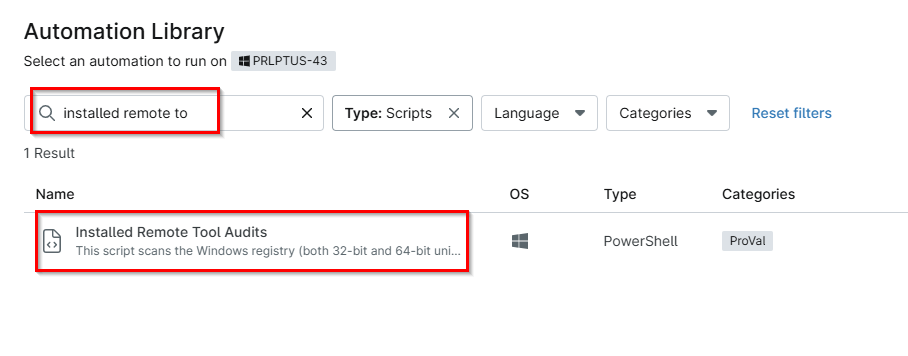
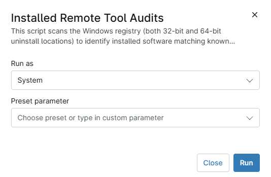

## Overview

This script scans the Windows registry (both 32-bit and 64-bit uninstall locations) to identify installed software matching known Remote Monitoring & Management (RMM), remote access, and support tool signatures.

Tool display names supported by this script:

1. `AeroAdmin`
2. `Ammyy Admin`  
3. `AnyDesk`  
4. `Atera`  
5. `BeyondTrust`  
6. `Chrome Remote Desktop`  
7. `ConnectWise Automate`  
8. `Datto RMM`  
9. `DameWare`  
10. `DWService`  
11. `GoToAssist`  
12. `GoToMyPC`  
13. `ITSPlatform`  
14. `Kaseya`  
15. `LiteManager`  
16. `LogMeIn`  
17. `Malwarebytes`  
18. `ManageEngine`  
19. `N-able N-Central`  
20. `N-able N-Sight`  
21. `NoMachine`  
22. `Parsec`  
23. `RealVNC (VNC Connect)`  
24. `RemotePC`  
25. `Remote Utilities`  
26. `RustDesk`  
27. `ScreenConnect`  
28. `Splashtop`  
29. `Supremo`  
30. `Syncro`  
31. `TeamViewer`  
32. `VNC`  
33. `VSA`  
34. `Zoho Assist`  

## Sample Run

`Play Button` > `Run Automation` > `Script`  

- Search for the `Installed Remote Tools Audit` and then click on it

- Click Run

## Dependencies

- [Custom field - cPVAL RMM Audits](/docs/62487ab1-8f55-426d-8127-f0ba0fcf4f66)

## Automation Setup/Import

[Automation Configuration](https://github.com/ProVal-Tech/ninjarmm/blob/main/scripts/installed-remote-tools-audit.ps1)

## Output

- Activity Details  
- Custom Field

## Changelog

### 2026-05-21

- Initial version of the document