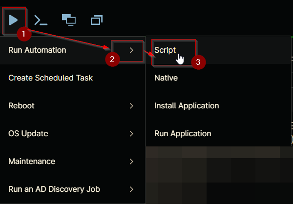
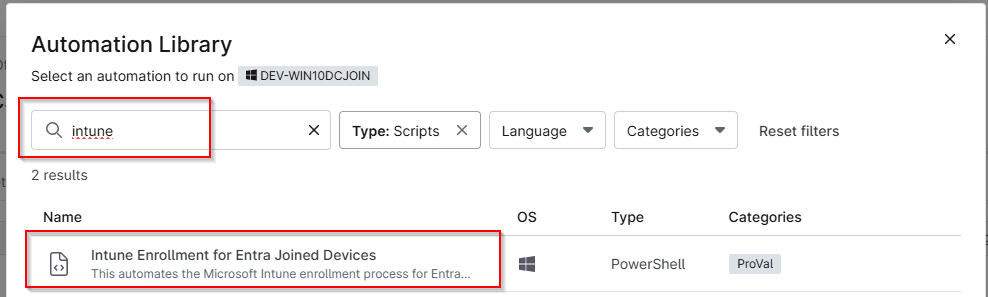
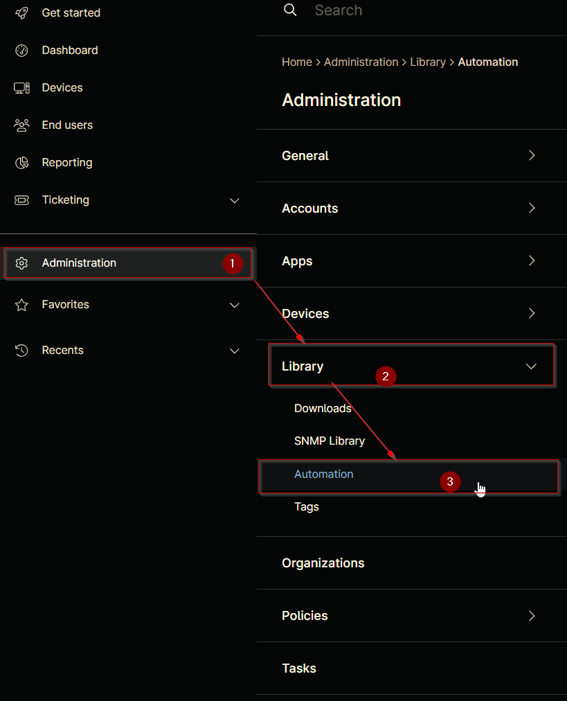
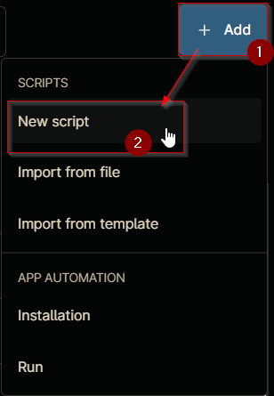
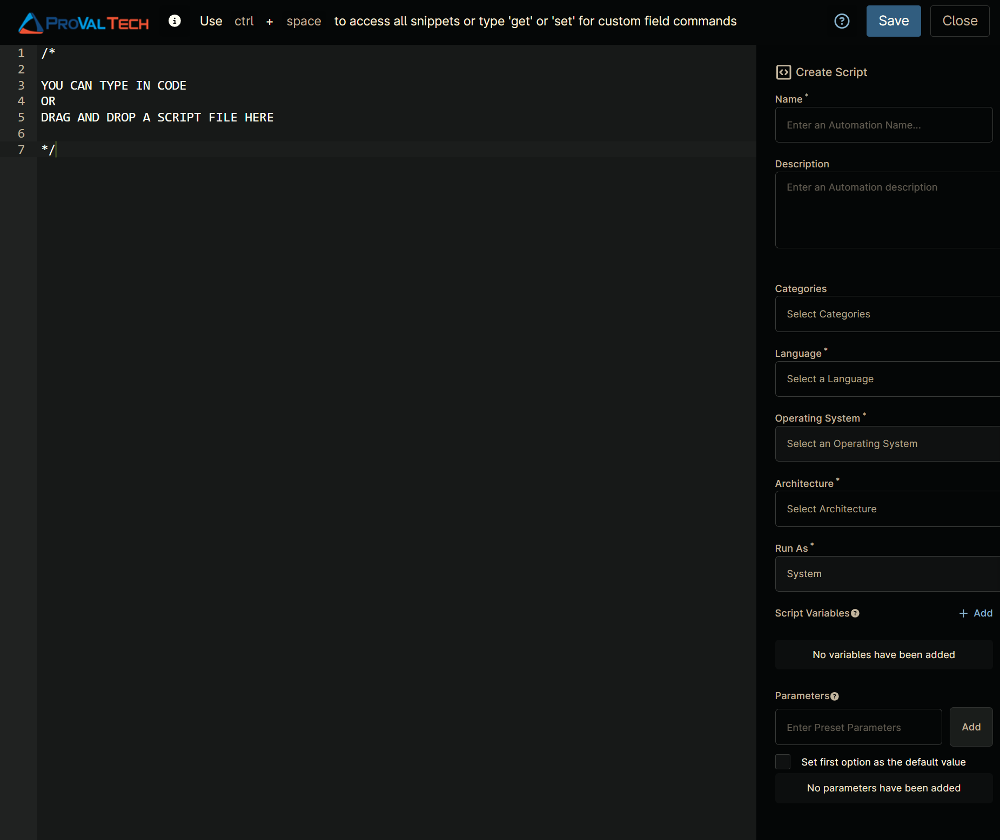
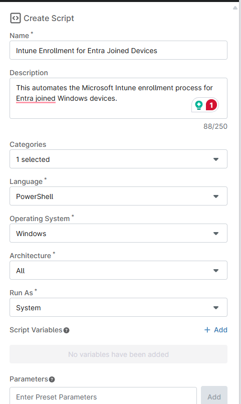
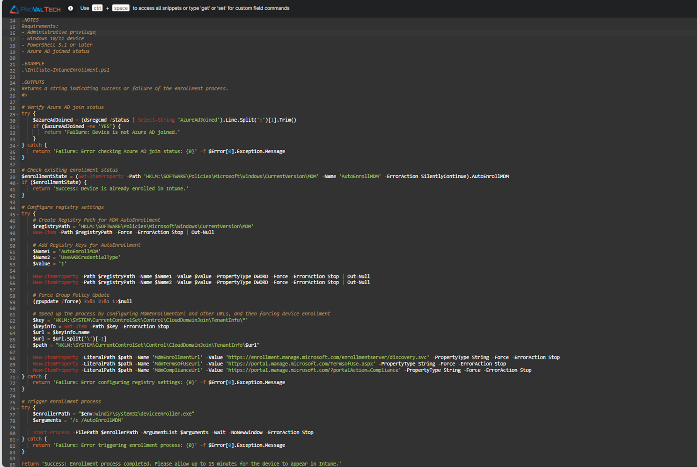
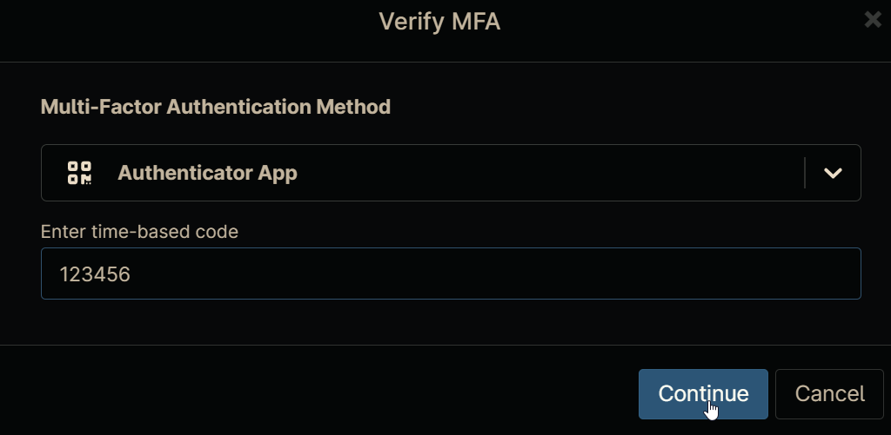
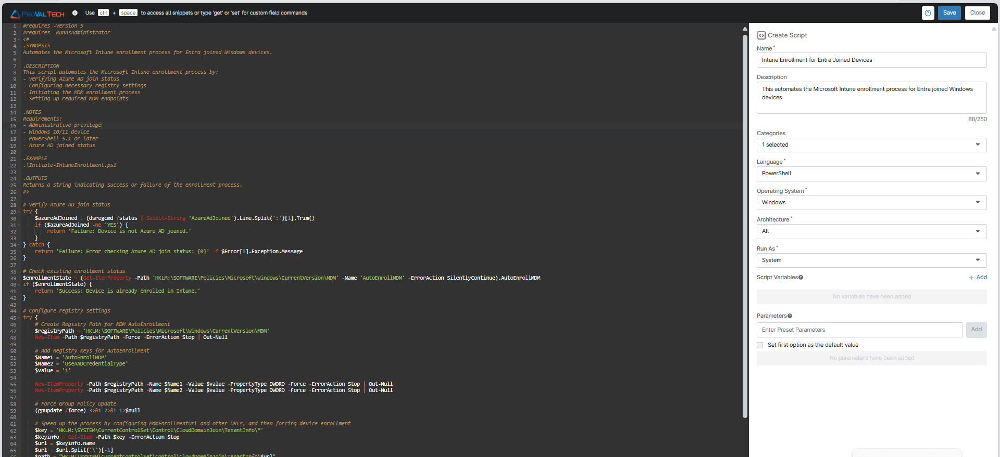

## Overview

The script automates the Microsoft Intune enrollment process for Entra joined Windows devices.

**Note:** The end machine may require a restart to complete the enrollment process.

## Sample Run

`Play Button` > `Run Automation` > `Script`  
  


## Requirements

- Windows 10/11 device
- PowerShell 5.1 or later
- Azure AD joined status

## Automation Setup/Import

### Step 1

Navigate to `Administration` > `Library` > `Automation`  


### Step 2

Locate the `Add` button on the right-hand side of the screen, click on it and click the `New Script` button.  


The scripting window will open.  


**Name:** `Intune Enrollment for Entra Joined Devices`  
**Description:** `This automates the Microsoft Intune enrollment process for Entra joined Windows devices.`  
**Categories:** `ProVal`  
**Language:** `PowerShell`  
**Operating System:** `Windows`  
**Architecture:** `All`  
**Run As:** `System`  



Paste in the following PowerShell script into the Ninja One editor

```powershell
#requires -Version 5
#requires -RunAsAdministrator
<#
.SYNOPSIS
Automates the Microsoft Intune enrollment process for Entra joined Windows devices.

.DESCRIPTION
This script automates the Microsoft Intune enrollment process by:
- Verifying Azure AD join status
- Configuring necessary registry settings
- Initiating the MDM enrollment process
- Setting up required MDM endpoints

.NOTES
Requirements:
- Administrative privileges
- Windows 10/11 device
- PowerShell 5.1 or later
- Azure AD joined status

.EXAMPLE
.\Initiate-IntuneEnrollment.ps1

.OUTPUTS
Returns a string indicating success or failure of the enrollment process.
#>

# Verify Azure AD join status
try {
    $azureAdJoined = (dsregcmd /status | Select-String 'AzureAdJoined').Line.Split(':')[1].Trim()
    if ($azureAdJoined -ne 'YES') {
        return 'Failure: Device is not Azure AD joined.'
    }
} catch {
    return 'Failure: Error checking Azure AD join status: {0}' -f $Error[0].Exception.Message
}

# Check existing enrollment status
$enrollmentState = (Get-ItemProperty -Path 'HKLM:\SOFTWARE\Policies\Microsoft\Windows\CurrentVersion\MDM' -Name 'AutoEnrollMDM' -ErrorAction SilentlyContinue).AutoEnrollMDM
if ($enrollmentState) {
    return 'Success: Device is already enrolled in Intune.'
}

# Configure registry settings
try {
    # Create Registry Path for MDM AutoEnrollment
    $registryPath = 'HKLM:\SOFTWARE\Policies\Microsoft\Windows\CurrentVersion\MDM'
    New-Item -Path $registryPath -Force -ErrorAction Stop | Out-Null

    # Add Registry Keys for AutoEnrollment
    $Name1 = 'AutoEnrollMDM'
    $Name2 = 'UseAADCredentialType'
    $value = '1'

    New-ItemProperty -Path $registryPath -Name $Name1 -Value $value -PropertyType DWORD -Force -ErrorAction Stop | Out-Null
    New-ItemProperty -Path $registryPath -Name $Name2 -Value $value -PropertyType DWORD -Force -ErrorAction Stop | Out-Null

    # Force Group Policy Update
    (gpupdate /force) 3>&1 2>&1 1>$null

    # Speed up the process by configuring MdmEnrollmentUrl and other URLs, and then forcing device enrollment
    $key = 'HKLM:\SYSTEM\CurrentControlSet\Control\CloudDomainJoin\TenantInfo\*'
    $keyinfo = Get-Item -Path $key -ErrorAction Stop
    $url = $keyinfo.name
    $url = $url.Split('\')[-1]
    $path = "HKLM:\SYSTEM\CurrentControlSet\Control\CloudDomainJoin\TenantInfo\$url"

    New-ItemProperty -LiteralPath $path -Name 'MdmEnrollmentUrl' -Value 'https://enrollment.manage.microsoft.com/enrollmentserver/discovery.svc' -PropertyType String -Force -ErrorAction Stop
    New-ItemProperty -LiteralPath $path -Name 'MdmTermsOfUseUrl' -Value 'https://portal.manage.microsoft.com/TermsofUse.aspx' -PropertyType String -Force -ErrorAction Stop
    New-ItemProperty -LiteralPath $path -Name 'MdmComplianceUrl' -Value 'https://portal.manage.microsoft.com/?portalAction=Compliance' -PropertyType String -Force -ErrorAction Stop
} catch {
    return 'Failure: Error configuring registry settings: {0}' -f $Error[0].Exception.Message
}
# Trigger enrollment process
try {
    $enrollerPath = "$env:windir\system32\deviceenroller.exe"
    $arguments = '/c /AutoEnrollMDM'

    Start-Process -FilePath $enrollerPath -ArgumentList $arguments -Wait -NoNewWindow -ErrorAction Stop
} catch {
    return 'Failure: Error triggering enrollment process: {0}' -f $Error[0].Exception.Message
}

return 'Success: Enrollment process completed. Please allow up to 15 minutes for the device to appear in Intune.'
```



## Saving the Automation

Click the Save button in the top-right corner of the screen to save your automation.  


You will be prompted to enter your MFA code. Provide the code and press the Continue button to finalize the process.  


## Completed Automation



## Output

- Activity Details
