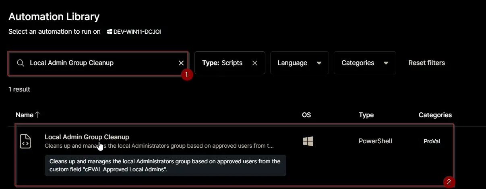
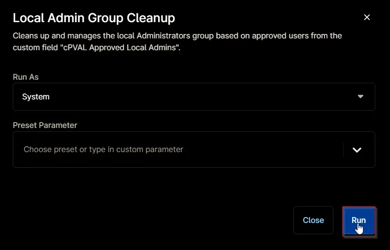
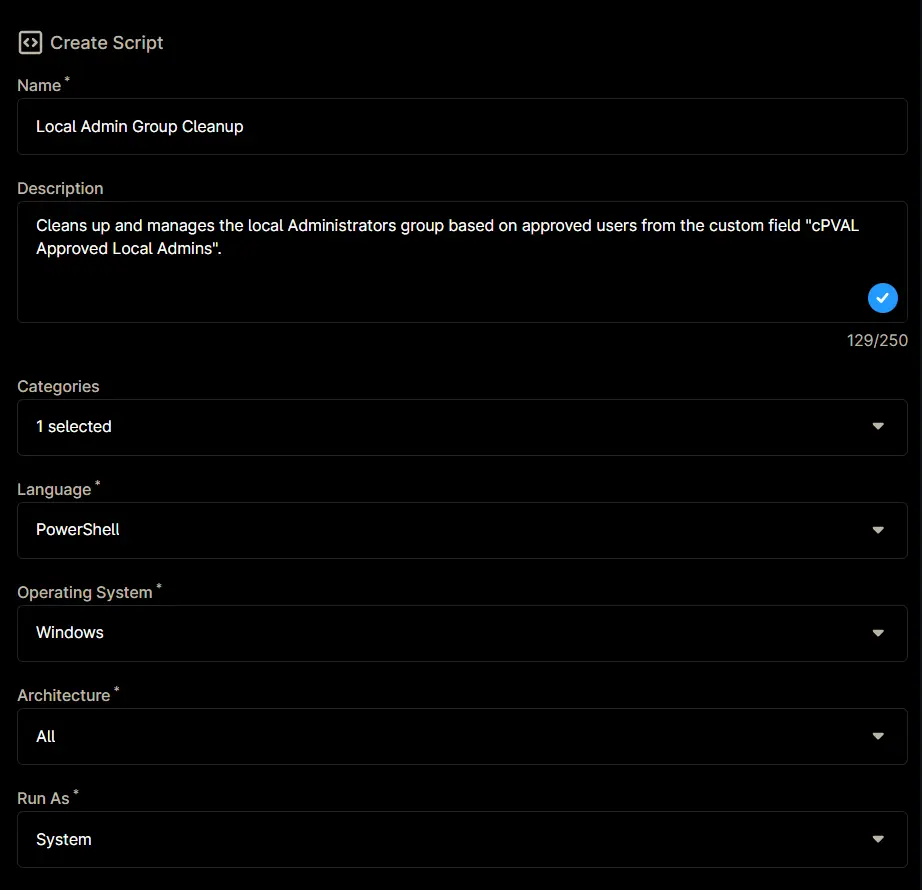
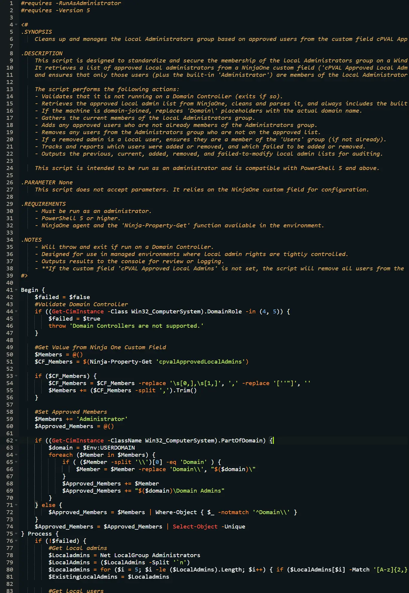
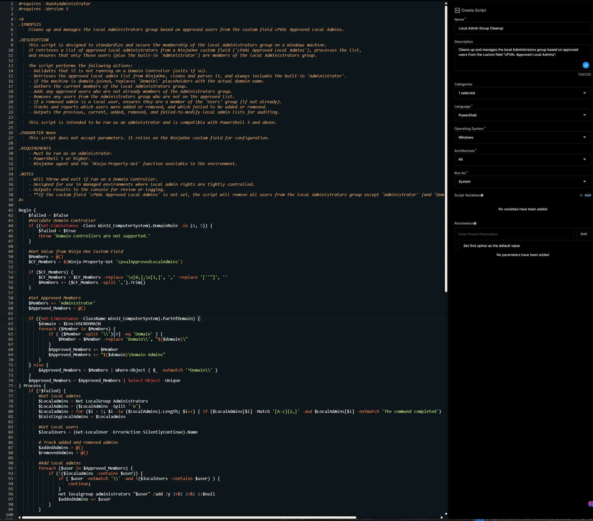

## Overview

Cleans up and manages the local Administrators group based on approved users from the custom field [cPVAL Approved Local Admins](/docs/ead6d2e4-c4a2-442e-8471-09c4e6b78bd4). If the custom field is not set, the script will remove all users from the local Administrators group except 'Administrator' (and 'Domain Admins' for domain-joined machines).

## Sample Run

`Play Button` > `Run Automation` > `Script`  


Search and select `Local Admin Group Cleanup`


Set the required arguments and click the `Run` button to run the script.  
- **Run As:** `System`  
- **Preset Parameter:** `<Leave it Blank>`  


**Run Automation:** `Yes`  


## Dependencies

- [cPVAL Approved Local Admins](/docs/ead6d2e4-c4a2-442e-8471-09c4e6b78bd4)
- [Solution - Local Admin Group Cleanup](/docs/70aec704-a188-45fe-b059-52f1cf39d468)

## Automation Setup/Import

### Step 1

Navigate to `Administration` > `Library` > `Automation`  


### Step 2

Locate the `Add` button on the right-hand side of the screen, click on it and click the `New Script` button.  


The scripting window will open.  


### Step 3

Configure the `Create Script` section as follows:

- **Name:** `Local Admin Group Cleanup`  
- **Description:** `Cleans up and manages the local Administrators group based on approved users from the custom field "cPVAL Approved Local Admins".`  
- **Categories:** `ProVal`  
- **Language:** `PowerShell`  
- **Operating System:** `Windows`  
- **Architecture:** `All`  
- **Run As:** `System`  


## Step 4

Paste the following powershell script in the scripting section:  

```PowerShell
#requires -RunAsAdministrator
#requires -Version 5

<#
.SYNOPSIS
    Cleans up and manages the local Administrators group based on approved users from the custom field cPVAL Approved Local Admins.

.DESCRIPTION
    This script is designed to standardize and secure the membership of the local Administrators group on a Windows machine.
    It retrieves a list of approved local administrators from a NinjaOne custom field ('cPVAL Approved Local Admins'), processes the list,
    and ensures that only those users (plus the built-in 'Administrator') are members of the local Administrators group.

    The script performs the following actions:
    - Validates that it is not running on a Domain Controller (exits if so).
    - Retrieves the approved local admin list from NinjaOne, cleans and parses it, and always includes the built-in 'Administrator'.
    - If the machine is domain-joined, replaces 'Domain\' placeholders with the actual domain name.
    - Gathers the current members of the local Administrators group.
    - Adds any approved users who are not already members of the Administrators group.
    - Removes any users from the Administrators group who are not on the approved list.
    - If a removed admin is a local user, ensures they are a member of the 'Users' group (if not already).
    - Tracks and reports which users were added or removed, and which failed to be added or removed.
    - Outputs the previous, current, added, removed, and failed-to-modify local admin lists for auditing.

    This script is intended to be run as an administrator and is compatible with PowerShell 5 and above.

.PARAMETER None
    This script does not accept parameters. It relies on the NinjaOne custom field for configuration.

.REQUIREMENTS
    - Must be run as an administrator.
    - PowerShell 5 or higher.
    - NinjaOne agent and the 'Ninja-Property-Get' function available in the environment.

.NOTES
    - Will throw and exit if run on a Domain Controller.
    - Designed for use in managed environments where local admin rights are tightly controlled.
    - Outputs results to the console for review or logging.
    - **If the custom field 'cPVAL Approved Local Admins' is not set, the script will remove all users from the local Administrators group except 'Administrator' (and 'Domain Admins' for domain-joined machines).**
#>

Begin {
    $failed = $false
    #Validate Domain Controller
    if ((Get-CimInstance -Class Win32_ComputerSystem).DomainRole -in (4, 5)) {
        $failed = $true
        throw 'Domain Controllers are not supported.'
    }

    #Get Value from Ninja One Custom Field
    $Members = @()
    $CF_Members = $(Ninja-Property-Get 'cpvalApprovedLocalAdmins')

    if ($CF_Members) {
        $CF_Members = $CF_Members -replace '\s[0,],\s[1,]', ',' -replace '[''"]', ''
        $Members += ($CF_Members -split ',').Trim()
    }

    #Set Approved Members
    $Members += 'Administrator'
    $Approved_Members = @()

    if ((Get-CimInstance -ClassName Win32_ComputerSystem).PartOfDomain) {
        $domain = $Env:USERDOMAIN
        foreach ($Member in $Members) {
            if ( ($Member -split '\\')[0] -eq 'Domain' ) {
                $Member = $Member -replace 'Domain\\', "$($domain)\"
            }
            $Approved_Members += $Member
            $Approved_Members += "$($domain)\Domain Admins"
        }
    } else {
        $Approved_Members = $Members | Where-Object { $_ -notmatch '^Domain\\' }
    }
    $Approved_Members = $Approved_Members | Select-Object -Unique
} Process {
    if (!$failed) {
        #Get local admins
        $Localadmins = Net LocalGroup Administrators
        $LocalAdmins = ($LocalAdmins -Split '`n')
        $Localadmins = for ($i = 5; $i -le ($LocalAdmins).Length; $i++) { if ($LocalAdmins[$i] -Match '[A-z]{2,}' -and $LocalAdmins[$i] -notmatch 'The command completed') { $Localadmins[$i] } }
        $ExistingLocalAdmins = $Localadmins

        #Get local users
        $localUsers = (Get-LocalUser -ErrorAction SilentlyContinue).Name

        # Track added and removed admins
        $addedAdmins = @()
        $removedAdmins = @()

        #Add local admins
        foreach ($user in $Approved_Members) {
            if (!($localadmins -contains $user)) {
                if ( $user -notmatch '\\' -and !($localUsers -contains $user) ) {
                    continue;
                }
                net localgroup administrators "$user" /add /y 3>&1 2>&1 1>$null
                $addedAdmins += $user
            }
        }

        #Remove local admins
        foreach ($admin in $localadmins) {
            if (!($Approved_Members -contains $admin)) {
                net localgroup administrators "$admin" /delete /y 3>&1 2>&1 1>$null
                $removedAdmins += $admin

                # Check if removed user is a local user and add to localgroup users if not already a member
                if ($localUsers -contains $admin) {
                    $userGroups = net user "$admin" | Select-String -Pattern 'Local Group Memberships' | Out-String
                    if ($userGroups -notmatch 'Users') {
                        net localgroup users "$admin" /add /y 3>&1 2>&1 1>$null
                    }
                }
            }
        }

        #Validate local admins
        $Localadmins = Net LocalGroup Administrators
        $LocalAdmins = ($LocalAdmins -Split '`n')
        $Localadmins = for ($i = 5; $i -le ($LocalAdmins).Length; $i++) { if ($LocalAdmins[$i] -Match '[A-z]{2,}' -and $LocalAdmins[$i] -notmatch 'The command completed') { $Localadmins[$i] } }

        #Failed to add
        $failedToAdd = foreach ($user in $Approved_Members) {
            if (!($localadmins -contains $user)) {
                if ( $user -notmatch '\\' -and !($localUsers -contains $user) ) {
                    continue;
                }
                $user
            }
        }

        #Failed to remove
        $failedToRemove = foreach ($admin in $localadmins) {
            if (!($Approved_Members -contains $admin)) {
                $admin
            }
        }
    }
} End {
    if (!$failed) {
        #Return result
        Write-Output 'Existing Local Admins:'
        $ExistingLocalAdmins

        if ($failedToRemove) {
            $removedAdmins = $removedAdmins | Where-Object { $_ -notin $failedToRemove }
        }

        if ($failedToAdd) {
            $addedAdmins = $addedAdmins | Where-Object { $_ -notin $failedToAdd }
        }

        if ($removedAdmins) {
            Write-Output "`nRemoved Local Admins:"
            $removedAdmins
        }

        if ($addedAdmins ) {
            Write-Output "`nAdded Local Admins:"
            $addedAdmins
        }

        if ($failedToAdd) {
            Write-Output "`nFailed to add the following users to the local admin list:"
            $failedToAdd
        }

        if ($failedToRemove) {
            Write-Output "`nFailed to remove the following users from the local admin list:"
            $failedToRemove
        }

        Write-Output "`nCurrent Local Admins:"
        $Localadmins
    }
}
```



## Saving the Automation

Click the `Save` button in the top-right corner of the screen to save your automation.  


You will be prompted to enter your MFA code. Provide the code and press the Continue button to finalize the process.  


## Completed Automation



## Output

- Activity Details
