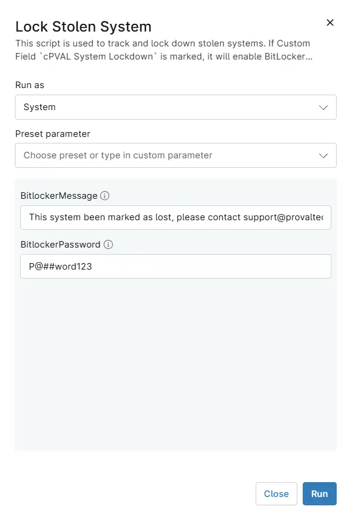

## Overview
This script is used to track and lock down stolen systems. If Custom Field `cPVAL System Lockdown` is marked, it will enable BitLocker and shut down the computer.

## Sample Run

`Play Button` > `Run Automation` > `Script`  

## Dependencies
- [Custom Field - cPVAL Mark System as Stolen](/docs/20a99ff3-a63d-4f73-bd48-3bb8d66626e6)
- [Custom Field - cPVAL System Lockdown ](/docs/4b18c9bf-8aea-41a5-8242-77dfcfd0042a) 
- [Custom Field - cPVAL Current Location and IP Details](/docs/85cb62ba-6e5f-4235-9964-975af04658d0)
- [Solution  - Lock Stolen System](/docs/13b4df99-df9b-4a57-bc0f-8675c68be028)

## Parameters

| Name | Example  | Required | Default | Type | Description |
| ---- | ------- | -------- | ------- | ---- | ----------- |
| BitlockerMessage | This system been marked as lost, please contact support@provaltech.com | False| This system been marked as lost, please contact support@provaltech.com | String/Text | The message to display on the BitLocker lock screen. |
| BitlockerPassword | P@##word123 | False| P@##word123 | String/Text | The password to use to enable BitLocker on the target machine. |

## Automation Setup/Import

[Automation Configuration](https://github.com/ProVal-Tech/ninjarmm/blob/main/scripts/lock-stolen-system.ps1)

## Output

- Activity Details  
- Custom Field
