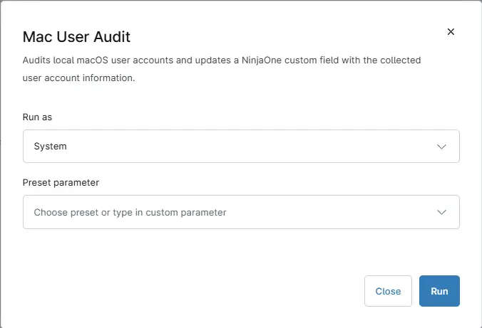

## Overview

Audits local and directory based macOS user accounts and updates [Custom field - cPVAL MAC User Audit](/docs/501108e2-70fe-4510-8614-11081d489ffc) with the collected user account information.

## Sample Run

## Dependencies

- [Custom Field - cPVAL MAC User Audit](/docs/501108e2-70fe-4510-8614-11081d489ffc)
- [Solution - Mac Users Audit](/docs/d4d9f6a6-92f9-4a6c-a197-136ff523c547)

## Custom Fields

| Field Name | Type | Mandatory | Scope | Description |
| ---------- | ---- | --------- | ----- | ----------- |
| cPVAL MAC User Audit | WYSIWYG | False | Devices | Displays local macOS user account details, including username, account type, status, UID, and last login information. This custom field is updated by the script |

## Automation Setup/Import

[Automation Configuration](https://github.com/ProVal-Tech/ninjarmm/blob/main/scripts/mac-user-audit.sh)

## Output

- Activity Details  
- Custom Field

## Changelog

### 2026-08-17

- Initial version of the document

