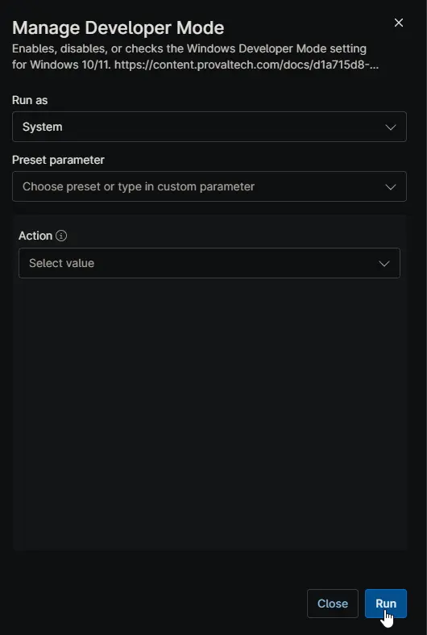
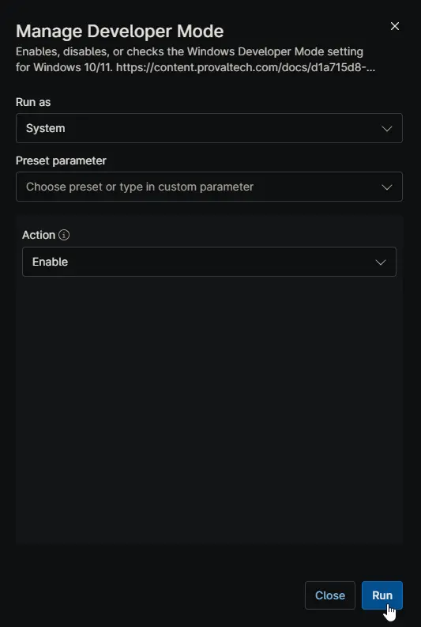
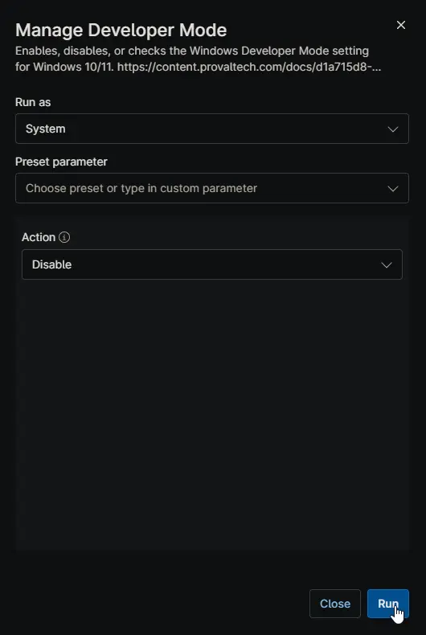

## Overview

Manages the Windows Developer Mode setting on Windows 10/11 devices. The automation can enable, disable, or check the current Developer Mode state.

The desired action is determined in the following priority order:

1. The `Action` script parameter, if set.
2. The [cPVAL Desired Developer Mode](/docs/bdb8829b-76bf-4703-9cd6-7bcb6f5068a2) custom field, if configured at the Organization, Location, or Device level.
3. Defaults to `Check` if neither is set.

After each run, the [cPVAL Current Developer Mode](/docs/9e05e3a1-05fb-4e33-a74c-f9df79ca5e1b) custom field is updated to reflect the current Developer Mode state on the device.

> **Notes:**
>
> - Supported on Windows 10 and Windows 11 only.
> - Set the [cPVAL Desired Developer Mode](/docs/bdb8829b-76bf-4703-9cd6-7bcb6f5068a2) custom field to `None` to exclude devices at that scope from scheduled automation runs. The automation can still be run manually on those devices and will default to the `Check` action.
> - Lower-level settings (Device) override higher-level settings (Location, Organization) in the [cPVAL Desired Developer Mode](/docs/bdb8829b-76bf-4703-9cd6-7bcb6f5068a2) custom field.
> - The `Action` parameter always takes priority over the custom field value.

## Sample Run

### Action Determined by [cPVAL Desired Developer Mode](/docs/bdb8829b-76bf-4703-9cd6-7bcb6f5068a2) Custom Field

### Enable Developer Mode via Action Parameter

### Disable Developer Mode via Action Parameter

## Dependencies

- [Custom Field: cPVAL Desired Developer Mode](/docs/bdb8829b-76bf-4703-9cd6-7bcb6f5068a2)
- [Custom Field: cPVAL Current Developer Mode](/docs/9e05e3a1-05fb-4e33-a74c-f9df79ca5e1b)
- [PowerShell: Manage-DeveloperMode](/docs/89c84696-8c47-4dbe-a134-0f25a5822ae2)
- [Solution: Manage Developer Mode](/docs/3ab05cd9-d579-49d1-92c8-2b57870f5e7d)

## Parameters

| Name | Example | Accepted Values | Required | Default | Type | Description |
| ---- | ------- | --------------- | -------- | ------- | ---- | ----------- |
| Action | Enable | `Check`, `Enable`, `Disable` | False | `Check` | Dropdown | Defines the action to perform on Developer Mode. When set, this overrides the value stored in the [cPVAL Desired Developer Mode](/docs/bdb8829b-76bf-4703-9cd6-7bcb6f5068a2) custom field. Defaults to `Check` if neither this parameter nor the custom field is configured. |

## Custom Fields

| Name | Definition Scope | Type | Required | Default Value | Available Options | Editable | Custom Field Tab Name | Description |
| -----| ---------------- | ---- | -------- | ------------- | ----------------- | -------- | --------------------- | ----------- |
| [cPVAL Desired Developer Mode](/docs/bdb8829b-76bf-4703-9cd6-7bcb6f5068a2) | Organization, Location, Device | Dropdown | No | None | `None`, `Check`, `Enable`, `Disable` | Yes | Developer Mode | Controls the desired Developer Mode state for scheduled automation runs. Set at Organization, Location, or Device level. Lower-level settings override higher-level ones. Set to `None` to exclude the device from scheduled automation; manual runs will still default to `Check`. |
| [cPVAL Current Developer Mode](/docs/9e05e3a1-05fb-4e33-a74c-f9df79ca5e1b) | Device | Text | No | | | No | Developer Mode | Displays the current Developer Mode state (`Enabled` or `Disabled`) as of the last automation run. This field is updated automatically by the automation. |

## Automation Setup/Import

[Automation Configuration](https://github.com/ProVal-Tech/ninjarmm/blob/main/scripts/manage-developer-mode.ps1)

## Output

- Activity Details  
- Custom Field

## Changelog

### 2026-06-17

- Initial version of the document
