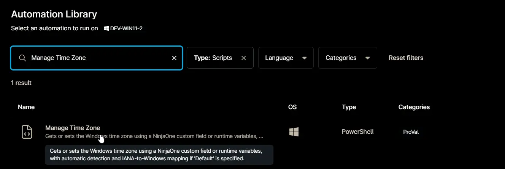
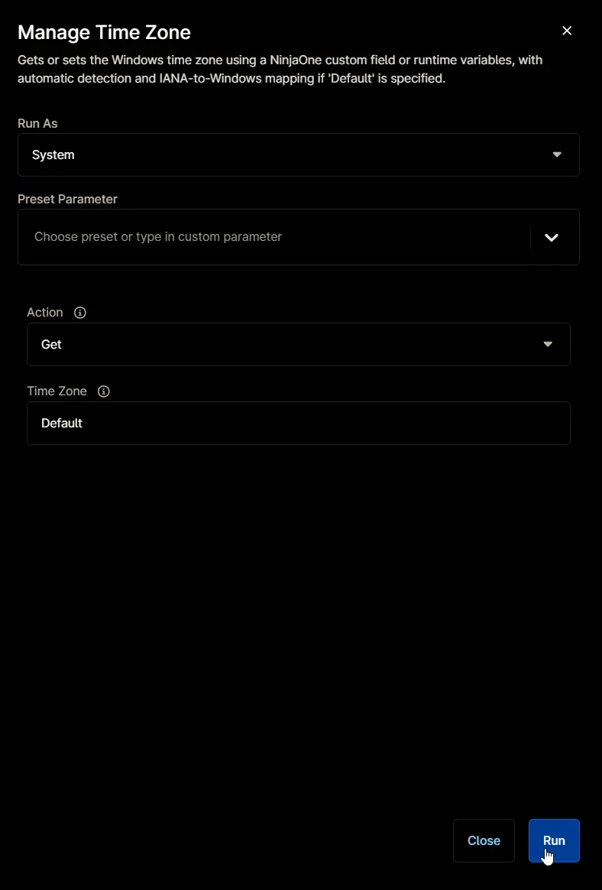

## Overview

Gets or sets the Windows time zone using a NinjaOne custom field or runtime variables, with automatic detection and IANA-to-Windows mapping if 'Default' is specified.

## Sample Run

`Play Button` > `Run Automation` > `Script`  

Search and select `Manage Time Zone`

Set the required arguments and click the `Run` button to run the script.

- **Run As:** `System`  
- **Preset Parameter:** `<Leave it Blank>`  
- **Action:** `Get` or `Set`  
- **TimeZone:** `Default` or `<TimeZone to set>`  

**Run Automation:** `Yes`  

## Dependencies

- [Custom Field: cPVAL Time Zone To Set](/docs/23bc744a-aef7-40dd-bfc6-058138a4d302)
- [Solution: Time Zone Management](/docs/3641dd0d-82d8-4137-b987-0b6c0d8238da)

## Parameters

| Name | Example | Accepted Values | Required | Default | Type | Description |
| ---- | ------- | --------------- | -------- | ------- | ---- | ----------- |
| Action | Get | `Get`, `Set` | False | `Get` | Drop-Down | Specifies the action to perform. |
| Time Zone | Eastern Standard Time | | False | `Default` | String | The Windows time zone ID to set (e.g., 'Pacific Standard Time'). If left blank, the script sets the Windows time zone automatically based on the device's public IP address. |

## Automation Setup/Import

[Automation Configuration](https://github.com/ProVal-Tech/ninjarmm/blob/main/scripts/manage-time-zone.ps1)

## Output

- Activity Details  
- Custom Field
