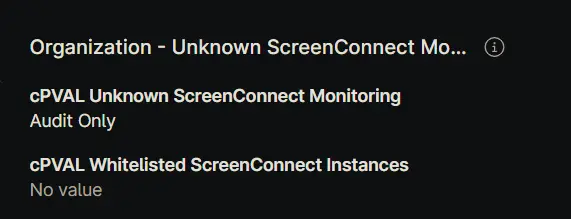
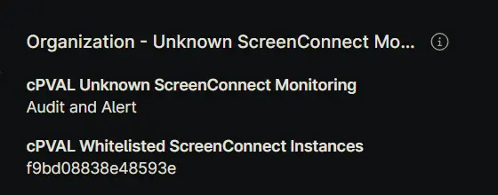
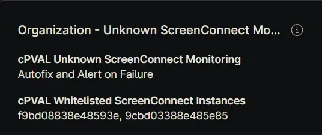
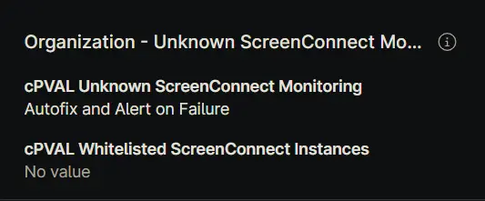
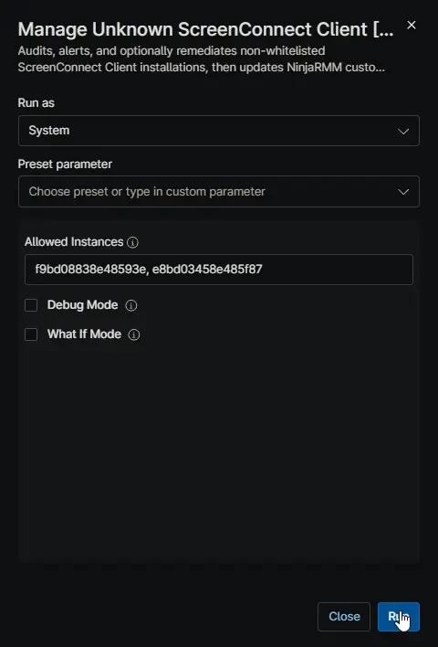
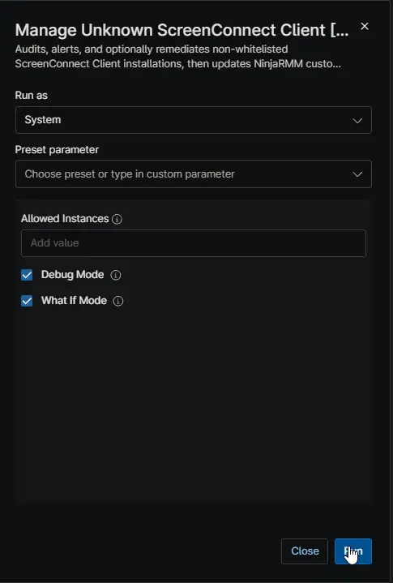

## Overview

Audits, alerts, and optionally remediates non-whitelisted ScreenConnect Client installations including corrupt or broken versions, performing full cleanup of services, registry keys, and install directories, then updates NinjaRMM custom fields with current-state results.

Approved identifiers can come from:

- [cPVAL Whitelisted ScreenConnect Instances](/docs/b190f460-afd9-4761-ad30-93094d15be2b)
- Runtime variable `Allowed Instances` (takes precedence over the custom field when set)

Monitoring behavior is controlled by [cPVAL Unknown ScreenConnect Monitoring](/docs/ce85f694-4518-4e46-93e2-b008210e9627):

- `Audit Only`
- `Audit and Alert`
- `Autofix and Alert on Failure`

During each run, the automation updates:

- [cPVAL Installed ScreenConnect Instances](/docs/7379dfd8-d88c-4655-bab7-7b97e8798914) (WYSIWYG details)
- [cPVAL Unknown ScreenConnect Installed](/docs/72651ab4-28ea-4ee5-a7a3-63b03e437d96) (checkbox status)

If [cPVAL Unknown ScreenConnect Monitoring](/docs/ce85f694-4518-4e46-93e2-b008210e9627) is blank, the automation defaults to `Audit Only`.

If both `Allowed Instances` and [cPVAL Whitelisted ScreenConnect Instances](/docs/b190f460-afd9-4761-ad30-93094d15be2b) are blank, no instances are considered approved.

Related automation:

- [Manage Unknown ScreenConnect Client [Macintosh]](/docs/0b6b654a-f27e-4d5f-8dea-e5f9c2a30e72)

Related Compound Conditions:

- [Unknown ScreenConnect Detection - Windows Workstation](/docs/741d52b4-f7db-42e3-a494-0071bd3edab4)
- [Unknown ScreenConnect Detection - Windows Server](/docs/977d1dc8-2b16-4f63-a447-745c2ac21648)

## Sample Run

### Example 1: Audit only with empty whitelist

- **[Custom Field: cPVAL Unknown ScreenConnect Monitoring](/docs/ce85f694-4518-4e46-93e2-b008210e9627)** = `Audit Only`
- **[Custom Field: cPVAL Whitelisted ScreenConnect Instances](/docs/b190f460-afd9-4761-ad30-93094d15be2b)** = `<blank>`  
    
- **Allowed Instances** = `<blank>`

**Expected Outcome:** All detected ScreenConnect instances are marked unknown. [cPVAL Unknown ScreenConnect Installed](/docs/72651ab4-28ea-4ee5-a7a3-63b03e437d96) is checked. No removal and no alert exit.

### Example 2: Audit and alert with partial whitelist

- **[Custom Field: cPVAL Unknown ScreenConnect Monitoring](/docs/ce85f694-4518-4e46-93e2-b008210e9627)** = `Audit and Alert`
- **[Custom Field: cPVAL Whitelisted ScreenConnect Instances](/docs/b190f460-afd9-4761-ad30-93094d15be2b)** = one approved identifier  
    
- **Allowed Instances** = `<blank>`

**Expected Outcome:** Approved rows show `Whitelisted` and unknown rows show `Unknown`. Alert output is returned and the script exits non-zero if any unknown instance exists.

### Example 3: Autofix with custom field whitelist

- **[Custom Field: cPVAL Unknown ScreenConnect Monitoring](/docs/ce85f694-4518-4e46-93e2-b008210e9627)** = `Autofix and Alert on Failure`
- **[Custom Field: cPVAL Whitelisted ScreenConnect Instances](/docs/b190f460-afd9-4761-ad30-93094d15be2b)** = approved identifiers  
    
- **What If Mode** = `false`

**Expected Outcome:** Unknown instances are targeted for uninstall, then the device is re-audited. [cPVAL Installed ScreenConnect Instances](/docs/7379dfd8-d88c-4655-bab7-7b97e8798914) is updated with post-remediation results. Alert output occurs only if unknown instances remain.

### Example 4: Autofix with runtime override

- **[Custom Field: cPVAL Unknown ScreenConnect Monitoring](/docs/ce85f694-4518-4e46-93e2-b008210e9627)** = `Autofix and Alert on Failure`
- **[Custom Field: cPVAL Whitelisted ScreenConnect Instances](/docs/b190f460-afd9-4761-ad30-93094d15be2b)** = `<blank>`  
      
- **Allowed Instances** = approved identifiers

**Expected Outcome:** `Allowed Instances` overrides the blank custom field. Matching instances are preserved, and non-matching instances are targeted for uninstall.

### Example 5: What-if preview before enforcement

- **[Custom Field: cPVAL Unknown ScreenConnect Monitoring](/docs/ce85f694-4518-4e46-93e2-b008210e9627)** = `Autofix and Alert on Failure`  
    
- **Debug Mode:** = `true`
- **What If Mode** = `true`

**Expected Outcome:** No uninstall or cleanup occurs. Output shows detailed logs and what would be removed. [cPVAL Installed ScreenConnect Instances](/docs/7379dfd8-d88c-4655-bab7-7b97e8798914) is updated with WhatIf action text.

## Dependencies

- [Custom Field: cPVAL Unknown ScreenConnect Monitoring](/docs/ce85f694-4518-4e46-93e2-b008210e9627)
- [Custom Field: cPVAL Whitelisted ScreenConnect Instances](/docs/b190f460-afd9-4761-ad30-93094d15be2b)
- [Custom Field: cPVAL Installed ScreenConnect Instances](/docs/7379dfd8-d88c-4655-bab7-7b97e8798914)
- [Custom Field: cPVAL Unknown ScreenConnect Installed](/docs/72651ab4-28ea-4ee5-a7a3-63b03e437d96)
- [Solution: Unknown ScreenConnect Monitoring](/docs/b3bbf754-fbdc-4034-8728-c52286746b1f)

## Parameters

| Name | Example | Accepted Values | Required | Default | Type | Description |
| ---- | ------- | --------------- | -------- | ------- | ---- | ----------- |
| `Allowed Instances` | `c6bd08847e48343e,7df67d57637499f5` | Comma-separated identifiers | No | blank | `String/Text` | Optional runtime list of approved identifiers. When set, it overrides [cPVAL Whitelisted ScreenConnect Instances](/docs/b190f460-afd9-4761-ad30-93094d15be2b). |
| `Debug Mode` | `true` | `true/false`, `1/0`, `yes/no`, `on/off` | No | blank | `Checkbox` | Enables additional debug logging only. Does not change detection, alerting, or remediation logic. |
| `What If Mode` | `true` | `true/false`, `1/0`, `yes/no`, `on/off` | No | blank | `Checkbox` | Dry-run mode for autofix. Shows what would be removed without uninstalling or deleting anything. |

## Custom Fields

| Custom Field | Field Name | Scope | Type | Access | Used As |
| ---- | ---- | ---- | ---- | ---- | ---- |
| [cPVAL Unknown ScreenConnect Monitoring](/docs/ce85f694-4518-4e46-93e2-b008210e9627) | `cpvalUnknownScreenconnectMonitoring` | Organization, Location, Device | Drop-down | Read | Selects enforcement mode for audit, alerting, and remediation behavior. |
| [cPVAL Whitelisted ScreenConnect Instances](/docs/b190f460-afd9-4761-ad30-93094d15be2b) | `cpvalWhitelistedScreenconnectInstances` | Organization, Location, Device | Text | Read | Stores approved ScreenConnect identifiers used for allowlist matching. |
| [cPVAL Installed ScreenConnect Instances](/docs/7379dfd8-d88c-4655-bab7-7b97e8798914) | `cpvalInstalledScreenconnectInstances` | Device | WYSIWYG | Write | Stores current-run details for detected instances, status, actions, and timestamps. |
| [cPVAL Unknown ScreenConnect Installed](/docs/72651ab4-28ea-4ee5-a7a3-63b03e437d96) | `cpvalUnknownScreenconnectInstalled` | Device | Checkbox | Write | Set to checked when any unknown instance is detected in the current scan. |

### Available Options and Behavior

#### cPVAL Unknown ScreenConnect Monitoring (Drop-down)

| Option | Behavior |
| ---- | ---- |
| `Audit Only` | Audits installed instances and updates custom fields only. No remediation and no alert failure exit. |
| `Audit and Alert` | Audits and updates custom fields. Returns alert output and non-zero exit when unknown instances are detected. |
| `Autofix and Alert on Failure` | Attempts uninstall of unknown instances, re-audits, updates custom fields, and alerts only when unknown instances remain. |

If this field is blank or invalid, the script uses `Audit Only`.

#### cPVAL Unknown ScreenConnect Installed (Checkbox)

| Value | Meaning |
| ---- | ---- |
| `1` (checked / true) | One or more unknown ScreenConnect instances were detected in the latest run. |
| `0` (unchecked / false) | No unknown ScreenConnect instances were detected in the latest run. |

### cPVAL Installed ScreenConnect Instances WYSIWYG Columns

| Column Name | Description |
| ---- | ---- |
| `Name` | Detected installed ScreenConnect Client display name. |
| `DisplayVersion` | Installed version from uninstall registry details when available. |
| `InstallDate` | Install date normalized to `yyyy-MM-dd` when parseable. |
| `Whitelist Status` | `Whitelisted` when identifier match is found; `Unknown` otherwise. |
| `Action / Result` | Audit-only status, remediation attempt result, or post-remediation verification status. |
| `DataCollectionTime` | Timestamp when the report row was generated for the current script phase. |

## Automation Setup/Import

[Automation Configuration](https://github.com/ProVal-Tech/ninjarmm/blob/main/scripts/manage-unknown-screenconnect-client-windows.ps1)

## Output

- Activity Details
- Custom field updates to [cPVAL Installed ScreenConnect Instances](/docs/7379dfd8-d88c-4655-bab7-7b97e8798914)
- Custom field updates to [cPVAL Unknown ScreenConnect Installed](/docs/72651ab4-28ea-4ee5-a7a3-63b03e437d96)
- Alert-oriented output in `Audit and Alert` and `Autofix and Alert on Failure` when unknown instances are present

## Changelog

### 2026-04-16

- Included detection and removal of corrupt or broken installations
- Included full cleanup of related services, registry keys, and install directories.

### 2026-04-09

- Initial version of the document
