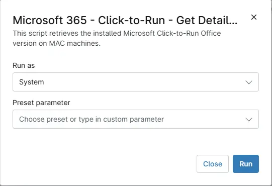

## Overview
his script retrieves the installed Microsoft Click-to-Run Office version on MAC machines.

## Sample Run

`Play Button` > `Run Automation` > `Script`  

## Dependencies
- [Solution - Microsoft 365 - Click-to-Run - Get Details](/docs/f493756c-e4e0-4aba-af87-9aef14f389aa) 
- [cPVAL C2R Update Channel](/docs/76865fc9-4736-4590-b365-e4f858b6da8d) 

## Automation Setup/Import

[Automation Configuration](https://github.com/ProVal-Tech/ninjarmm/blob/main/scripts/microsoft-365-click-to-run-get-details-macos.ps1)

## Output

- Activity Details  
- Custom Field
