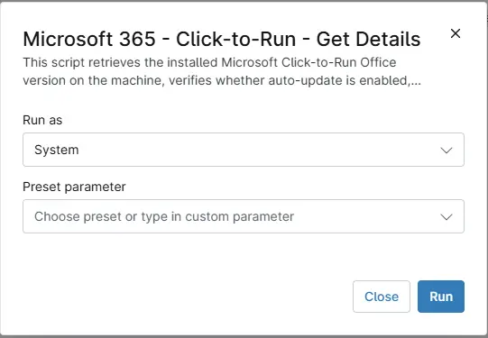

## Overview
This script retrieves the installed Microsoft Click-to-Run Office version on the machine, verifies whether auto-update is enabled, obtains the update channel, and updates the custom fields with the gathered details.

## Sample Run

`Play Button` > `Run Automation` > `Script` 

## Dependencies
- [Solution - Microsoft 365 - Click-to-Run - Get Details](/docs/f493756c-e4e0-4aba-af87-9aef14f389aa) 
- [cPVAL C2R Auto Update](/docs/e0c31574-10e7-4b8c-b5d5-24e355753441) 
- [cPVAL C2R Office Version](/docs/05d64903-e13b-4937-bba8-e2b2236d52d3) 
- [cPVAL C2R Update Channel](/docs/76865fc9-4736-4590-b365-e4f858b6da8d) 
- [cPVAL C2R Data Collection Time](/docs/02ef6c2c-bd37-43ab-8564-a808768f51c3)

## Automation Setup/Import

[Automation Configuration](https://github.com/ProVal-Tech/ninjarmm/blob/main/scripts/microsoft-365-click-to-run-get-details-windows.ps1)

## Output

- Activity Details  
- Custom Field
