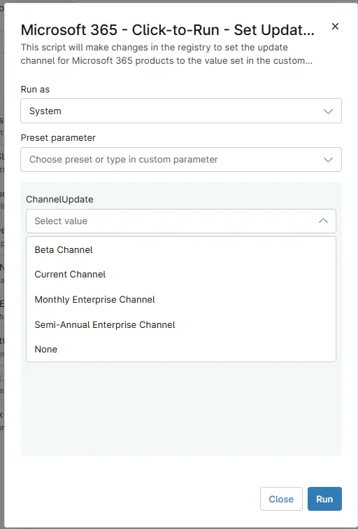

## Overview

This script updates the Microsoft 365 (Office Click-to-Run) update channel by modifying the required registry values under:

  `HKLM:\SOFTWARE\Microsoft\Office\ClickToRun\Configuration`

  The script supports all major Microsoft 365 servicing channels including:
  - Current Channel
  - Monthly Enterprise Channel
  - Semi-Annual Enterprise Channel
  - Beta Channel
  - None

  The script retrieves the desired update channel from:  
  1. Environment variable: ChannelUpdate  
  2. NinjaOne custom property: cpvalEndpointUpdateChannel

  The following registry values are updated:  
  - CDNBaseUrl
  - UpdateChannel
  - UnmanagedUpdateUrl

If the registry path does not exist, it will be created automatically.

## Sample Run

`Play Button` > `Run Automation` > `Script`  

## Dependencies

- [Solution - Microsoft 365 - Click-to-Run - Set Update Channel](/docs/2b379cba-388e-4980-834b-f7f6654efe3b)

## Parameters

| Name | Accepted Values | Required | Default | Type | Description |
| ---- | --------------- | -------- | ------- | ---- | ----------- |
| ChannelUpdate |`Current Channel`, `Monthly Enterprise Channel`, `Semi-Annual Enterprise Channel`, `Beta Channel`, `None` | -- | -- | DropDown | Used to Select Channel Type from the drop-down menu for that particular computer. |

## Automation Setup/Import

[Automation Configuration](https://github.com/ProVal-Tech/ninjarmm/blob/main/scripts/microsoft-365-click-to-run-set-update-channel.ps1)

## Output

- Activity Details  

## Changelog

### 2026-05-08

- Initial Creation