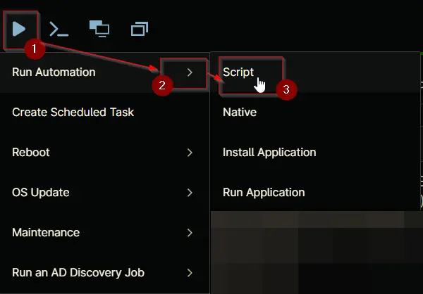

## Overview
This script checks if Microsoft 365 Apps (Click-to-Run) is installed, reports the current version, and silently triggers an Office update.

## Sample Run

`Play Button` > `Run Automation` > `Script`  

## Automation Setup/Import

[Automation Configuration](https://github.com/ProVal-Tech/ninjarmm/blob/main/scripts/microsoft-c2r-update.ps1)

## Output

- Activity Details  
