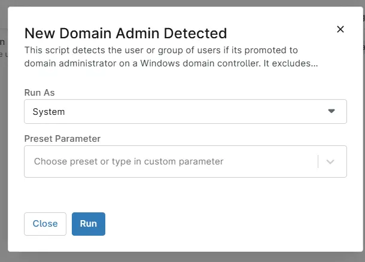

## Overview

This script detects the user or group of users if its promoted to domain administrator on a Windows domain controller. It excludes the default administrators and any user mentioned in the cpvalExcludedDomainAdmins. 

## Sample Run

`Play Button` > `Run Automation` > `Script`

## Dependencies

- [Custom Field : cPval Excluded Domain Admin](/docs/32a5e5bb-b72e-4597-beae-8f2d8a2eb1c0)
- [Custom Field : cPVAL New Domain Admin Monitoring](/docs/28f66783-6f12-4091-abe0-6aa41f7cfd9a)
- [Solution : New Domain Admin Detected](/docs/ffbbe3fe-f579-4521-a95a-1eb772d93ac7)

## Automation Setup/Import

[Automation Configuration](https://github.com/ProVal-Tech/ninjarmm/blob/main/scripts/new-domain-admin-detected.ps1)

## Output

- Activity Details

