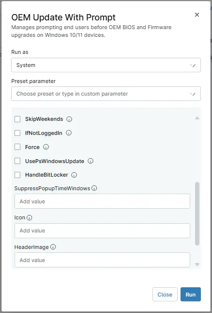
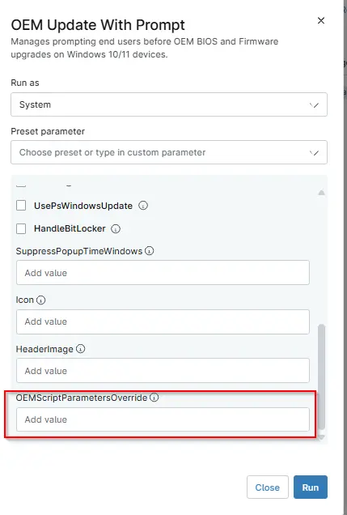
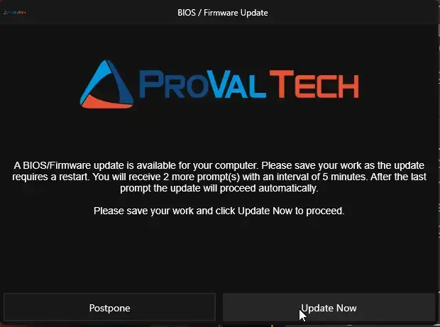
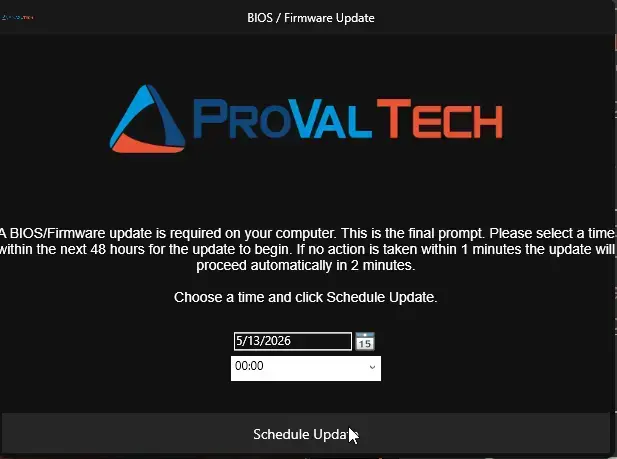
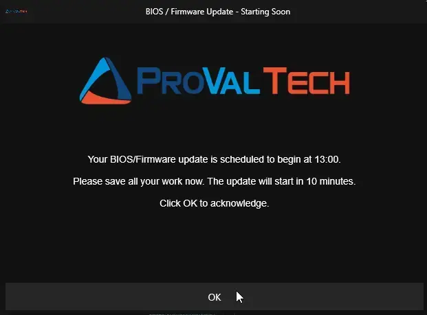
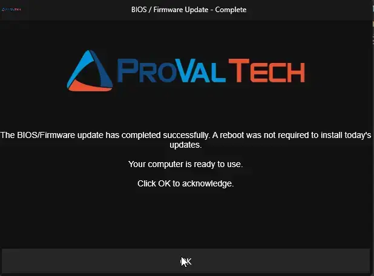

## Overview

This is a Ninja implementation of the agnostic [Invoke-OEMUpdateWithPrompt](/docs/52c50165-38d5-4793-b751-97260ab31f72)

The script prompts logged-in users before BIOS and firmware updates, allows postponement for a configured number of cycles, and then enforces the update. It is designed for a single deployment from Ninja RMM, then continues through scheduled task re-runs on the endpoint.

## Sample Run

`Play Button` > `Run Automation` > `Script`  

## Dependencies

 - [Agnostic Script - Invoke-OEMUpdateWithPrompt](/docs/52c50165-38d5-4793-b751-97260ab31f72)

 ## Examples

### Scenario 1: OEMScriptParametersOverride

Custom parameter string passed to the vendor update script, replacing the default parameter set for the detected manufacturer.

  

  - For PSWindowsUpdate, set `OEMScriptParametersOverride` = `-Category 'Drivers','Tools' -AllowReboot`
  - For Dell DCU, set `OEMScriptParametersOverride` = `'/applyUpdates -updateType=bios -silent'`

### Scenario 2: UsePsWindowsUpdate
 
Run with user parameter `UsePsWindowsUpdate = True`. Please ensure that the corresponding checkbox is selected before executing the script.

Expected output:

- Update execution path uses Install-WindowsUpdates flow.
- This runs Windows update instead of vendor-specific updates

### Scenario 3: IfNotLoggedIn

Run with user parameter `IfNotLoggedIn = True`. Please ensure that the corresponding checkbox is selected before executing the script.

Expected output:

- If no user session is active, update starts without prompting.
- If a user is logged in, normal prompt workflow continues.

### Scenario 4: HandleBitLocker

Run with user parameter `HandleBitLocker = True`. Please ensure that the corresponding checkbox is selected before executing the script.

Expected output:

- BitLocker is suspended before update execution for one reboot cycle.
- If no reboot is needed, BitLocker is resumed at completion.

### Scenario 5: Force

Run with user parameter `Force = True`. Please ensure that the corresponding checkbox is selected before executing the script.

Expected output:

- Existing OEM prompt scheduled tasks are removed.
- Stored prompt state is reset.
- Prompt workflow starts again from the beginning.

### Scenario 6: SkipWeekends

Run with user parameter `SkipWeekends = True`. Please ensure that the corresponding checkbox is selected before executing the script.

Expected output:

- There will be no popup get generated on the users machine during weekend.
- Will is usefull as user will not miss any popup during weekends.

## Sample Prompts

The First prompt that will get generated on the user machine.     

This prompt is shown while the update needs to be schedule on particular time.  

The prompt shows the confirmation that update is scheduled and will start on the particular time and need aknowledgement.  

The prompt shows the confirmation that update has been completed and reboot is required.  

## Parameters

| Name | Calculated Name | Example | Accepted Values | Required | Default | Type | Description |
| ---- | --------------- | ------- | --------------- | -------- | ------- | ---- | ----------- |
| MaxPostpone | maxpostpone | -- | 0-5 | True | 5 | string/text | Maximum number of times the upgrade can be postponed before the final prompt is shown. Total prompts = MaxPostpone + 1 (final). |
| IntervalMinutes | intervalminutes | -- | 0-240 | True | 240 | string/text | Minutes between each prompt. After postpone or miss, a SYSTEM scheduled task re-runs the script at this interval. |
| RegularPromptTimeout | RegularPromptTimeout | -- | 0-600 | True | 600 | string/text | Seconds before a regular prompt auto-closes and counts as missed. |
| FinalPromptTimeout | finalprompttimeout | -- | 0-900 | True | 900 | string/text | Seconds before the final prompt times out and the upgrade is forced. |
| SkipWeekends | skipweekends | -- | `True/False` | False | False | Checkbox | Prevents prompts on Saturdays and Sundays. |
| IfNotLoggedIn | ifnotloggedin | -- | `True/False` | False | False | Checkbox | Runs the upgrade immediately without prompting if no user is logged in. |
| Force | force | -- | `True/False` | False | False | Checkbox | Clears all scheduled tasks and stored state, restarting the prompt cycle from 0. |
| UsePsWindowsUpdate | usepswindowsupdate | -- | `True/False` | False | False | Checkbox | Uses the PSWindowsUpdate module instead of OEM-specific scripts (Dell/HP/Lenovo). |
| HandleBitLocker | handlebitlocker | -- | `True/False` | False | False | Checkbox | Suspends BitLocker protection on the OS drive for one reboot cycle before OEM updates run. If no reboot is required after the update, BitLocker protection is automatically resumed. |
| SuppressPopupTimeWindows | suppresspopuptimewindows | `1800-0900` | --- | False | -- | string/text | MTime window (24-hour format, e.g., 1800-0900) during which prompts are suppressed. |
| Icon | icon | `https://example.com/icon.png` | -- | --- | --- | string/text | URL or local file path for the icon displayed in the prompt dialog (e.g., https://example.com/icon.png or C:\Icons\icon.png). |
| HeaderImage | headerimage | `https://example.com/header.png or C:\Images\header.png` | -- | -- | -- | string/text | URL or local file path for the header image displayed at the top of the prompt dialog (e.g., https://example.com/header.png or C:\Images\header.png). |
| OEMScriptParametersOverride | oemscriptparametersoverride | <ul><li>for Dell DCU `'/applyUpdates -updateType=bios -silent'`</li><li> for PSWindowsUpdate `-Category 'Drivers','Tools' -AllowReboot`</li></ul> | -- | -- | -- | string/text | Custom parameter string passed to the vendor update script, replacing the default parameter set for the detected manufacturer |

## Automation Setup/Import

[Automation Configuration](https://github.com/ProVal-Tech/ninjarmm/blob/main/scripts/invoke-oemupdatewithprompt.ps1)

## Output

- Activity Details  

## Changelog

### 2026-06-19

- Initial version of the document.