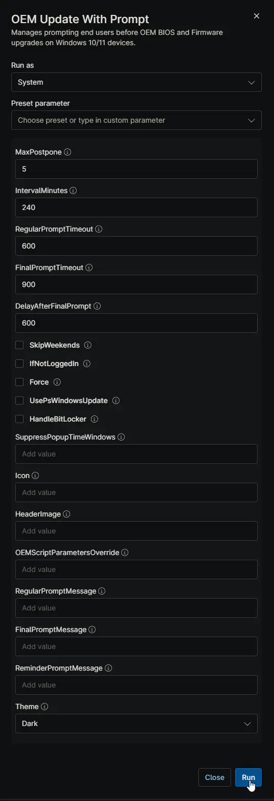

## Overview

This is a Ninja implementation of the agnostic [Invoke-OEMUpdateWithPrompt](/docs/52c50165-38d5-4793-b751-97260ab31f72)

The script prompts logged-in users before BIOS and firmware updates, allows postponement for a configured number of cycles, and then enforces the update. It is designed for a single deployment from Ninja RMM, then continues through scheduled task re-runs on the endpoint.

While the update installs, an optional on-screen notification keeps the user informed — enabled and configured through a single `ProgressPrompt` variable that selects interval or stay mode. Prompts can also carry your own branding through the `Icon` and `HeaderImage` variables, which accept a web URL, local path, or UNC share and are staged locally by the script before use.

## Sample Run



## Dependencies

- [Invoke-OEMUpdateWithPrompt](/docs/52c50165-38d5-4793-b751-97260ab31f72)

## Examples

### Scenario 1: OEMScriptParametersOverride

Custom parameter string passed to the vendor update script, replacing the default parameter set for the detected manufacturer.

- For PSWindowsUpdate, set `OEMScriptParametersOverride` = `-Category 'Drivers' -Description '(?i)(BIOS|Firmware|UEFI)' -AllowReboot`
- For Dell DCU, set `OEMScriptParametersOverride` = `'/applyUpdates -updateType=bios -silent'`

### Scenario 2: UsePsWindowsUpdate

Run with user parameter `UsePsWindowsUpdate = True`. Please ensure that the corresponding checkbox is selected before executing the script.

Expected output:

- Update execution path uses Install-WindowsUpdates flow.
- This runs Windows update instead of vendor-specific updates

### Scenario 3: IfNotLoggedIn

Run with user parameter `IfNotLoggedIn = True`. Please ensure that the corresponding checkbox is selected before executing the script.

Expected output:

- If no user session is active, update starts without prompting.
- If a user is logged in, normal prompt workflow continues.

### Scenario 4: HandleBitLocker

Run with user parameter `HandleBitLocker = True`. Please ensure that the corresponding checkbox is selected before executing the script.

Expected output:

- BitLocker is suspended before update execution for one reboot cycle.
- If no reboot is needed, BitLocker is resumed at completion.

### Scenario 5: Force

Run with user parameter `Force = True`. Please ensure that the corresponding checkbox is selected before executing the script.

Expected output:

- Existing OEM prompt scheduled tasks are removed.
- Stored prompt state is reset.
- Prompt workflow starts again from the beginning.

### Scenario 6: SkipWeekends

Run with user parameter `SkipWeekends = True`. Please ensure that the corresponding checkbox is selected before executing the script.

Expected output:

- No popup is generated on the user's machine during weekends.
- This is useful because the user will not miss any popup during weekends.

### Scenario 7: ProgressPrompt (Interval Mode)

Run with user parameter `ProgressPrompt = Interval=15/600`.

Expected output:

- While the update installs, a notice appears on the user's desktop for 600 seconds (10 minutes) every 15 minutes.
- Plain `Interval` uses the built-in defaults: every 10 minutes for 300 seconds.
- The notice closes itself and repeats until the update finishes, and only appears while a user is logged in and the machine is unlocked.

### Scenario 8: ProgressPrompt (Stay Mode)

Run with user parameter `ProgressPrompt = Stay`.

Expected output:

- The notice appears as soon as the update starts and stays on the desktop for the whole update.
- Clicking its OK button only hides it until the next check brings it back.
- No other variable is needed; stay mode is enabled entirely through `ProgressPrompt`.

### Scenario 9: Icon and HeaderImage

Run with user parameters `Icon = https://example.com/icon.png` and `HeaderImage = \\fileserver\share\header.png`.

Expected output:

- Both values are passed through unchanged; the script stages verified local copies in its prompt working directory and runs every prompt with those local paths.
- The logged-in user never needs access to the original sources, and a failed refresh keeps the last good copy.

## While the Update Runs

Firmware installs can take a long time with nothing visible on screen. An optional notification keeps the user informed while the update installs. NinjaOne caps a script at 20 variables, which left a single slot for the whole feature, so one variable — `ProgressPrompt` — enables it and selects the mode:

- **Blank (default):** the notification stays off.
- **`Interval`:** every 10 minutes a notice appears for 300 seconds, closes itself, and repeats until the update finishes. `Interval=<minutes>` sets a custom interval, and `Interval=<minutes>/<seconds>` sets a custom interval and timeout, for example `Interval=15/600`.
- **`Stay`:** the notice appears as soon as the update starts and stays on screen until the update finishes. Clicking its OK button only hides it until the next check brings it back — intentional, so nobody power-cycles a machine they think is stuck.

Values are case-insensitive, and a bare `<minutes>` or `<minutes>/<seconds>` is shorthand for the Interval forms. An unrecognized value is logged as a warning and leaves the notification off. The notice only appears while a user is logged in and the machine is unlocked, and it is closed and cleaned up as soon as the update finishes. A reboot triggered by the update closes it too, and the leftover task is removed on the next run.

The notice wording is set through the `ProgressPromptMessage` variable, and its title is set in the `prompt titles` section of the script.

## Prompt Display Retry

A prompt that fails to display — the scheduled task never reached the prompt application, or its output matched no known button caption — is retried automatically. A failed attempt never consumes one of the user's postponements, and a prompt the user simply ignored is still handled as a missed prompt rather than retried. When every attempt fails, the script cleans up its tasks and reschedules itself for the next interval, preserving all prompt state so the cycle resumes where it left off instead of starting over.

The retry behaviour uses the agnostic script defaults, currently one extra attempt thirty seconds apart. The count and the pause are not Ninja variables; they are set in the `prompt display retry settings` section of the script, and editing them requires re-signing. See [Manually Customizable Variables](#manually-customizable-variables) under Parameters for the full list and the re-signing requirement.

## Customize the Prompt Text

Leave the message variables empty and users see the built-in wording in their own language (English or Dutch). Enter your own text and it is used instead, exactly as written.

| Variable | Replaces |
| --- | --- |
| `RegularPromptMessage` | Body of the postponable prompts |
| `FinalPromptMessage` | Body of the final scheduling prompt |
| `ReminderPromptMessage` | Body of the 10-minute warning |
| `ProgressPromptMessage` | Body of the notice shown while the update installs |
| `ProgressPrompt` | Enables and configures the in-progress notice (see [While the Update Runs](#while-the-update-runs)) |
| `Theme` | Prompt window appearance (`Dark` or `Light`) |

### Default messages

These are the messages users see when the message variables are left empty. Dutch equivalents are used automatically when the logged-in user runs Windows in Dutch.

Names such as `PromptsLeft`, `ScheduledUpdateTime`, and `UpdateElapsedMinutes` are replaced with live values before the prompt appears. `\n` produces a line break.

#### Titles

| Parameter | Default |
| --- | --- |
| `Title` | BIOS / Firmware Update |
| `ReminderPromptTitle` | BIOS / Firmware Update - Starting Soon |
| `CompletionPromptTitle` | BIOS / Firmware Update - Complete |
| `ProgressPromptTitle` | BIOS / Firmware Update - In Progress |

#### Messages

**Regular prompt** — `RegularPromptMessage`

```text
A BIOS/Firmware update is available for your computer. Please save your work as the update requires a restart. You will receive PromptsLeft more prompt(s) with an interval of PromptIntervalMinutes minutes. After the last prompt the update will proceed automatically.\n\nPlease save your work and click Update Now to proceed.
```

**Final prompt** — `FinalPromptMessage`

```text
A BIOS/Firmware update is required on your computer. This is the final prompt. Please select a time within the next 48 hours for the update to begin. If no action is taken within FinalTimeoutMinutes minutes the update will proceed automatically in DelayAfterFinalMinutes minutes.\n\nChoose a time and click Schedule Update.
```

**Reminder prompt** — `ReminderPromptMessage`

```text
Your BIOS/Firmware update is scheduled to begin at ScheduledUpdateTime.\n\nPlease save all your work now. The update will start in MinutesUntilUpdate minute(s).\n\nClick OK to acknowledge.
```

**Completion prompt** — `CompletionPromptMessage`

```text
The BIOS/Firmware update has completed successfully. A reboot was not required to install today's updates.\n\nYour computer is ready to use.\n\nClick OK to acknowledge.
```

**In-progress notice** — `ProgressPromptMessage`

```text
A BIOS/Firmware update is currently being installed on your computer. The installation is still running in the background.\n\nYour computer may restart automatically once the update has finished, so please save your work and leave the computer switched on.\n\nNo action is needed from you.
```

#### Extra line on laptops

On laptops, notebooks, and tablets the following line is added before the closing sentence of these four prompts. Desktops do not see it.

| Prompt | Added line |
| --- | --- |
| Regular prompt | Please connect your laptop to power before the update begins. Do not run the update on battery. |
| Final prompt | Please make sure your laptop is connected to power at the time you select. |
| Reminder prompt | Please make sure your laptop is connected to power now. |
| In-progress notice | Please keep your laptop connected to power until the update has finished. |

### Insert live values

Type any of these names into your message as a plain word. The real value is filled in before the prompt appears.

| Name | Shows |
| --- | --- |
| `PromptsToSend` | Total prompts the user will receive |
| `PromptsSent` | Prompts shown so far, including this one |
| `PromptsLeft` | Prompts still to come after this one |
| `PromptIntervalMinutes` / `PromptIntervalHours` | Time between prompts |
| `RegularTimeoutSeconds` / `RegularTimeoutMinutes` | Regular prompt timeout |
| `FinalTimeoutSeconds` / `FinalTimeoutMinutes` | Final prompt timeout |
| `DelayAfterFinalSeconds` / `DelayAfterFinalMinutes` | Grace period after the final prompt |
| `ScheduledUpdateTime` | Time the user picked (reminder prompt only) |
| `MinutesUntilUpdate` | Minutes until the update starts (reminder prompt only) |
| `ProgressIntervalMinutes` | Minutes between in-progress notices |
| `ProgressTimeoutSeconds` / `ProgressTimeoutMinutes` | How long each in-progress notice stays on screen |
| `UpdateElapsedMinutes` | Minutes the update has been running (in-progress notice only) |
| `ComputerName` | Machine name |
| `UserName` | Logged-in username |

Use `\n` for a line break.

**Example:**

```text
A firmware update is pending on ComputerName. You have PromptsLeft reminder(s) left, one every PromptIntervalHours hour(s).\n\nSave your work and click Update Now.
```

**Example with the in-progress notice:**

```text
IT is updating the firmware on ComputerName. This has been running for UpdateElapsedMinutes minute(s).\n\nPlease leave the machine switched on.
```

### Prompt titles

Titles are not Ninja variables, because a script is capped at 20 variables and titles change far less often than message bodies. To change a title, edit the `prompt titles` section near the top of the script and re-sign it. Leave them blank and the built-in titles are used. The section also holds the title of the in-progress notice, so all four titles are set in one place. The script additionally holds the completion message, the prompt display retry settings, and the unattended and forced update settings as script-side placeholders — see [Manually Customizable Variables](#manually-customizable-variables) under Parameters for the full list and the re-signing requirement.

### Things to know

* These names are reserved words. If a message needs the literal word `ComputerName`, reword it.
* Button labels always follow the user's language and cannot be changed.
* The in-progress notice always carries an OK button. In stay mode, clicking it only hides the notice until the next check brings it back.
* Custom text is not translated and does not receive the automatic connect-to-power line shown on laptops. Include that wording yourself if your fleet has laptops.

## Sample Prompts

### Sample Prompts - English

**Desktops:**

  
  
  

**Laptops:**

  
  
  


### Completion Acknowledgement Prompt (No Reboot Pending) - English

  

### Update In Progress Notification - English

  

### Update In Progress Notification - Dutch

  

## Parameters

The script uses all 20 of NinjaOne's variable slots.

| Name | Calculated Name | Example | Accepted Values | Required | Default | Type | Description |
| ---- | --------------- | ------- | --------------- | -------- | ------- | ---- | ----------- |
| MaxPostpone | maxpostpone | -- | 0-5 | True | 5 | string/text | Maximum number of times the upgrade can be postponed before the final prompt is shown. Total prompts = MaxPostpone + 1 (final). |
| IntervalMinutes | intervalminutes | -- | 0-240 | True | 240 | string/text | Minutes between each prompt. After postpone or miss, a SYSTEM scheduled task re-runs the script at this interval. |
| RegularPromptTimeout | RegularPromptTimeout | -- | 0-600 | True | 600 | string/text | Seconds before a regular prompt auto-closes and counts as missed. |
| FinalPromptTimeout | finalprompttimeout | -- | 0-900 | True | 900 | string/text | Seconds before the final prompt times out and the upgrade is forced. |
| DelayAfterFinalPrompt | delayafterfinalprompt | -- | -- | True | 600 | string/text | Seconds to wait before forcing the upgrade after the final prompt times out without a user selection. |
| SkipWeekends | skipweekends | -- | `True/False` | False | False | Checkbox | Prevents prompts on Saturdays and Sundays. |
| IfNotLoggedIn | ifnotloggedin | -- | `True/False` | False | False | Checkbox | Runs the upgrade immediately without prompting if no user is logged in. |
| Force | force | -- | `True/False` | False | False | Checkbox | Clears all scheduled tasks and stored state, restarting the prompt cycle from 0. |
| UsePsWindowsUpdate | usepswindowsupdate | -- | `True/False` | False | False | Checkbox | Uses the PSWindowsUpdate module instead of OEM-specific scripts (Dell/HP/Lenovo). |
| HandleBitLocker | handlebitlocker | -- | `True/False` | False | False | Checkbox | Suspends BitLocker protection on the OS drive for one reboot cycle before OEM updates run. If no reboot is required after the update, BitLocker protection is automatically resumed. |
| SuppressPopupTimeWindows | suppresspopuptimewindows | `1800-0900` | --- | False | -- | string/text | Time window (24-hour format, e.g., 1800-0900) during which prompts are suppressed. |
| Icon | icon | `https://example.com/icon.png` | -- | --- | --- | string/text | URL, local path, or UNC share path for the icon displayed in the prompt dialog (e.g., https://example.com/icon.png or \\server\share\icon.png). Passed through unchanged; the script stages a verified local copy and runs every prompt with that path. |
| HeaderImage | headerimage | `https://example.com/header.png` | -- | -- | -- | string/text | URL, local path, or UNC share path for the header image displayed at the top of the prompt dialog. Passed through unchanged and staged locally in the same way as `Icon`. |
| OEMScriptParametersOverride | oemscriptparametersoverride | <ul><li>for Dell DCU `'/applyUpdates -updateType=bios -silent'`</li><li> for PSWindowsUpdate `-Category 'Drivers','Tools' -AllowReboot`</li></ul> | -- | -- | -- | string/text | Custom parameter string passed to the vendor update script, replacing the default parameter set for the detected manufacturer |
| RegularPromptMessage | regularpromptmessage | `A firmware update is pending on ComputerName. You have PromptsLeft reminder(s) left.` | -- | False | -- | string/text | Body of the postponable prompts. Leave blank to use the built-in wording. |
| FinalPromptMessage | finalpromptmessage | `This is the last reminder. Pick a time in the next 48 hours.` | -- | False | -- | string/text | Body of the final scheduling prompt. Leave blank to use the built-in wording. |
| ReminderPromptMessage | reminderpromptmessage | `Your update begins at ScheduledUpdateTime. Save your work now.` | -- | False | -- | string/text | Body of the 10-minute warning. Leave blank to use the built-in wording. |
| ProgressPromptMessage | progresspromptmessage | `IT is updating the firmware on ComputerName. This has been running for UpdateElapsedMinutes minute(s).` | -- | False | -- | string/text | Body of the notice shown while the update installs. Leave blank to use the built-in wording. The notification itself is enabled through `ProgressPrompt`. |
| ProgressPrompt | progressprompt | `Interval=15/600` | `Stay` / `Interval` / `Interval=<m>` / `Interval=<m>/<s>` / `<m>` / `<m>/<s>` | False | -- | string/text | Enables and configures the in-progress notification. Leave blank to keep it off. See [While the Update Runs](#while-the-update-runs). |
| Theme | theme | -- | `Dark/Light` | False | Dark | Dropdown | Prompt window theme. |

### ProgressPrompt

| Format | Example | Effect | Valid |
| --- | --- | --- | --- |
| *(blank)* | *(leave the variable empty)* | Notification stays off (the default) | ✅ |
| `null` (literal string) | `null` | Treated the same as blank — NinjaOne sends this for an unset variable | ✅ |
| `Stay` | `Stay` | Notice kept on the desktop for the whole update and shown again whenever it is dismissed | ✅ |
| `Keep` / `KeepVisible` | `Keep` | Same effect as `Stay` | ✅ |
| `Interval` | `Interval` | Notice repeats at the built-in defaults: every 10 minutes, each staying on screen for 300 seconds | ✅ |
| `Interval=<minutes>` | `Interval=15` | Notice repeats every 15 minutes, each staying on screen for the default 300 seconds | ✅ |
| `Interval=<minutes>/<seconds>` | `Interval=15/600` | Notice repeats every 15 minutes, each staying on screen for 600 seconds | ✅ |
| `:` instead of `=` after `Interval` | `Interval:15/600` | Equivalent to the `=` form | ✅ |
| `<minutes>` (bare number) | `15` | Shorthand for `Interval=15` | ✅ |
| `<minutes>/<seconds>` (bare numbers) | `15/600` | Shorthand for `Interval=15/600` | ✅ |
| Any letter casing | `STAY` or `interval=15` | Values are case-insensitive | ✅ |
| Spaces anywhere in the value | `Interval = 15 / 600` | Whitespace is stripped before parsing, so spaced values work | ✅ |
| `Interval=0` | `Interval=0` | Parses successfully, but a zero interval turns the repeating notices off — leave the variable blank instead | ✅ |
| `True` / `On` / `Show` / `Enabled` | `True` | Not recognized; a warning is logged and the notification stays off | ❌ |
| `Stay` with settings attached | `Stay=10` | Stay mode takes no interval or timeout, so extra text makes the value invalid | ❌ |
| Separator with no number after it | `Interval=` | Nothing follows the separator | ❌ |
| Non-numeric settings | `Interval=abc` | The minutes and seconds must be whole numbers | ❌ |
| Units written inside the value | `15 min` or `Interval=15m/600s` | Units are not part of the format; supply bare numbers | ❌ |
| Wrong separator before the timeout | `Interval=15:600` | The timeout must follow a `/`, not a `:` or a second `=` | ❌ |
| Too many segments | `Interval=15/600/300` | Only one interval and one timeout are accepted | ❌ |
| Negative or decimal values | `Interval=-5` or `Interval=7.5` | Only whole, non-negative numbers are accepted | ❌ |

:::note  
Every rejected value logs a warning to Activity Details and leaves the notification off. The script never guesses a mode from an unrecognized value, so a typo can never silently switch a deployment into stay mode.

In all accepted stay-mode values, `ShowProgressPrompt` is not needed anywhere — stay mode is enabled entirely through `ProgressPrompt`, and it implies the interval-mode switch inside the agnostic script.
:::

### Manually Customizable Variables

NinjaOne caps a script at 20 variables, and this script uses all of them. A few parameters of the update script are therefore plain placeholder variables inside the PowerShell file rather than Ninja variables. They live in three clearly marked regions near the top of the script, and together they cover every parameter of the update script that is not exposed as a Ninja variable — nothing is unreachable.

Leave every value at its shipped default and the parameter is simply not passed, which leaves the update script to apply its own built-in default. Set a value and it is passed on every deployment of this script.

**`prompt titles` region**

| Variable | Agnostic parameter | Ships as | Effect |
| --- | --- | --- | --- |
| `$promptTitle` | `Title` | `''` (blank) | Custom title for the regular and final prompts. Built-in: `BIOS / Firmware Update`. |
| `$reminderPromptTitle` | `ReminderPromptTitle` | `''` (blank) | Custom title for the 10-minute warning. Built-in: `BIOS / Firmware Update - Starting Soon` (English) or `BIOS / Firmware Update - Start binnenkort` (Dutch). |
| `$completionPromptTitle` | `CompletionPromptTitle` | `''` (blank) | Custom title for the completion confirmation. Built-in: `BIOS / Firmware Update - Complete` / `Voltooid`. |
| `$completionPromptMessage` | `CompletionPromptMessage` | `''` (blank) | Custom body for the completion confirmation. Blank uses the built-in wording in the user's language. |
| `$progressPromptTitle` | `ProgressPromptTitle` | `''` (blank) | Custom title for the in-progress notice. Built-in: `BIOS / Firmware Update - In Progress` / `Bezig`. |

Titles and messages set here accept the same Message Substitution Variables and `\n` line breaks as the Ninja message variables.

**`prompt display retry settings` region**

| Variable | Agnostic parameter | Ships as | Effect |
| --- | --- | --- | --- |
| `$promptDisplayRetryCount` | `PromptDisplayRetryCount` | `$null` | Extra attempts to display a prompt when it fails to appear or returns unreadable output. `$null` uses the update script default (currently 1). Valid range 0-5. |
| `$promptDisplayRetryDelay` | `PromptDisplayRetryDelay` | `$null` | Seconds to wait between display attempts. `$null` uses the update script default (currently 30). Valid range 0-600. |

**`unattended and forced update settings` region**

| Variable | Agnostic parameter | Ships as | Effect |
| --- | --- | --- | --- |
| `$maxMissedPromptsBeforeForce` | `MaxMissedPromptsBeforeForce` | `$null` | Consecutive missed prompts (machine locked or logged off) before the update is forced without any prompt. `$null` uses the update script default (currently 0, which disables forcing). The counter resets as soon as a user is active at an unlocked machine. |
| `$updateDuringSuppress` | `UpdateDuringSuppress` | `$false` | Set to `$true` to allow an unattended update (`IfNotLoggedIn` with no user logged in) or a forced update (the threshold above reached) to run inside the suppress time window or on a weekend. Interactive prompts are never shown during suppression either way. |

**Setting a value**

Each region sits near the top of the script with a comment block explaining it. Setting a value is a one-line edit:

```powershell
# prompt titles region
$promptTitle = 'Firmware maintenance'

# prompt display retry settings region
$promptDisplayRetryCount = 2
$promptDisplayRetryDelay = 60

# unattended and forced update settings region
$maxMissedPromptsBeforeForce = 3
$updateDuringSuppress = $true
```

:::warning  
**The script must be re-signed after any edit.** This script is Authenticode-signed and validates its own signature at the start of every run. Editing any variable in the three regions above changes the script file, which invalidates the signature. Until the script is re-signed, every execution stops immediately with:

```text
Invalid Signature: Current script '<script path>' failed code-signature validation. Execution has been stopped.
```

The script will not run again in that state. The self-signature check runs before the working directory is created, before the update script is downloaded, and before any parameter is passed, so nothing is processed — no prompts appear and no update runs.
:::

:::note  
**Need one of these values changed?** Reach out to ProVal. ProVal can add or update the values in these variables for you, re-sign the script through the ProVal code-signing portal, and publish the updated version, so the change flows to every deployment that pulls the script from the [Automation Configuration](https://github.com/ProVal-Tech/ninjarmm/blob/main/scripts/oem-update-with-prompt.ps1). If you re-sign the script yourself instead, make sure the edited copy replaces the published automation script — otherwise NinjaOne keeps deploying the previous signed version and your change never reaches the endpoints.
:::

## Automation Setup/Import

[Automation Configuration](https://github.com/ProVal-Tech/ninjarmm/blob/main/scripts/oem-update-with-prompt.ps1)

## Output

- Activity Details  

## Changelog

### 2026-09-21

- Added the optional **update in progress notification**, controlled through a single `ProgressPrompt` variable: `Interval` repeats a notice on the user's desktop while the update installs, `Stay` keeps one on screen for the entire update, and custom interval and timeout values can be carried in the same value (for example `Interval=15/600`). The `ProgressPromptMessage` variable sets the notice wording, and its title joins the other titles in the `prompt titles` section of the script. The script now uses all 20 of NinjaOne's variable slots.
- Added a **Manually Customizable Variables** section under Parameters documenting the three script-side placeholder regions (`prompt titles`, `prompt display retry settings`, `unattended and forced update settings`). Together with the 20 Ninja variables these now cover every parameter of the update script, including `MaxMissedPromptsBeforeForce` and `UpdateDuringSuppress`, which previously had no home in the wrapper. Editing any of these variables requires the script to be re-signed before it will run; ProVal can apply the values and re-sign on request.
- `Icon` and `HeaderImage` now accept a web URL, local path, or UNC share and are passed through unchanged; the script stages verified local copies in its prompt working directory, so the wrapper no longer pre-downloads image files.
- Prompt display retry is now automatic: a prompt that fails to display is retried and never consumes a postponement, and when every attempt fails the script reschedules itself for the next interval with the stored prompt state untouched. The retry settings can be pinned in the `prompt display retry settings` section of the script.
- Picks up the agnostic script improvements for prompt task start detection, image staging, and reschedule-on-failure. See the [agnostic script changelog](/docs/52c50165-38d5-4793-b751-97260ab31f72#changelog).
- Documentation now lists the `DelayAfterFinalPrompt` variable, which the parameters table previously omitted.

### 2026-09-14

- Added `RegularPromptMessage`, `FinalPromptMessage`, and `ReminderPromptMessage` variables so prompt wording can be set per organization or per run.
- Added a `Theme` variable to switch the prompt window between dark and light.
- Prompt titles can now be set in the `prompt titles` section of the script.
- Picks up the agnostic script fixes for missed prompts and prompt counting. See the [agnostic script changelog](/docs/52c50165-38d5-4793-b751-97260ab31f72#changelog).

### 2026-09-09

- Updated Script to use our new template for signature verification

### 2026-07-14

- **Bug Fix:** Added missing `iconLocalPath` and `headerImageLocalPath` variable definitions required for loading prompt images correctly.

### 2026-06-19

- Initial version of the document.
