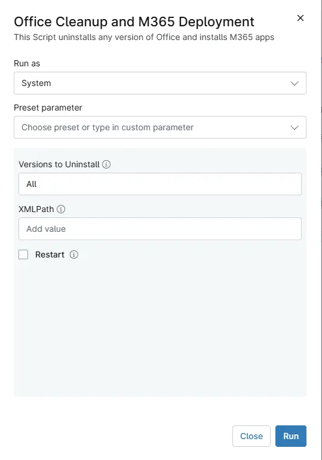

## Overview
This Script uninstalls any version of Office and installs M365 apps

## Sample Run

`Play Button` > `Run Automation` > `Script`  

## Dependenciess

- [Solution: Office Cleanup and M365 Deployment](/docs/f5efe485-4c55-4fe0-88db-05c06305b101)

## Parameters

| Name | Example | Accepted Values | Required | Default | Type | Description |
| ---- | ------- | --------------- | -------- | ------- | ---- | ----------- |
| `Versions to Uninstall` | 2003,2007 | All, 2003, 2007, 2010, 2013, 2016, C2R | False | All     | String/Text | Specifies Office Version that needs to be Uninstalled. Leaving the parameter blank will remove all installed versions. |
| `XMLPath` | `https://pathtoxml.com` `C:\Temp\FileName.xml` |  |False | | String/Text | Installs Microsoft 365 using the specified XML configuration file. Supports both a local file path or a URL. If not provided, a default configuration is used. |
| `Restart` | `0 - 1` |    | False |   | Checkbox |  Optional. Performs a system restart after installation. |

## Automation Setup/Import

[Automation Configuration](https://github.com/ProVal-Tech/ninjarmm/blob/main/scripts/office-cleanup-n-m365-deployment.ps1)

## Output

- Activity Details  

## Changelog

### 2026-30-04

- Initial version of the document