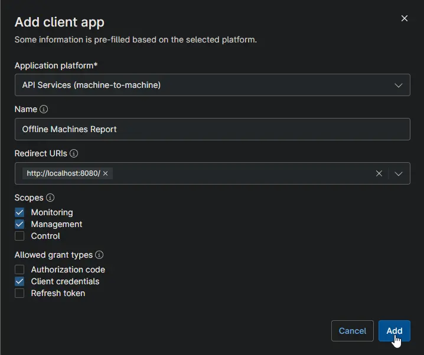
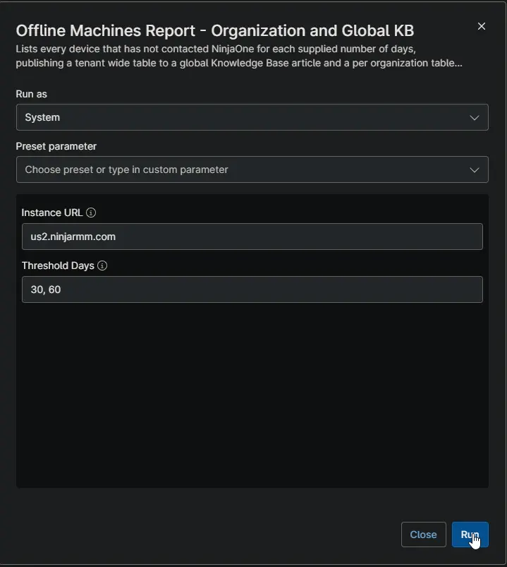
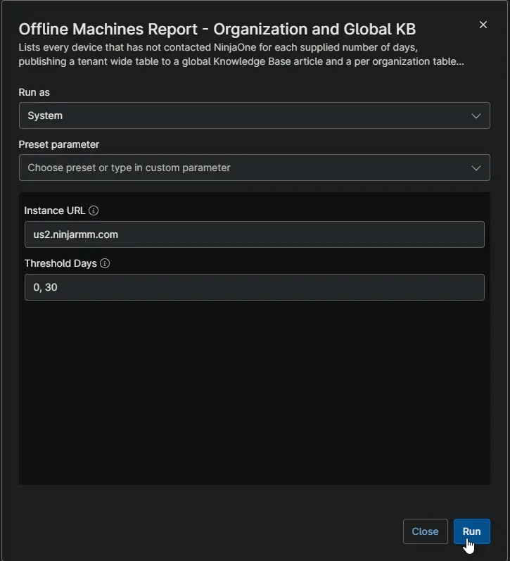
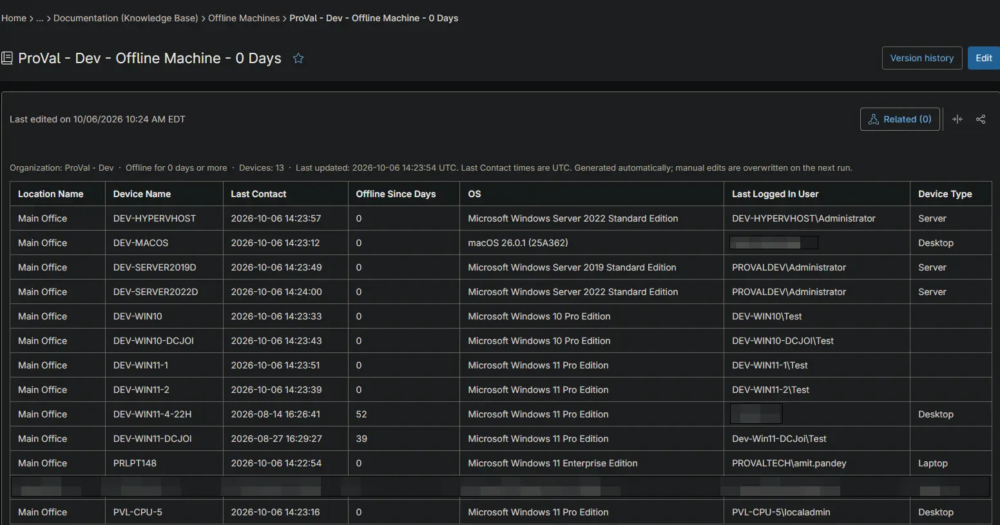
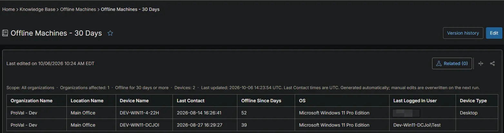

## Overview

This automation reports on devices that have stopped checking in to NinjaOne. For every value supplied in `Threshold Days`, it lists the devices whose last contact is at least that many days old. It publishes a device table to the Knowledge Base of each organization that has such a device, and a tenant-wide table to a global Knowledge Base article.

It is the NinjaOne replacement for the CW Automate *Offline Machines X days Detection per client [Global]* solution. NinjaOne cannot raise client-level tickets, so the offline device list is published as a Knowledge Base table laid out like an Automate dataview instead.

Device data is not collected from the endpoint the script runs on. The script calls the NinjaOne Public API and works from the last contact time NinjaOne already records for every device, authenticating with the OAuth 2.0 client credentials grant. The credential comes from two secure custom fields — [cPVAL Ninja API Client ID](/docs/32142af2-d352-4d0d-9ec3-9dae0a5fef88) and [cPVAL Ninja API Client Secret](/docs/58b01634-4e1a-4793-aafd-18526ea8c80e) — populated once during setup and read at runtime, so no credential is passed in as a script parameter.

Because the report is assembled centrally, run this on a single scheduled device rather than deploying it across the fleet.

> **⚠️ Prerequisite:** Both credential custom fields must be populated before the first run, from an API application configured as described in [API Application Configuration](#api-application-configuration). The script exits without producing a report if it cannot obtain an access token.

## API Application Configuration

> **💡 Already configured?** If [cPVAL Ninja API Client ID](/docs/32142af2-d352-4d0d-9ec3-9dae0a5fef88) and [cPVAL Ninja API Client Secret](/docs/58b01634-4e1a-4793-aafd-18526ea8c80e) are already populated — for example, because [Application Installation Report - Organization and Global KB](/docs/d128edba-4851-4810-8b99-c94e0ac0780a) is already in use — skip this section. This automation needs the same `Monitoring` and `Management` scopes, so the existing API application and credential work as they are. No new application is needed and the custom fields do not need to change.

If no API application exists yet, create one once, before the first run, under **Administration → Apps → API → Client App IDs → Add**.

| Setting | Value | Notes |
| ------- | ----- | ----- |
| Application platform | `API Services (machine-to-machine)` | Required. Pre-fills the dialog for unattended access with no user sign-in. |
| Name | `Offline Machines Report` | Any name works. Naming it after the automation makes the credential easy to identify and revoke later. |
| Redirect URIs | `http://localhost:8080/` | Not used by the client credentials flow, but the field must contain a value. |
| Scopes | `Monitoring`, `Management` | **Monitoring** reads organizations, locations, and devices. **Management** creates, updates, archives, and deletes the Knowledge Base articles. Leave **Control** unchecked — the automation never takes remote action on a device. |
| Allowed grant types | `Client credentials` | Leave **Authorization code** and **Refresh token** unchecked. Client credentials is the only flow the automation uses. |

On **Add**, NinjaOne issues a Client ID and a Client Secret. Copy both into their custom fields straight away:

- Client ID → [cPVAL Ninja API Client ID](/docs/32142af2-d352-4d0d-9ec3-9dae0a5fef88)
- Client Secret → [cPVAL Ninja API Client Secret](/docs/58b01634-4e1a-4793-aafd-18526ea8c80e)

> **⚠️ The Client Secret is shown only once.** If the dialog is closed before it is copied, the secret cannot be retrieved — a new one must be generated, which immediately invalidates the old one. Update the custom field at the same time, or this automation and any other automation sharing the credential will fail to obtain an access token on their next run.
>
> **💡 Note:** Granting only Monitoring and Management keeps the credential to the minimum this automation needs. If the same API application is later reused by other automations, review whether their requirements change the scopes above.

## Sample Run

### Example 1

Runs with `Threshold Days` set to `30, 60`.

Devices whose last contact is at least 30 days old are listed in the global article `Offline Machines - 30 Days`, and those at least 60 days old also appear in `Offline Machines - 60 Days`. Both are written to the global **Offline Machines** folder. Every organization with a qualifying device receives `OrgName - Offline Machine - 30 Days`, `OrgName - Offline Machine - 60 Days`, or both in its own **Offline Machines** folder. An organization with no device over a threshold receives no article for it.

On later runs the same articles are updated in place. If an organization's last 60-day device comes back online, its `OrgName - Offline Machine - 60 Days` article is removed rather than left behind with an empty or outdated table.

### Example 2

Runs with `Threshold Days` set to `0, 30`.

A threshold of `0` lists every device regardless of when it last checked in, including devices that are online right now. `Offline Machines - 0 Days` and the per-organization `OrgName - Offline Machine - 0 Days` articles therefore act as a full machine inventory, showing each device's last contact and the days elapsed since. The 30-day articles are written alongside them, as in Example 1.

The 60-day articles written by Example 1 are left untouched, because `60` is not one of the thresholds supplied in this run.

## Dependencies

- [Custom Field: cPVAL Ninja API Client ID](/docs/32142af2-d352-4d0d-9ec3-9dae0a5fef88)
- [Custom Field: cPVAL Ninja API Client Secret](/docs/58b01634-4e1a-4793-aafd-18526ea8c80e)
- [Solution: Offline Machines Reporting](/docs/ec53fd65-8cd1-4af6-9f78-b3fa97e54af1)

## Parameters

| Name | Calculated Name | Example | Accepted Values | Required | Default | Type | Description |
| ---- | --------------- | ------- | --------------- | -------- | ------- | ---- | ----------- |
| Instance URL | instanceurl | `us2.ninjarmm.com` | Any valid NinjaOne instance host | False | `us2.ninjarmm.com` | string/text | Host name of the NinjaOne instance the API calls are directed at. Set this to match the region your tenant is hosted in. |
| Threshold Days | thresholddays | `30, 60, 90` | Comma-separated whole numbers, `0` or greater | **True** | `30, 60` | string/text | Number of days without contact after which a device is reported. One set of articles is produced for each value. `0` lists every device. |

### Threshold Days

Each value is processed independently in the same run, so a device offline for 75 days appears in the 30-day and 60-day articles but not in the 90-day article. Spaces, blank entries, and repeated values are ignored. A negative or non-numeric entry stops the run before anything is written.

A device is listed against a threshold once at least that many full days have passed since its last contact. Only Windows, macOS, and Linux workstations and servers running the NinjaOne agent are reported. Network devices, virtualization hosts, cloud monitors, and mobile devices are excluded.

### Knowledge Base Articles

Article names carry no date, so every run finds and updates the articles written by the previous one. `X` stands for the threshold value and `OrgName` for the organization name.

| Article Name | Scope | Folder | Written When |
| ------------ | ----- | ------ | ------------ |
| `Offline Machines - X Days` | Global | `Offline Machines` | Every run, for every threshold. States that no devices were found when none qualify. |
| `OrgName - Offline Machine - X Days` | Organization | `Offline Machines` | Only for organizations with at least one device over the threshold. |

- An existing article is updated in place, and a missing one is created. The **Offline Machines** folder is created on first use. The collection time is shown in the caption line of each article.
- An organization article for a threshold supplied in this run is archived and then deleted once that organization no longer has a device over the threshold.
- Articles for thresholds not supplied in this run, and anything outside the **Offline Machines** folder, are never touched.

> **💡 Note:** The folder name and both article name patterns are set in the `#region variables` block of the script rather than as parameters. If they are changed, articles written under the old names are no longer found, updated, or cleaned up, and must be removed manually.

## Custom Fields

| Field Name | Type | Mandatory | Scope | Description |
| ---------- | ---- | --------- | ----- | ----------- |
| [cPVAL Ninja API Client ID](/docs/32142af2-d352-4d0d-9ec3-9dae0a5fef88) | Secure | Yes | System | Client ID of the client-credentials API application used to authenticate against the NinjaOne Public API. Read at runtime. |
| [cPVAL Ninja API Client Secret](/docs/58b01634-4e1a-4793-aafd-18526ea8c80e) | Secure | Yes | System | Client Secret paired with the Client ID above. Read at runtime; never passed as a script parameter. |

## Automation Setup/Import

[Automation Configuration](https://github.com/ProVal-Tech/ninjarmm/blob/main/scripts/offline-machines-report-organization-and-global-kb.ps1)

## Sample Output

**Organization Knowledge Base article:**

**Global Knowledge Base article:**

### Report Columns

| Column | Organization Article | Global Article | Description |
| ------ | -------------------- | -------------- | ----------- |
| Organization Name | No | Yes | Name of the organization as recorded in NinjaOne. |
| Location Name | Yes | Yes | Location the device belongs to. |
| Device Name | Yes | Yes | System name of the device, falling back to its DNS name or display name. |
| Last Contact | Yes | Yes | Date and time, in UTC, the device last contacted NinjaOne. |
| Offline Since Days | Yes | Yes | Whole number of days elapsed since the last contact. |
| OS | Yes | Yes | Operating system reported by the agent. |
| Last Logged In User | Optional | Optional | Last user to log on to the device. |
| Device Type | Optional | Optional | `Server` for any server, and `Desktop` or `Laptop` for a workstation based on the chassis type the agent reports. Left blank when no chassis type is reported. |

> **💡 Note:** Optional columns are added to an article only when NinjaOne returned that information for at least one device listed in it.

## Output

- **Activity Details:** Logs the authentication result, the number of organizations, locations, and devices retrieved, the device count for each threshold, every Knowledge Base article created, updated, or removed, and a run summary.
- **Knowledge Base:** Writes a global article for every threshold and an organization article for every organization with a device over that threshold. Removes organization articles that no longer list any device.

> **💡 Note:** If a table grows past the Knowledge Base article size limit, which in practice only affects a very large global article, it is cut off at a row boundary and a line in the article states how many devices were listed out of the total.

## Changelog

### 2026-10-06

- Initial version of the document
