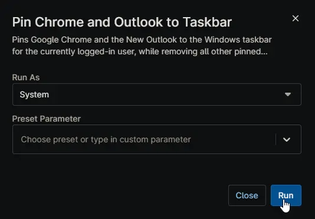

## Overview

Pins Google Chrome and the New Outlook to the Windows taskbar for the currently logged-in user, while removing all other pinned items. This action is restricted to Windows Workstation systems only. This script is executed as automation script from [Configure Taskbar Outlook Chrome Only](/docs/0b21bc06-3e82-4d45-939a-cf2d2425251c) compound conditions.

## Sample Run

## Dependencies

- [Custom Field - cPVAL Configure Taskbar Outlook Chrome Only](/docs/6c8e4e35-3db7-4ff0-8d3c-ec8d0b04e82f)
- [Solution - Configure Taskbar Outlook Chrome Only](/docs/8efbc9f2-0812-40c2-8583-a563049c7762)
- [Solution - Device Standards](/docs/a0c383d4-699a-4bb8-af7f-c2a007747182)

## Automation Setup/Import

[Automation Configuration](https://github.com/ProVal-Tech/ninjarmm/blob/main/scripts/pin-chrome-and-outlook-to-taskbar.ps1)

## Output

- Activity Details
