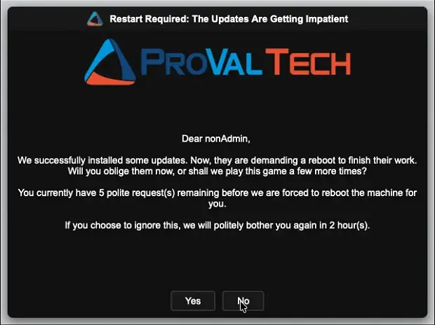
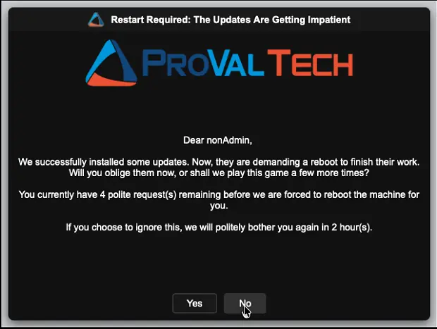
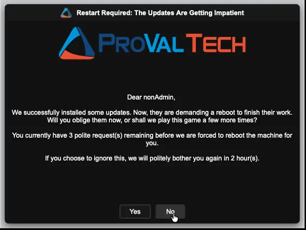
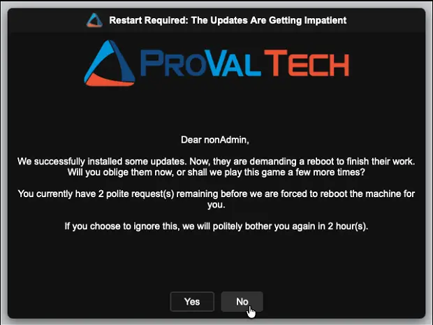
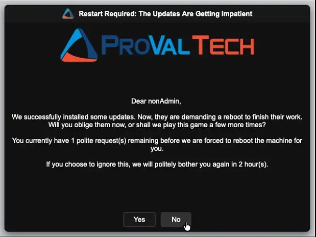
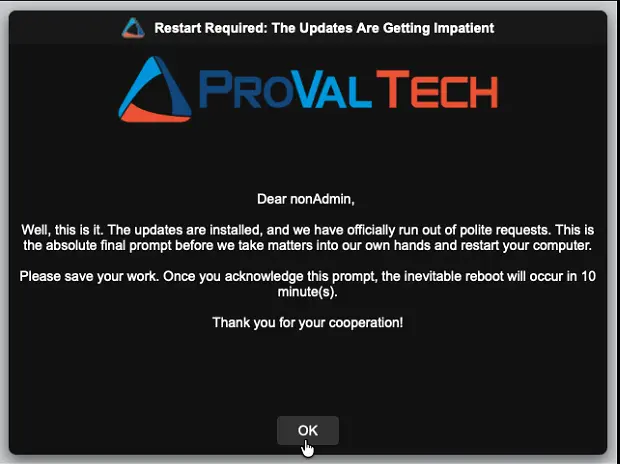
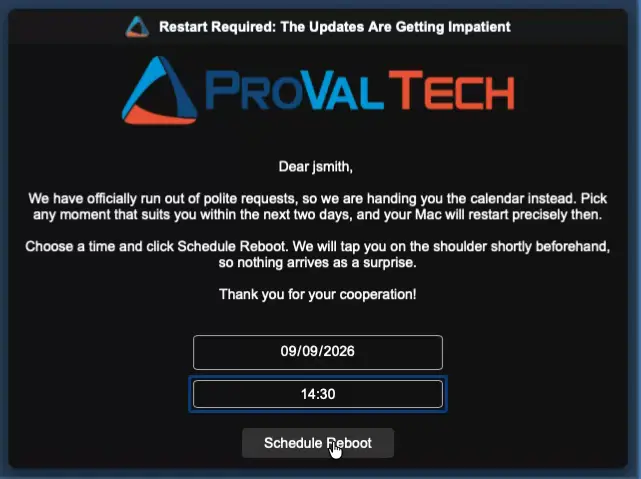
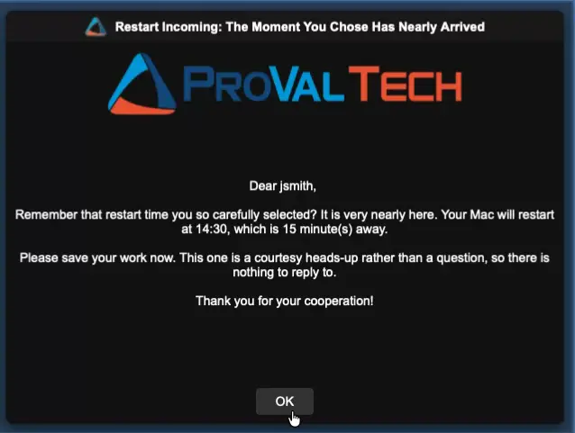

## Overview

This script acts as the remediation (Autofix) component of the "[Reboot Pending Prompt](/docs/d7758fa4-9fcc-4259-a7a5-0ca65dda10eb)" solution for macOS. It is triggered automatically when the [Detection](/docs/0a3f085c-11da-4567-80c3-8ba2f4047e4a) script determines that a reboot is necessary and conditions are right to interrupt the user.

Unlike Windows, where RMM scripts run in an isolated Session 0 and require Scheduled Task wrappers to display a GUI, macOS scripts running as `root` from NinjaRMM can render directly in the console user's active session. Therefore, this script executes the `OmniPrompt.app` utility directly, simplifying the execution flow while maintaining the same robust "Deferral" vs. "Forced" phase logic.

Optionally, the final warning can hand the decision back to the user: with the reboot scheduler enabled they pick their own restart time and receive a reminder shortly before it arrives. See [Reboot Scheduler & Pre-Reboot Reminder](#reboot-scheduler--pre-reboot-reminder).

## Install-In-Progress Protection

Before rebooting an unattended machine (no user logged in, or locked screen with the forced reboot threshold reached), the script checks whether software or updates are currently being installed. If an install is detected, the script exits cleanly without rebooting. It will try again on the next cycle after the install finishes.

This prevents the machine from restarting in the middle of a macOS software update, application installer, or feature upgrade.

The following macOS-specific processes are checked:

| Signal | What It Means |
| :--- | :--- |
| `softwareupdate` | macOS Software Update is actively installing an update |
| `install` | A general macOS installer package is running |
| `msud` | macOS Software Update Daemon is active |
| `setupd` | macOS Setup Assistant or installer is running |
| `osinstallersetupd` | macOS OS Installer is actively performing an upgrade |

> **Note:** This check only blocks unattended reboots. If a user is at their desk and clicks "Yes" or "OK" to reboot, the reboot happens immediately. The user made a conscious choice to restart.

## Reboot Scheduler & Pre-Reboot Reminder

By default the final prompt is a single acknowledgement: the user clicks OK and the restart follows after the configured grace period. The optional scheduler changes that last step, letting the user choose their own restart time instead.

The feature is controlled entirely by `cPVAL Reboot Schedule Max Hours`:

| Value | Behaviour of the Final Prompt |
| :--- | :--- |
| `0` or blank | Unchanged. A single OK button, and the restart follows `cPVAL Final Prompt Reboot Delay Minutes`. |
| Greater than `0` | A date and time picker is shown alongside a **Schedule Reboot** button, covering everything from now to this many hours ahead. |

### How a scheduled restart plays out

1. **The user picks a time** on the final prompt and clicks Schedule Reboot. The choice is written to `cPVAL Scheduled Reboot Time`, the prompt cycle is marked complete, and the script exits without restarting anything.
2. **The device is left alone** while it waits. The Detection automation deliberately stops detecting it, so no further prompts appear for a restart the user has already agreed to.
3. **The reminder appears** once the chosen time comes within `cPVAL Reboot Reminder Lead Minutes`. It states the real restart time and the actual minutes remaining, and carries a single acknowledgement button.
4. **The restart happens** at the moment the user selected. The script clears every tracking field, stamps `cPVAL Reboot Reminder Sent Time`, and waits out the remaining time and then issues the restart with a one minute countdown.

Because macOS has no scheduled task equivalent, the script stays running while the reminder is on screen and until the restart is issued. The automation timeout for this script must therefore be longer than `cPVAL Reboot Reminder Lead Minutes`.

A few edge cases are handled deliberately:

- **A time that has already passed, or one already inside the reminder window,** is treated as "restart now" rather than scheduled. The earliest option the picker offers is the current time, so this is the honest reading of the choice.
- **A device switched off through its scheduled time** is picked up as overdue on its next check-in and restarts late rather than never.
- **An installation in progress** when the reminder falls due pushes the scheduled time forward by one reminder window instead of restarting through the install.
- **A cancelled countdown** (the user runs `shutdown /a`, or a policy aborts it) is noticed after 60 minutes, and the device returns to the normal prompt cycle.

> **⚠️ Important:** `cPVAL Reboot Reminder Lead Minutes` must be set to the same value on both this Autofix automation and the Detection automation. The Detection automation decides when a scheduled restart is due for its reminder, and this script sizes the countdown from it.

## Sample Run

> **Note:**
>
> - It is not recommended to run this script manually. The script is designed for the Autofix action of the [Reboot Pending Prompt - Macintosh](/docs/203e9aa3-5081-487b-b71c-ee8c37a6f769) compound condition.
> - `OmniPrompt` is a cross-platform, Go-based GUI utility that runs natively on macOS without requiring any external runtimes (like .NET).

## Dependencies

- [Custom Field: cPVAL Reboot Prompt Count](/docs/40cf882a-83e1-4197-b536-e6840c498d0c)
- [Custom Field: cPVAL Reboot Prompt Duration Between Prompt](/docs/2b88d214-a59b-4972-a462-121ecfc2a098)
- [Custom Field: cPVAL Reboot Prompt Title](/docs/9003db99-40e0-4450-8ce7-95e273d5c252)
- [Custom Field: cPVAL Reboot Prompt Message](/docs/96249acb-33f6-42ac-bcc1-d37266533397)
- [Custom Field: cPVAL Final Prompt Message](/docs/02ca99e5-85be-4e2e-a77b-3cd94be65566)
- [Custom Field: cPVAL Reboot Prompt Timeout](/docs/cb8acc9e-06df-4408-b986-a35e8cc23cff)
- [Custom Field: cPVAL Final Prompt Timeout](/docs/02cc7b8d-28aa-46c6-936b-21786c56206e)
- [Custom Field: cPVAL Final Prompt Reboot Delay Minutes](/docs/58e81186-a952-40e6-8f06-ad485c52ef2a)
- [Custom Field: cPVAL Reboot Prompt Header Image](/docs/93363322-3d61-484b-abbd-eb5e28bfb6df)
- [Custom Field: cPVAL Reboot Prompt Icon Image](/docs/27c3c19d-d5cb-46ae-97e7-605e682df948)
- [Custom Field: cPVAL Reboot Prompt Theme](/docs/1cef781e-295c-4cf5-aca5-bea0de5537fc)
- [Custom Field: cPVAL Reboot if Not Logged In](/docs/c1c1cb99-496a-4b3a-9a9c-e0fdf7ee4562)
- [Custom Field: cPVAL Reboot During Suppress Period](/docs/32897c40-8b81-4f6b-97eb-6fdc47a20bc5)
- [Custom Field: cPVAL Reboot Prompt Suppress Time Window](/docs/12775f61-616e-4157-9f47-4623433bf68d)
- [Custom Field: cPVAL Max Missed Prompts Before Force](/docs/f93e2bb8-905f-4032-98c5-4d943f0e6580)
- [Custom Field: cPVAL Reboot Prompt Size](/docs/6c47725e-9162-4f6d-aaf8-3e3df24f263b)
- [Custom Field: cPVAL Reboot Prompt Text Box Size](/docs/0b87e4d5-6548-4603-b741-77db2e81b8f3)
- [Custom Field: cPVAL Reboot Prompt Logo Size](/docs/0782fa7d-74e2-462d-8d71-1c9750d90b15)
- [Custom Field: cPVAL Reboot Prompt Text Size](/docs/eb1cc24a-cef3-435f-899a-65743054c3bb)
- [Custom Field: cPVAL Reboot Prompt Text Style](/docs/4336846b-1395-46a5-8c40-b4838b8e8720)
- [Custom Field: cPVAL Reboot Prompt Button Text Style](/docs/124f688c-156e-421c-93be-0b4361bf300c)
- [Custom Field: cPVAL Reboot Prompt Button Text Size](/docs/2eeaaa34-ffca-4f6c-a159-4e91353c3ff2)
- [Custom Field: cPVAL Reboot Prompt Button Size](/docs/4dd04068-bcd3-4ea0-a51b-c59960dffadd)
- [Custom Field: cPVAL Reboot Prompt Title Text Style](/docs/69dec24f-e5be-4973-9cd1-59adde2b94ca)
- [Custom Field: cPVAL Reboot Prompt Title Text Size](/docs/105858ba-5b0a-4927-80be-76e1fc425490)
- [Custom Field: cPVAL Reboot Prompt Title Field Size](/docs/62efc1fe-b6f0-4a1f-99f4-36843a46c566)
- [Custom Field: cPVAL Last Prompted](/docs/fe3a8ca4-3722-4eaf-895a-723f8d563395)
- [Custom Field: cPVAL Times Prompted](/docs/fded67bb-c3a3-40bb-acb1-2baa0464de45)
- [Custom Field: cPVAL Pending Reboot](/docs/31558959-f3a5-4f4f-9388-6e7512972b01)
- [Custom Field: cPVAL Consecutive Missed Prompts](/docs/e61fd6fa-cf42-4315-831f-d4a150bc53d6)
- [Custom Field: cPVAL First Missed Prompt Time](/docs/d6add994-9648-4f4c-9888-b2c8416b0c9a)
- [Custom Field: cPVAL Reboot Schedule Max Hours](/docs/b5ebd2f7-43ab-414e-876f-25d843fcb7bd)
- [Custom Field: cPVAL Reboot Reminder Lead Minutes](/docs/0ee089f7-57f0-4f99-a896-bd366b9ff08c)
- [Custom Field: cPVAL Reboot Reminder Prompt Title](/docs/5877dc91-199c-451e-9f39-a287c82343c2)
- [Custom Field: cPVAL Reboot Reminder Prompt Message](/docs/c738149c-3efb-459e-8bff-96653fa028c4)
- [Custom Field: cPVAL Scheduled Reboot Time](/docs/e5cebd02-17e2-4e64-9ace-c62d8541f52c)
- [Custom Field: cPVAL Reboot Reminder Sent Time](/docs/0181a174-2874-47d1-a18f-009c1aeb7024)
- [Application: OmniPrompt](/docs/8ead1ffd-dade-4e17-9958-3313da9a7aa8)
- [Application: SilentLauncher](/docs/b0b9f423-eee3-4148-b8a0-e99400c45698)
- [Automation: Reboot Pending Prompt - Detection [Macintosh]](/docs/0a3f085c-11da-4567-80c3-8ba2f4047e4a)
- [Solution: Reboot Pending Prompt](/docs/d7758fa4-9fcc-4259-a7a5-0ca65dda10eb)

## Custom Fields

| Custom Field | Type | Example | Scope | Available Options | Editable | Description |
| :--- | :--- | :--- | :--- | :--- | :--- | :--- |
| [cPVAL Reboot Prompt Count](/docs/40cf882a-83e1-4197-b536-e6840c498d0c) | Numeric | `5` | Organization, Location, Device | N/A | Yes | Max deferrals allowed before a forced reboot. |
| [cPVAL Reboot Prompt Duration Between Prompt](/docs/2b88d214-a59b-4972-a462-121ecfc2a098) | Numeric | `4` | Organization, Location, Device | N/A | Yes | Minimum hours to wait between prompts. |
| [cPVAL Reboot Prompt Title](/docs/9003db99-40e0-4450-8ce7-95e273d5c252) | Text | `IT Dept: Important Updates` | Organization, Location, Device | N/A | Yes | Title of the GUI window. |
| [cPVAL Reboot Prompt Message](/docs/96249acb-33f6-42ac-bcc1-d37266533397) | Multi-line | `We installed security patches.` | Organization, Location, Device | N/A | Yes | Custom message body. Supports message substitution variables. |
| [cPVAL Final Prompt Message](/docs/02ca99e5-85be-4e2e-a77b-3cd94be65566) | Multi-line | `Deferrals exhausted.` | Organization, Location, Device | N/A | Yes | Message displayed when no deferrals remain. Supports message substitution variables. |
| [cPVAL Reboot Prompt Timeout](/docs/cb8acc9e-06df-4408-b986-a35e8cc23cff) | Numeric | `600` | Organization, Location, Device | N/A | Yes | Time in seconds before a "Warning" prompt closes automatically. |
| [cPVAL Final Prompt Timeout](/docs/02cc7b8d-28aa-46c6-936b-21786c56206e) | Numeric | `900` | Organization, Location, Device | N/A | Yes | Time in seconds before a "Final" prompt closes automatically. |
| [cPVAL Final Prompt Reboot Delay Minutes](/docs/58e81186-a952-40e6-8f06-ad485c52ef2a) | Numeric | `10` | Organization, Location, Device | N/A | Yes | Grace period (in minutes) after final acknowledgment before the forced reboot occurs. |
| [cPVAL Reboot Prompt Header Image](/docs/93363322-3d61-484b-abbd-eb5e28bfb6df) | Text | `https://example.com/logo.png` | Organization, Location, Device | N/A | Yes | Local file path or URL for the header image. |
| [cPVAL Reboot Prompt Icon Image](/docs/27c3c19d-d5cb-46ae-97e7-605e682df948) | Text | `C:\Logos\icon.ico` | Organization, Location, Device | N/A | Yes | Local file path or URL for the icon image. |
| [cPVAL Reboot Prompt Theme](/docs/1cef781e-295c-4cf5-aca5-bea0de5537fc) | Dropdown | `Dark` | Organization, Location, Device | `Dark`, `Light` | Yes | UI Theme: "Dark" or "Light". |
| [cPVAL Reboot if Not Logged In](/docs/c1c1cb99-496a-4b3a-9a9c-e0fdf7ee4562) | Dropdown | `Enable` | Organization, Location, Device | `Disable`, `Enable` | Yes | Forces reboot immediately if no user session is active. |
| [cPVAL Reboot During Suppress Period](/docs/32897c40-8b81-4f6b-97eb-6fdc47a20bc5) | Dropdown | `Enable` | Organization, Location, Device | `Disable`, `Enable` | Yes | Allows unattended/forced reboots during suppress windows or weekends. |
| [cPVAL Reboot Prompt Suppress Time Window](/docs/12775f61-616e-4157-9f47-4623433bf68d) | Text | `1800-0800` | Organization, Location, Device | N/A | Yes | 24-hour time range (HHmm-HHmm) to suppress prompts. Leave blank to disable. |
| [cPVAL Max Missed Prompts Before Force](/docs/f93e2bb8-905f-4032-98c5-4d943f0e6580) | Numeric | `3` | Organization, Location, Device | N/A | Yes | Number of consecutive missed prompts before forcing a reboot without showing the GUI. Set to `0` to disable. |
| [cPVAL Reboot Prompt Size](/docs/6c47725e-9162-4f6d-aaf8-3e3df24f263b) | Text | `640x480` | Organization, Location, Device | N/A | Yes | Size of the prompt window (WIDTHxHEIGHT). |
| [cPVAL Reboot Prompt Text Box Size](/docs/0b87e4d5-6548-4603-b741-77db2e81b8f3) | Text | `500x200` | Organization, Location, Device | N/A | Yes | Size of the text box (WIDTHxHEIGHT). |
| [cPVAL Reboot Prompt Logo Size](/docs/0782fa7d-74e2-462d-8d71-1c9750d90b15) | Text | `400x150` | Organization, Location, Device | N/A | Yes | Size of the logo (WIDTHxHEIGHT). |
| [cPVAL Reboot Prompt Text Size](/docs/eb1cc24a-cef3-435f-899a-65743054c3bb) | Numeric | `14` | Organization, Location, Device | N/A | Yes | Font size for the message text. |
| [cPVAL Reboot Prompt Text Style](/docs/4336846b-1395-46a5-8c40-b4838b8e8720) | Text | `Arial` | Organization, Location, Device | N/A | Yes | Font family for the message text. |
| [cPVAL Reboot Prompt Button Text Style](/docs/124f688c-156e-421c-93be-0b4361bf300c) | Text | `Arial` | Organization, Location, Device | N/A | Yes | Font family for button text. |
| [cPVAL Reboot Prompt Button Text Size](/docs/2eeaaa34-ffca-4f6c-a159-4e91353c3ff2) | Numeric | `14` | Organization, Location, Device | N/A | Yes | Font size for button text. |
| [cPVAL Reboot Prompt Button Size](/docs/4dd04068-bcd3-4ea0-a51b-c59960dffadd) | Text | `100x40` | Organization, Location, Device | N/A | Yes | Size of each button (WIDTHxHEIGHT). |
| [cPVAL Reboot Prompt Title Text Style](/docs/69dec24f-e5be-4973-9cd1-59adde2b94ca) | Text | `Arial` | Organization, Location, Device | N/A | Yes | Font family for the title bar text. |
| [cPVAL Reboot Prompt Title Text Size](/docs/105858ba-5b0a-4927-80be-76e1fc425490) | Numeric | `14` | Organization, Location, Device | N/A | Yes | Font size for the title bar text. |
| [cPVAL Reboot Prompt Title Field Size](/docs/62efc1fe-b6f0-4a1f-99f4-36843a46c566) | Text | `640x35` | Organization, Location, Device | N/A | Yes | Size of the title bar (WIDTHxHEIGHT). |
| [cPVAL Last Prompted](/docs/fe3a8ca4-3722-4eaf-895a-723f8d563395) | Text | `2024-05-20 14:30:00` | Device | N/A | No | Updated to current timestamp if user defers. Updated by script. |
| [cPVAL Times Prompted](/docs/fded67bb-c3a3-40bb-acb1-2baa0464de45) | Numeric | `2` | Device | N/A | No | Incremented by 1 if user defers. Resets to 0 on Reboot. Updated by script. |
| [cPVAL Pending Reboot](/docs/31558959-f3a5-4f4f-9388-6e7512972b01) | Checkbox | `False` | Device | `True`, `False` | Yes | Set to False upon successful reboot initiation. Updated by script. |
| [cPVAL Consecutive Missed Prompts](/docs/e61fd6fa-cf42-4315-831f-d4a150bc53d6) | Numeric | `2` | Device | N/A | No | Tracks consecutive missed prompts. Managed by the Detection script and reset on reboot. |
| [cPVAL First Missed Prompt Time](/docs/d6add994-9648-4f4c-9888-b2c8416b0c9a) | Text | `2024-05-20 14:30:00` | Device | N/A | No | Records when the current missed-prompt streak started. Managed by the Detection script and reset on reboot. |
| [cPVAL Reboot Schedule Max Hours](/docs/b5ebd2f7-43ab-414e-876f-25d843fcb7bd) | Numeric | `48` | Organization, Location, Device | N/A | Yes | Maximum hours ahead the user may schedule their restart on the final prompt. Set to `0` to disable the scheduler and the reminder entirely. |
| [cPVAL Reboot Reminder Lead Minutes](/docs/0ee089f7-57f0-4f99-a896-bd366b9ff08c) | Numeric | `15` | Organization, Location, Device | N/A | Yes | How many minutes ahead of a scheduled restart the reminder appears and the countdown begins. Must match the Detection value. |
| [cPVAL Reboot Reminder Prompt Title](/docs/5877dc91-199c-451e-9f39-a287c82343c2) | Text | `Restart Starting Soon` | Organization, Location, Device | N/A | Yes | Title of the pre-reboot reminder window. |
| [cPVAL Reboot Reminder Prompt Message](/docs/c738149c-3efb-459e-8bff-96653fa028c4) | Multi-line | `Your restart begins at ScheduledRebootTime.` | Organization, Location, Device | N/A | Yes | Message body of the pre-reboot reminder. Supports message substitution variables. Avoid using single quotation marks (') in the message. |
| [cPVAL Scheduled Reboot Time](/docs/e5cebd02-17e2-4e64-9ace-c62d8541f52c) | Text | `2026-09-09 14:30:00` | Device | N/A | No | The restart time the user selected. Written when a restart is scheduled and cleared once the reminder fires. Updated by script. |
| [cPVAL Reboot Reminder Sent Time](/docs/0181a174-2874-47d1-a18f-009c1aeb7024) | Text | `2026-09-09 14:15:00` | Device | N/A | No | Records when the reminder was sent and the countdown began. A value here means a restart is already pending. Updated by script. |

## Configuration Hierarchy

The solution evaluates settings using a strict top-down hierarchy. If a value is configured at a higher priority level, it overrides the lower levels.

| Priority | Level | Description |
| :--- | :--- | :--- |
| **1 (Highest)** | **Device Level Custom Field** | Overrides all lower levels. Applied to a specific endpoint. |
| **2** | **Location Level Custom Field** | Overrides Organization level. Applied to all endpoints in a location. |
| **3** | **Organization Level Custom Field** | Global default for the entire tenant. |
| **4 (Lowest)** | **Script Runtime Variable** | Ultimate fallback default used if the custom field is blank at all levels. |

## Script Variables

Instead of hardcoding defaults, the script relies on NinjaRMM Script Variables as the ultimate fallback mechanism. You can configure these variables directly in the script's settings within NinjaRMM to establish global baseline behaviors without modifying the script file.

| Name | Type | Example | Default | Available Options | Description |
| :--- | :--- | :--- | :--- | :--- | :--- |
| `Prompt Title` | String/Text | `Action Required` | `Updates Installed - Reboot Required` | N/A | Title of the GUI window. |
| `Regular Prompt Message` | String/Text | `Security updates applied.` | Built-in standard message | N/A | Default message for regular prompts. Supports message substitution variables. |
| `Final Prompt Message` | String/Text | `Final warning.` | Built-in final warning message | N/A | Default message for final prompts. Supports message substitution variables. |
| `Prompt Count` | Integer | `5` | `4` | N/A | Max deferrals allowed before a forced reboot. |
| `Final Reboot Delay Minutes` | Integer | `10` | `5` | N/A | Grace period after final acknowledgment. |
| `Duration Between Prompts` | Integer | `6` | `4` | N/A | Minimum hours to wait between prompts. |
| `Regular Prompt Timeout Seconds` | Integer | `600` | `300` | N/A | Time in seconds before a Warning prompt closes automatically. |
| `Final Prompt Timeout Seconds` | Integer | `1200` | `900` | N/A | Time in seconds before a Final prompt closes automatically. |
| `Prompt Theme` | Dropdown | `Light` | `Dark` | `Dark`, `Light` | Sets the UI theme. |
| `Header Image` | String/Text | `https://example.com/logo.png` | *(blank)* | N/A | Local file path or URL for the header image. |
| `Icon Image` | String/Text | `/opt/logos/icon.icns` | *(blank)* | N/A | Local file path or URL for the icon image. |
| `Suppress Time Window` | String/Text | `1800-0800` | *(blank)* | N/A | 24h time range (HHmm-HHmm) to suppress prompts. |
| `Max Missed Prompts Before Force` | Integer | `3` | `0` | N/A | Number of consecutive missed prompts before forcing a reboot without GUI. |
| `Reboot If Not Logged In` | Dropdown | `Enable` | `Disable` | `Disable`, `Enable` | Enable to reboot immediately if no user is signed in. |
| `Reboot During Suppress Period` | Dropdown | `Enable` | `Disable` | `Disable`, `Enable` | Fallback default. Allows unattended/forced reboots during suppress windows. |
| `Reboot Schedule Max Hours` | Integer | `48` | `0` | N/A | Maximum hours ahead the user may schedule their restart on the final prompt. `0` disables the scheduler and the reminder. |
| `Reboot Reminder Lead Minutes` | Integer | `15` | `15` | N/A | How many minutes ahead of a scheduled restart the reminder appears. Must match the Detection value. |
| `Reminder Prompt Title` | String/Text | `Restart Starting Soon` | `Reboot Required - Starting Soon` | N/A | Title of the pre-reboot reminder window. |
| `Reminder Prompt Message` | String/Text | `Your restart begins shortly.` | Built-in reminder message | N/A | Default message for the pre-reboot reminder. Supports message substitution variables. |

> **💡 Note:** Do not attempt to change default values by editing the script file directly. Modifying the script may break its execution. Always use Custom Fields or Script Variables to adjust behaviors.

## Message Substitution Variables

The following tokens can be used in ANY prompt message - the Regular Prompt Message, the Final Prompt Message, or their custom-field equivalents (`cPVAL Reboot Prompt Message` / `cPVAL Final Prompt Message`). Write them in PascalCase with NO surrounding symbols; each is replaced with its live value when the prompt is displayed.

| Token | Description | Example |
| :--- | :--- | :--- |
| `PromptsToSend` | Total prompts the user will receive (regular + final) | `5` |
| `PromptsSent` | Number of prompts shown so far, including the current one | `2` |
| `PromptsLeft` | Remaining prompts before the forced/final one | `3` |
| `PromptIntervalMinutes` | Interval between prompts, in minutes | `240` |
| `PromptIntervalHours` | Same interval, in hours | `4` |
| `RegularTimeoutSeconds` | Regular prompt timeout, in seconds | `600` |
| `RegularTimeoutMinutes` | Same timeout, in minutes | `10` |
| `FinalTimeoutSeconds` | Final prompt timeout, in seconds | `900` |
| `FinalTimeoutMinutes` | Same timeout, in minutes | `15` |
| `DelayAfterFinalSeconds` | Delay after the final prompt before reboot, in seconds | `900` |
| `DelayAfterFinalMinutes` | Same delay, in minutes | `15` |
| `ScheduledRebootTime` | Clock time (HH:MM) of the automatic reboot. On a regular or final prompt this is now plus the final delay; on the pre-reboot reminder it is the real time the user selected | `14:30` |
| `MinutesUntilReboot` | Minutes until the automatic reboot. On a regular or final prompt this is the final delay; on the pre-reboot reminder it is the actual minutes remaining | `10` |
| `ComputerName` | Machine name | `MAC-OFFICE-01` |
| `UserName` | Logged-in (console) username | `jsmith` |

## Automation Setup/Import

[Automation Configuration](https://github.com/ProVal-Tech/ninjarmm/blob/main/scripts/reboot-pending-prompt-autofix-macintosh.sh)

## Output

- **Activity Details:** Logs the interaction result (e.g., "User declined reboot", "User opted to reboot", or "Final prompt acknowledged").
- **Custom Fields:** Updates `cPVAL Last Prompted` and increments `cPVAL Times Prompted` if the user defers. Resets `cPVAL Pending Reboot`, `cPVAL Last Prompted`, `cPVAL Times Prompted`, `cPVAL Consecutive Missed Prompts`, and `cPVAL First Missed Prompt Time` if the reboot is initiated. Writes `cPVAL Scheduled Reboot Time` when a user schedules their restart, and stamps `cPVAL Reboot Reminder Sent Time` when the reminder is sent and the countdown begins.
- **User Prompt:** Displays the `OmniPrompt` GUI directly in the console user's session.

## Prompt Progression & Message Examples

The script calculates the number of remaining prompts by subtracting the times the user has already been prompted (`cPVAL Times Prompted`) from the maximum allowed deferrals (`cPVAL Reboot Prompt Count`). The user sees this count in every message they receive.

### Understanding the Count

The **first prompt displays the same number as `cPVAL Reboot Prompt Count`** (e.g., 4) because this represents the total "deferrals" available. However, an additional **final mandatory prompt** is always added after all deferrals are exhausted. This means if you set `cPVAL Reboot Prompt Count` to **4**, the user will receive:

- **4 regular prompts** (Yes/No buttons) — user can defer
- **1 final prompt** (OK button only) — reboot is mandatory
- **Total: 5 prompts before forced reboot**

> **💡 Note:** When the reboot scheduler is enabled through `cPVAL Reboot Schedule Max Hours`, the final prompt becomes a scheduling prompt rather than a plain acknowledgement, and one further **pre-reboot reminder** is shown shortly before the restart the user chose. The number of regular prompts is unaffected.

## Sample Prompts

### Example Configuration: Standard Final Prompt

| Custom Field | Value |
| :--- | :--- |
| `cPVAL Pending Reboot` | `Yes` |
| `cPVAL Reboot Prompt Count` | `5` |
| `cPVAL Reboot Schedule Max Hours` | `0` *(scheduler disabled)* |
| `cPVAL Reboot Prompt Title` | `Restart Required: The Updates Are Getting Impatient` |
| `cPVAL Reboot Prompt Message` | `Dear UserName, \n\nWe successfully installed some updates. Now, they are demanding a reboot to finish their work. Will you oblige them now, or shall we play this game a few more times?\n\nYou currently have PromptsLeft polite request(s) remaining before we are forced to reboot the machine for you.\n\nIf you choose to ignore this, we will politely bother you again in PromptIntervalHours hour(s).` |
| `cPVAL Reboot Prompt Timeout` | `600` |
| `cPVAL Final Prompt Message` | `Dear UserName, \n\nWell, this is it. The updates are installed, and we have officially run out of polite requests. This is the absolute final prompt before we take matters into our own hands and restart your computer.\n\nPlease save your work. Once you acknowledge this prompt, the inevitable reboot will occur in DelayAfterFinalMinutes minute(s).\n\nThank you for your cooperation\!` |
| `cPVAL Final Prompt Timeout` | `900` |
| `cPVAL Reboot Prompt Theme` | `Dark` |
| `cPVAL Reboot Prompt Header Image` | `https://content.provaltech.com/img/logo_r4.png` |
| `cPVAL Reboot Prompt Icon Image` | `https://www.provaltech.com/favicon.ico` |

**Prompt 1** (5 remaining):  

**Prompt 2** (4 remaining):  

**Prompt 3** (3 remaining):  

**Prompt 4** (2 remaining):  

**Prompt 5** (1 remaining):  

**Prompt 6** (Final - 0 remaining):  

**macOS Reboot Behavior:** `Unlike Windows, macOS does not display a shutdown message. When the user clicks "Yes" to reboot, the system will restart approximately one minute later. This delay allows the script sufficient time to update the custom fields before the reboot occurs.`

### Example Configuration: Scheduled Final Prompt

The configuration above ends with a plain acknowledgement because `cPVAL Reboot Schedule Max Hours` is `0`. Raise it above zero and the last prompt hands the decision to the user instead, followed by a reminder shortly before their chosen moment arrives.

| Custom Field | Value |
| :--- | :--- |
| `cPVAL Pending Reboot` | `Yes` |
| `cPVAL Reboot Prompt Count` | `5` |
| `cPVAL Reboot Schedule Max Hours` | `48` |
| `cPVAL Reboot Reminder Lead Minutes` | `15` |
| `cPVAL Reboot Prompt Title` | `Restart Required: The Updates Are Getting Impatient` |
| `cPVAL Final Prompt Message` | `Dear UserName, \n\nWe have officially run out of polite requests, so we are handing you the calendar instead. Pick any moment that suits you within the next two days, and your Mac will restart precisely then.\n\nChoose a time and click Schedule Reboot. We will tap you on the shoulder shortly beforehand, so nothing arrives as a surprise.\n\nThank you for your cooperation\!` |
| `cPVAL Final Prompt Timeout` | `900` |
| `cPVAL Reboot Reminder Prompt Title` | `Restart Incoming: The Moment You Chose Has Nearly Arrived` |
| `cPVAL Reboot Reminder Prompt Message` | `Dear UserName, \n\nRemember that restart time you so carefully selected? It is very nearly here. Your Mac will restart at ScheduledRebootTime, which is MinutesUntilReboot minute(s) away.\n\nPlease save your work now. This one is a courtesy heads-up rather than a question, so there is nothing to reply to.\n\nThank you for your cooperation\!` |
| `cPVAL Reboot Prompt Theme` | `Dark` |
| `cPVAL Reboot Prompt Header Image` | `https://content.provaltech.com/img/logo_r4.png` |
| `cPVAL Reboot Prompt Icon Image` | `https://www.provaltech.com/favicon.ico` |

Prompts 1 through 5 are identical to the examples above. Only the final prompt changes, and a reminder is added:

**Prompt 6** (Final - user picks a restart time):  

**Pre-Reboot Reminder** (shown shortly before the chosen time):  

## Changelog

### 2026-09-09

- Added the optional reboot scheduler. When `cPVAL Reboot Schedule Max Hours` is greater than `0`, the final prompt presents a date and time picker so the user can choose their own restart time, and a pre-reboot reminder is shown shortly before it arrives.
- Added the new custom fields `cPVAL Reboot Schedule Max Hours`, `cPVAL Reboot Reminder Lead Minutes`, `cPVAL Reboot Reminder Prompt Title`, `cPVAL Reboot Reminder Prompt Message`, `cPVAL Scheduled Reboot Time`, and `cPVAL Reboot Reminder Sent Time`.
- Added the new script variables `Reboot Schedule Max Hours`, `Reboot Reminder Lead Minutes`, `Reminder Prompt Title`, and `Reminder Prompt Message`.
- Leaving `cPVAL Reboot Schedule Max Hours` at `0` keeps the previous behaviour exactly, with no scheduler and no reminder.
- The `ScheduledRebootTime` and `MinutesUntilReboot` substitution variables now resolve to the real restart time and the actual minutes remaining when used on the pre-reboot reminder.
- The reminder prompt is displayed in the foreground, matching how the regular and final prompts are shown, which is the only invocation reliably rendered on macOS.
- The restart is issued with a one minute countdown so the agent has time to save the custom field updates before the machine goes down. The wait beforehand is shortened by the same minute, so the restart still lands on the time the user selected.
- The tracking fields are cleared immediately before the restart. If the script is interrupted while the reminder is on screen, the scheduled time survives and the next cycle retries, so an interrupted run becomes a late restart rather than a lost one.

### 2026-07-20

- Initial version of the document.
