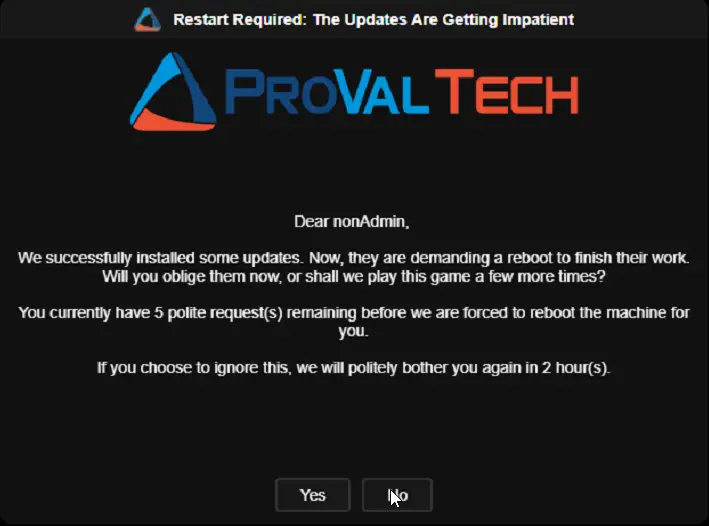
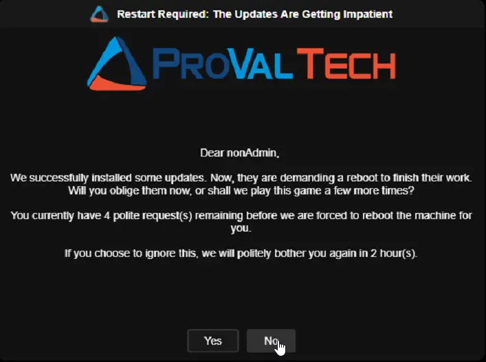
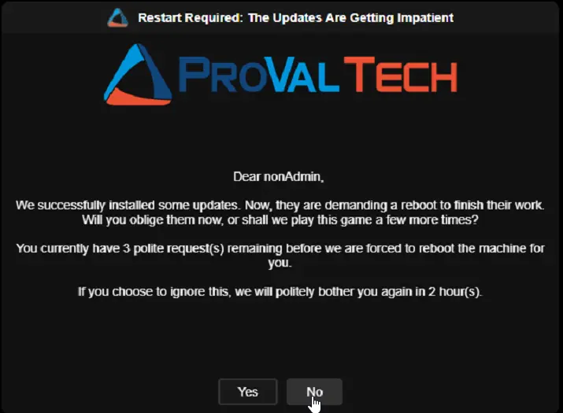
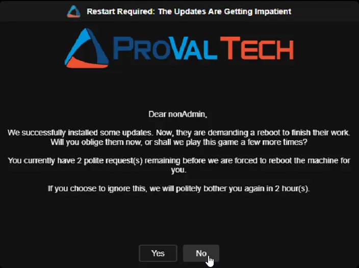
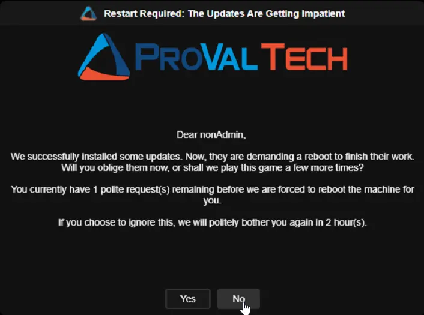
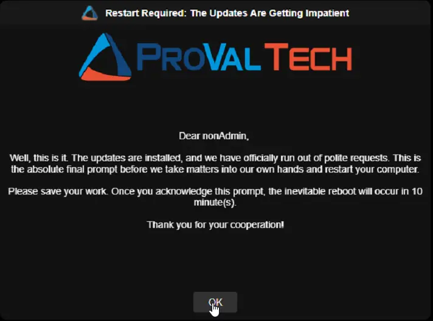
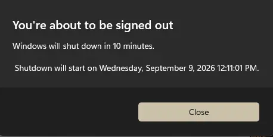

## Overview

This script acts as the remediation (Autofix) component of the "[Reboot Pending Prompt](/docs/d7758fa4-9fcc-4259-a7a5-0ca65dda10eb)" solution. It is triggered automatically when the [Detection](/docs/9817ce6b-6f8c-4718-844f-4f44f6c66376) script determines that a reboot is necessary and conditions are right to interrupt the user.

Since RMM scripts run in the background (Session 0) and cannot normally show windows to the user, this script utilizes a temporary Scheduled Task to bypass this limitation. It launches a branded GUI utility (`OmniPrompt.exe`) inside the active user's session. Depending on how many times the user has already postponed the reboot, the script will either present a "Yes/No" deferral option or a "Final Warning" that enforces the reboot after a few minutes.

## Install-In-Progress Protection

Before rebooting an unattended machine (no user logged in, or locked screen with the forced reboot threshold reached), the script checks whether software or updates are currently being installed. If an install is detected, the script exits cleanly without rebooting. It will try again on the next cycle after the install finishes.

This prevents the machine from restarting in the middle of a Windows Update, application installer, or feature upgrade.

The following processes and signals are checked:

| Signal | What It Means |
| :--- | :--- |
| TiWorker.exe | Windows Update is actively installing an update |
| wusa.exe | A standalone Windows Update package is being installed |
| SetupHost.exe | A Windows Feature Update is in progress |
| setup.exe | A general installer is running |
| MoUsoCoreWorker.exe | The Windows Update orchestrator is doing background work |
| Windows10Upgrader.exe | A feature upgrade using the Windows Update Agent is running |
| winget.exe (active) | Windows Package Manager is installing or updating software (only when actively using CPU) |
| MSI mutex held | An MSI installer package is currently running |

> **Note:** This check only blocks unattended reboots. If a user clicks "Yes" to reboot, the reboot happens immediately. The user made a conscious choice to restart.

## Sample Run

> **Note:**
>
> - It is not recommended to run this script manually. The script is designed for the Autofix script of [Reboot Pending Prompt - Windows Workstation](/docs/b540cb53-0d54-4d63-9ce4-073732fd1aa3) compound condition.
> - OmniPrompt is a cross-platform, Go-based GUI utility that runs natively on Windows without requiring .NET runtime.

## Dependencies

- [Custom Field: cPVAL Pending Reboot](/docs/31558959-f3a5-4f4f-9388-6e7512972b01)
- [Custom Field: cPVAL Last Prompted](/docs/fe3a8ca4-3722-4eaf-895a-723f8d563395)
- [Custom Field: cPVAL Times Prompted](/docs/fded67bb-c3a3-40bb-acb1-2baa0464de45)
- [Custom Field: cPVAL Reboot Prompt Count](/docs/40cf882a-83e1-4197-b536-e6840c498d0c)
- [Custom Field: cPVAL Reboot Prompt Duration Between Prompt](/docs/2b88d214-a59b-4972-a462-121ecfc2a098)
- [Custom Field: cPVAL Reboot Prompt Title](/docs/9003db99-40e0-4450-8ce7-95e273d5c252)
- [Custom Field: cPVAL Reboot Prompt Message](/docs/96249acb-33f6-42ac-bcc1-d37266533397)
- [Custom Field: cPVAL Reboot Prompt Timeout](/docs/cb8acc9e-06df-4408-b986-a35e8cc23cff)
- [Custom Field: cPVAL Final Prompt Message](/docs/02ca99e5-85be-4e2e-a77b-3cd94be65566)
- [Custom Field: cPVAL Final Prompt Timeout](/docs/02cc7b8d-28aa-46c6-936b-21786c56206e)
- [Custom Field: cPVAL Final Prompt Reboot Delay Minutes](/docs/58e81186-a952-40e6-8f06-ad485c52ef2a)
- [Custom Field: cPVAL Reboot Prompt Header Image](/docs/93363322-3d61-484b-abbd-eb5e28bfb6df)
- [Custom Field: cPVAL Reboot Prompt Icon Image](/docs/27c3c19d-d5cb-46ae-97e7-605e682df948)
- [Custom Field: cPVAL Reboot Prompt Theme](/docs/1cef781e-295c-4cf5-aca5-bea0de5537fc)
- [Custom Field: cPVAL Reboot if Not Logged In](/docs/c1c1cb99-496a-4b3a-9a9c-e0fdf7ee4562)
- [Custom Field: cPVAL Reboot During Suppress Period](/docs/32897c40-8b81-4f6b-97eb-6fdc47a20bc5)
- [Custom Field: cPVAL Reboot Prompt Suppress Time Window](/docs/12775f61-616e-4157-9f47-4623433bf68d)
- [Custom Field: cPVAL Max Missed Prompts Before Force](/docs/f93e2bb8-905f-4032-98c5-4d943f0e6580)
- [Custom Field: cPVAL Consecutive Missed Prompts](/docs/e61fd6fa-cf42-4315-831f-d4a150bc53d6)
- [Custom Field: cPVAL First Missed Prompt Time](/docs/d6add994-9648-4f4c-9888-b2c8416b0c9a)
- [Custom Field: cPVAL Reboot Prompt Size](/docs/6c47725e-9162-4f6d-aaf8-3e3df24f263b)
- [Custom Field: cPVAL Reboot Prompt Text Box Size](/docs/0b87e4d5-6548-4603-b741-77db2e81b8f3)
- [Custom Field: cPVAL Reboot Prompt Logo Size](/docs/0782fa7d-74e2-462d-8d71-1c9750d90b15)
- [Custom Field: cPVAL Reboot Prompt Text Size](/docs/eb1cc24a-cef3-435f-899a-65743054c3bb)
- [Custom Field: cPVAL Reboot Prompt Text Style](/docs/4336846b-1395-46a5-8c40-b4838b8e8720)
- [Custom Field: cPVAL Reboot Prompt Button Text Style](/docs/124f688c-156e-421c-93be-0b4361bf300c)
- [Custom Field: cPVAL Reboot Prompt Button Text Size](/docs/2eeaaa34-ffca-4f6c-a159-4e91353c3ff2)
- [Custom Field: cPVAL Reboot Prompt Button Size](/docs/4dd04068-bcd3-4ea0-a51b-c59960dffadd)
- [Custom Field: cPVAL Reboot Prompt Title Text Style](/docs/69dec24f-e5be-4973-9cd1-59adde2b94ca)
- [Custom Field: cPVAL Reboot Prompt Title Text Size](/docs/105858ba-5b0a-4927-80be-76e1fc425490)
- [Custom Field: cPVAL Reboot Prompt Title Field Size](/docs/62efc1fe-b6f0-4a1f-99f4-36843a46c566)
- [Application: OmniPrompt](https://github.com/ProVal-Tech/OmniPrompt)
- [Automation: Reboot Pending Prompt - Detection](/docs/9817ce6b-6f8c-4718-844f-4f44f6c66376)
- [Solution: Reboot Pending Prompt](/docs/d7758fa4-9fcc-4259-a7a5-0ca65dda10eb)

## Custom Fields

| Custom Field | Type | Example | Scope | Available Options | Editable | Description |
| :--- | :--- | :--- | :--- | :--- | :--- | :--- |
| [cPVAL Reboot Prompt Count](/docs/40cf882a-83e1-4197-b536-e6840c498d0c) | Numeric | `5` | Organization, Location, Device | N/A | Yes | Max deferrals allowed before a forced reboot. |
| [cPVAL Reboot Prompt Duration Between Prompt](/docs/2b88d214-a59b-4972-a462-121ecfc2a098) | Numeric | `4` | Organization, Location, Device | N/A | Yes | Minimum hours to wait between prompts. Used for message display text only in this script. |
| [cPVAL Reboot Prompt Title](/docs/9003db99-40e0-4450-8ce7-95e273d5c252) | Text | `IT Dept: Important Updates` | Organization, Location, Device | N/A | Yes | Title of the GUI window. |
| [cPVAL Reboot Prompt Message](/docs/96249acb-33f6-42ac-bcc1-d37266533397) | Multi-line | `We installed security patches.` | Organization, Location, Device, End User | N/A | Yes | Custom message body. Supports message substitution variables (e.g., PromptsLeft, PromptIntervalHours). The script automatically appends the question and remaining count to whatever text you provide. Avoid using single quotation marks (') in the message. Use regular quotes (") if needed. |
| [cPVAL Final Prompt Message](/docs/02ca99e5-85be-4e2e-a77b-3cd94be65566) | Multi-line | `Deferrals exhausted.` | Organization, Location, Device | N/A | Yes | Message displayed when no deferrals remain. Supports message substitution variables (e.g., DelayAfterFinalMinutes). The script automatically appends the reboot warning and timer to your text. Avoid using single quotation marks (') in the message. Use regular quotes (") if needed. |
| [cPVAL Reboot Prompt Timeout](/docs/cb8acc9e-06df-4408-b986-a35e8cc23cff) | Numeric | `600` | Organization, Location, Device | N/A | Yes | Time in seconds before a "Warning" prompt closes automatically (defaults to deferral). |
| [cPVAL Final Prompt Timeout](/docs/02cc7b8d-28aa-46c6-936b-21786c56206e) | Numeric | `900` | Organization, Location, Device | N/A | Yes | Time in seconds before a "Final" prompt closes automatically (defaults to forced reboot). |
| [cPVAL Final Prompt Reboot Delay Minutes](/docs/58e81186-a952-40e6-8f06-ad485c52ef2a) | Numeric | `10` | Organization, Location, Device | N/A | Yes | Grace period (in minutes) after final acknowledgment before the forced reboot occurs. |
| [cPVAL Reboot Prompt Header Image](/docs/93363322-3d61-484b-abbd-eb5e28bfb6df) | Text | `https://example.com/logo.png` | Organization, Location, Device | N/A | Yes | Local file path or URL for the header image. |
| [cPVAL Reboot Prompt Icon Image](/docs/27c3c19d-d5cb-46ae-97e7-605e682df948) | Text | `C:\Logos\icon.ico` | Organization, Location, Device | N/A | Yes | Local file path or URL for the icon image. |
| [cPVAL Reboot Prompt Theme](/docs/1cef781e-295c-4cf5-aca5-bea0de5537fc) | Dropdown | `Dark` | Organization, Location, Device | `Dark`, `Light` | Yes | UI Theme: "Dark" or "Light". |
| [cPVAL Reboot if Not Logged In](/docs/c1c1cb99-496a-4b3a-9a9c-e0fdf7ee4562) | Dropdown | `Enable` | Organization, Location, Device | `Disable`, `Enable` | Yes | Forces reboot immediately if no user session is active. |
| [cPVAL Reboot During Suppress Period](/docs/32897c40-8b81-4f6b-97eb-6fdc47a20bc5) | Dropdown | `Enable` | Organization, Location, Device | `Disable`, `Enable` | Yes | Allows unattended/forced reboots during suppress windows or weekends. |
| [cPVAL Reboot Prompt Suppress Time Window](/docs/12775f61-616e-4157-9f47-4623433bf68d) | Text | `1800-0800` | Organization, Location, Device | N/A | Yes | 24-hour time range (HHmm-HHmm) to suppress prompts. Leave blank to disable. |
| [cPVAL Max Missed Prompts Before Force](/docs/f93e2bb8-905f-4032-98c5-4d943f0e6580) | Numeric | `3` | Organization, Location, Device | N/A | Yes | Number of consecutive missed prompts before forcing a reboot without showing the GUI. Set to `0` to disable. |
| [cPVAL Reboot Prompt Size](/docs/6c47725e-9162-4f6d-aaf8-3e3df24f263b) | Text | `640x480` | Organization, Location, Device | N/A | Yes | Size of the prompt window (WIDTHxHEIGHT). |
| [cPVAL Reboot Prompt Text Box Size](/docs/0b87e4d5-6548-4603-b741-77db2e81b8f3) | Text | `500x200` | Organization, Location, Device | N/A | Yes | Size of the text box (WIDTHxHEIGHT). |
| [cPVAL Reboot Prompt Logo Size](/docs/0782fa7d-74e2-462d-8d71-1c9750d90b15) | Text | `400x150` | Organization, Location, Device | N/A | Yes | Size of the logo (WIDTHxHEIGHT). |
| [cPVAL Reboot Prompt Text Size](/docs/eb1cc24a-cef3-435f-899a-65743054c3bb) | Numeric | `14` | Organization, Location, Device | N/A | Yes | Font size for the message text. |
| [cPVAL Reboot Prompt Text Style](/docs/4336846b-1395-46a5-8c40-b4838b8e8720) | Text | `Arial` | Organization, Location, Device | N/A | Yes | Font family for the message text. |
| [cPVAL Reboot Prompt Button Text Style](/docs/124f688c-156e-421c-93be-0b4361bf300c) | Text | `Arial` | Organization, Location, Device | N/A | Yes | Font family for button text. |
| [cPVAL Reboot Prompt Button Text Size](/docs/2eeaaa34-ffca-4f6c-a159-4e91353c3ff2) | Numeric | `14` | Organization, Location, Device | N/A | Yes | Font size for button text. |
| [cPVAL Reboot Prompt Button Size](/docs/4dd04068-bcd3-4ea0-a51b-c59960dffadd) | Text | `100x40` | Organization, Location, Device | N/A | Yes | Size of each button (WIDTHxHEIGHT). |
| [cPVAL Reboot Prompt Title Text Style](/docs/69dec24f-e5be-4973-9cd1-59adde2b94ca) | Text | `Arial` | Organization, Location, Device | N/A | Yes | Font family for the title bar text. |
| [cPVAL Reboot Prompt Title Text Size](/docs/105858ba-5b0a-4927-80be-76e1fc425490) | Numeric | `14` | Organization, Location, Device | N/A | Yes | Font size for the title bar text. |
| [cPVAL Reboot Prompt Title Field Size](/docs/62efc1fe-b6f0-4a1f-99f4-36843a46c566) | Text | `640x35` | Organization, Location, Device | N/A | Yes | Size of the title bar (WIDTHxHEIGHT). |
| [cPVAL Last Prompted](/docs/fe3a8ca4-3722-4eaf-895a-723f8d563395) | Text | `2024-05-20 14:30:00` | Device | N/A | No | Updated to current timestamp if user defers. Updated by script. |
| [cPVAL Times Prompted](/docs/fded67bb-c3a3-40bb-acb1-2baa0464de45) | Numeric | `2` | Device | N/A | No | Incremented by 1 if user defers. Resets to 0 on Reboot. Updated by script. |
| [cPVAL Pending Reboot](/docs/31558959-f3a5-4f4f-9388-6e7512972b01) | Checkbox | `False` | Device | `True`, `False` | Yes | Set to False upon successful reboot initiation. Updated by script. |
| [cPVAL Consecutive Missed Prompts](/docs/e61fd6fa-cf42-4315-831f-d4a150bc53d6) | Numeric | `2` | Device | N/A | No | Tracks consecutive missed prompts. Managed by the Detection script and reset on reboot. |
| [cPVAL First Missed Prompt Time](/docs/d6add994-9648-4f4c-9888-b2c8416b0c9a) | Text | `2024-05-20 14:30:00` | Device | N/A | No | Records when the current missed-prompt streak started. Managed by the Detection script and reset on reboot. |

## Configuration Hierarchy

The solution evaluates settings using a strict top-down hierarchy. If a value is configured at a higher priority level, it overrides the lower levels.

| Priority | Level | Description |
| :--- | :--- | :--- |
| **1 (Highest)** | **Device Level Custom Field** | Overrides all lower levels. Applied to a specific endpoint. |
| **2** | **Location Level Custom Field** | Overrides Organization level. Applied to all endpoints in a location. |
| **3** | **Organization Level Custom Field** | Global default for the entire tenant. |
| **4 (Lowest)** | **Script Runtime Variable** | Ultimate fallback default used if the custom field is blank at all levels. |

## Script Variables

Instead of hardcoding defaults, the script relies on NinjaRMM Script Variables as the ultimate fallback mechanism. You can configure these variables directly in the script's settings within NinjaRMM to establish global baseline behaviors without modifying the code-signed script file.

| Name | Type | Example | Default | Available Options | Description |
| :--- | :--- | :--- | :--- | :--- | :--- |
| `Prompt Title` | String/Text | `Action Required` | `Updates Installed - Reboot Required` | N/A | Title of the GUI window. |
| `Regular Prompt Message` | String/Text | `Security updates applied.` | Built-in standard message | N/A | Default message for regular prompts. Supports message substitution variables. |
| `Final Prompt Message` | String/Text | `Final warning.` | Built-in final warning message | N/A | Default message for final prompts. Supports message substitution variables. |
| `Prompt Count` | Integer | `5` | `4` | N/A | Max deferrals allowed before a forced reboot. |
| `Final Reboot Delay Minutes` | Integer | `10` | `5` | N/A | Grace period after final acknowledgment. |
| `Duration Between Prompts` | Integer | `6` | `4` | N/A | Minimum hours to wait between prompts. |
| `Regular Prompt Timeout Seconds` | Integer | `600` | `300` | N/A | Time in seconds before a Warning prompt closes automatically. |
| `Final Prompt Timeout Seconds` | Integer | `1200` | `900` | N/A | Time in seconds before a Final prompt closes automatically. |
| `Prompt Theme` | Dropdown | `Light` | `Dark` | `Dark`, `Light` | Sets the UI theme. |
| `Header Image` | String/Text | `https://example.com/logo.png` | *(blank)* | N/A | Local file path or URL for the header image. |
| `Icon Image` | String/Text | `C:\Logos\icon.ico` | *(blank)* | N/A | Local file path or URL for the icon image. |
| `Suppress Time Window` | String/Text | `1800-0800` | *(blank)* | N/A | 24h time range (HHmm-HHmm) to suppress prompts. |
| `Max Missed Prompts Before Force` | Integer | `3` | `0` | N/A | Number of consecutive missed prompts before forcing a reboot without GUI. |
| `Reboot If Not Logged In` | Dropdown | `Enable` | `Disable` | `Disable`, `Enable` | Enable to reboot immediately if no user is signed in. |
| `Reboot During Suppress Period` | Dropdown | `Enable` | `Disable` | `Disable`, `Enable` | Fallback default. Allows unattended/forced reboots during suppress windows. |

> **💡 Note:** Do not attempt to change default values by editing the script file directly. The PowerShell script is code-signed, and modifying the code will break the signature and prevent execution. Always use Custom Fields or Script Variables to adjust behaviors.

## Message Substitution Variables

The following tokens can be used in ANY prompt message - the Regular Prompt Message, the Final Prompt Message, or their custom-field equivalents (cPVAL Reboot Prompt Message / cPVAL Final Prompt Message). Write them in PascalCase with NO surrounding symbols; each is replaced with its live value when the prompt is displayed.

| Token | Description | Example |
| :--- | :--- | :--- |
| `PromptsToSend` | Total prompts the user will receive (regular + final) | `5` |
| `PromptsSent` | Number of prompts shown so far, including the current one | `2` |
| `PromptsLeft` | Remaining prompts before the forced/final one | `3` |
| `PromptIntervalMinutes` | Interval between prompts, in minutes | `240` |
| `PromptIntervalHours` | Same interval, in hours | `4` |
| `RegularTimeoutSeconds` | Regular prompt timeout, in seconds | `600` |
| `RegularTimeoutMinutes` | Same timeout, in minutes | `10` |
| `FinalTimeoutSeconds` | Final prompt timeout, in seconds | `900` |
| `FinalTimeoutMinutes` | Same timeout, in minutes | `15` |
| `DelayAfterFinalSeconds` | Delay after the final prompt before reboot, in seconds | `900` |
| `DelayAfterFinalMinutes` | Same delay, in minutes | `15` |
| `ScheduledRebootTime` | Clock time (HH:mm) of the automatic reboot (now + final delay) | `14:30` |
| `MinutesUntilReboot` | Minutes until the automatic reboot (the final delay) | `10` |
| `ComputerName` | Machine name | `PC-OFFICE-01` |
| `UserName` | Logged-in username | `jsmith` |

## Automation Setup/Import

[Automation Configuration](https://github.com/ProVal-Tech/ninjarmm/blob/main/scripts/reboot-pending-prompt-autofix-windows.ps1)

## Output

- **Activity Details:** Logs the interaction result (e.g., "User declined reboot", "User opted to reboot", or "Final prompt acknowledged").
- **Custom Fields:** Updates `cPVAL Last Prompted` and increments `cPVAL Times Prompted` if the user defers. Resets `cPVAL Pending Reboot`, `cPVAL Last Prompted`, `cPVAL Times Prompted`, `cPVAL Consecutive Missed Prompts`, and `cPVAL First Missed Prompt Time` if the reboot is initiated.
- **User Prompt**

## Prompt Progression & Message Examples

The script calculates the number of remaining prompts by subtracting the times the user has already been prompted (`cPVAL Times Prompted`) from the maximum allowed deferrals (`cPVAL Reboot Prompt Count`). The user sees this count in every message they receive.

### Understanding the Count

The **first prompt displays the same number as `cPVAL Reboot Prompt Count`** (e.g., 4) because this represents the total "deferrals" available. However, an additional **final mandatory prompt** is always added after all deferrals are exhausted. This means if you set `cPVAL Reboot Prompt Count` to **4**, the user will receive:

- **4 regular prompts** (Yes/No buttons) — user can defer
- **1 final prompt** (OK button only) — reboot is mandatory
- **Total: 5 prompts before forced reboot**

## Sample Prompts

**Example Configuration:**

| Custom Field | Value |
| :--- | :--- |
| `cPVAL Pending Reboot` | `Yes` |
| `cPVAL Reboot Prompt Count` | `5` |
| `cPVAL Reboot Prompt Title` | `Restart Required: The Updates Are Getting Impatient` |
| `cPVAL Reboot Prompt Message` | `Dear UserName, \n\nWe successfully installed some updates. Now, they are demanding a reboot to finish their work. Will you oblige them now, or shall we play this game a few more times?\n\nYou currently have PromptsLeft polite request(s) remaining before we are forced to reboot the machine for you.\n\nIf you choose to ignore this, we will politely bother you again in PromptIntervalHours hour(s).` |
| `cPVAL Reboot Prompt Timeout` | `600` |
| `cPVAL Final Prompt Message` | `Dear UserName, \n\nWell, this is it. The updates are installed, and we have officially run out of polite requests. This is the absolute final prompt before we take matters into our own hands and restart your computer.\n\nPlease save your work. Once you acknowledge this prompt, the inevitable reboot will occur in DelayAfterFinalMinutes minute(s).\n\nThank you for your cooperation!` |
| `cPVAL Final Prompt Timeout` | `900` |
| `cPVAL Reboot Prompt Theme` | `Dark` |
| `cPVAL Reboot Prompt Header Image` | `https://content.provaltech.com/img/logo_r4.png` |
| `cPVAL Reboot Prompt Icon Image` | `https://www.provaltech.com/favicon.ico` |

**Prompt 1** (5 remaining):  

**Prompt 2** (4 remaining):  

**Prompt 3** (3 remaining):  

**Prompt 4** (2 remaining):  

**Prompt 5** (1 remaining):  

**Prompt 6** (Final - 0 remaining):  

**Windows Default Shutdown Message:**  

## Changelog

### 2026-07-13

- Replaced Prompter with OmniPrompt, a cross-platform Go-based GUI utility that runs natively on Windows without requiring .NET runtime.
- Added new custom fields for prompt sizing and styling: `cPVAL Reboot Prompt Size`, `cPVAL Reboot Prompt Text Box Size`, `cPVAL Reboot Prompt Logo Size`, `cPVAL Reboot Prompt Text Size`, `cPVAL Reboot Prompt Text Style`, `cPVAL Reboot Prompt Button Text Style`, `cPVAL Reboot Prompt Button Text Size`, `cPVAL Reboot Prompt Button Size`, `cPVAL Reboot Prompt Title Text Style`, `cPVAL Reboot Prompt Title Text Size`, and `cPVAL Reboot Prompt Title Field Size`.
- Added new custom field `cPVAL Reboot During Suppress Period` to allow unattended or forced reboots to proceed during configured suppress windows or weekends.
- Converted hardcoded default values to NinjaRMM Script Variables, allowing administrators to define global fallback defaults directly within the script configuration UI.
- Removed the BITS transfer job check from the Install-In-Progress guard to prevent false positives from regular background downloads (e.g., browser downloads, non-critical updates).
- Added message substitution variables support for dynamic content in prompt messages.

### 2026-06-10

- Missed prompt counter now uses real elapsed time instead of counting each script run. This makes the forced reboot timeline predictable no matter how often the detection script checks in.
- Added safety checks for active installations before rebooting unattended machines. The script now looks for Windows Updates, feature upgrades, MSI installers, and winget activity.
- If a forced reboot is due but an install is still running, the reboot waits until the install finishes. It will trigger automatically on the next check after the install completes.
- Machines with no user logged in will no longer reboot mid-update. The script exits safely and retries on the next cycle once servicing is done.
- Winget (Windows Package Manager) is only treated as active when it is actually doing work, preventing false detections from an idle process.
- Script documentation updated to reflect all of the above changes.

### 2026-06-03

- Added support for missed-prompt tracking custom fields and forced reboot threshold handling.
- Added default values for suppress window behavior, missed-prompt force reboot behavior, and no-user reboot behavior.

### 2026-05-26

- Updated the solution to install .Net 10 Desktop Runtime instead of .Net 8.
- Added a default values region in the PowerShell script.

### 2026-03-23

- Updated .Net8 Desktop Runtime installation logic to install the latest available version.
- Code Signed the PowerShell script.

### 2025-12-19

- Initial version of the document
