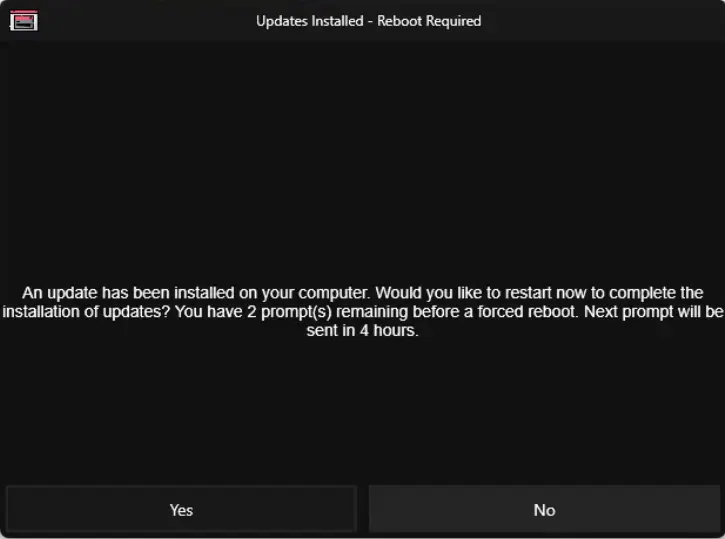
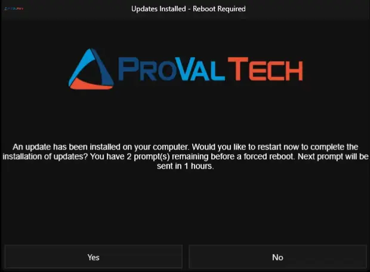

## Overview

This script acts as the remediation (Autofix) component of the "[Reboot Pending Prompt](/docs/d7758fa4-9fcc-4259-a7a5-0ca65dda10eb)" solution. It is triggered automatically when the [Detection](/docs/9817ce6b-6f8c-4718-844f-4f44f6c66376) script determines that a reboot is necessary and conditions are right to interrupt the user.

Since RMM scripts run in the background (Session 0) and cannot normally show windows to the user, this script utilizes a temporary Scheduled Task to bypass this limitation. It launches a branded GUI utility (`Prompter.exe`) inside the active user's session. Depending on how many times the user has already postponed the reboot, the script will either present a "Yes/No" deferral option or a "Final Warning" that enforces the reboot after a few minutes.

## Sample Run

> **Note:**
>
> - It is not recommended to run this script manually. The script is designed for the Autofix script of [Reboot Pending Prompt - Windows Workstation](/docs/b40cb53-0d54-4d63-9ce4-073732fd1aa3) compound condition. 
> - Prompter requires '.NET Desktop Runtime 8.0' to run. If missing, the script automatically downloads and installs it silently.

## Dependencies

- [Custom Field: cPVAL Pending Reboot](/docs/31558959-f3a5-4f4f-9388-6e7512972b01)
- [Custom Field: cPVAL Last Prompted](/docs/fe3a8ca4-3722-4eaf-895a-723f8d563395)
- [Custom Field: cPVAL Times Prompted](/docs/fded67bb-c3a3-40bb-acb1-2baa0464de45)
- [Custom Field: cPVAL Reboot Prompt Count](/docs/40cf882a-83e1-4197-b536-e6840c498d0c)
- [Custom Field: cPVAL Reboot Prompt Duration Between Prompt](/docs/2b88d214-a59b-4972-a462-121ecfc2a098)
- [Custom Field: cPVAL Reboot Prompt Title](/docs/9003db99-40e0-4450-8ce7-95e273d5c252)
- [Custom Field: cPVAL Reboot Prompt Message](/docs/96249acb-33f6-42ac-bcc1-d37266533397)
- [Custom Field: cPVAL Reboot Prompt Timeout](/docs/cb8acc9e-06df-4408-b986-a35e8cc23cff)
- [Custom Field: cPVAL Final Prompt Message](/docs/02ca99e5-85be-4e2e-a77b-3cd94be65566)
- [Custom Field: cPVAL Final Prompt Timeout](/docs/02cc7b8d-28aa-46c6-936b-21786c56206e)
- [Custom Field: cPVAL Final Prompt Reboot Delay Minutes](/docs/58e81186-a952-40e6-8f06-ad485c52ef2a)
- [Custom Field: cPVAL Reboot Prompt Header Image](/docs/93363322-3d61-484b-abbd-eb5e28bfb6df)
- [Custom Field: cPVAL Reboot Prompt Icon Image](/docs/27c3c19d-d5cb-46ae-97e7-605e682df948)
- [Custom Field: cPVAL Reboot Prompt Theme](/docs/1cef781e-295c-4cf5-aca5-bea0de5537fc)
- [Custom Field: cPVAL Reboot if Not Logged In](/docs/c1c1cb99-496a-4b3a-9a9c-e0fdf7ee4562)
- [Application: Prompter](/docs/aba254a9-e917-481d-9152-ecb6e990d98c)
- [Automation: Reboot Pending Prompt - Detection](/docs/9817ce6b-6f8c-4718-844f-4f44f6c66376)
- [Solution: Reboot Pending Prompt](/docs/d7758fa4-9fcc-4259-a7a5-0ca65dda10eb)

## Custom Fields

| Custom Field | Default | Example | Description |
| :--- | :--- | :--- | :--- |
| [cPVAL Reboot Prompt Count](/docs/40cf882a-83e1-4197-b536-e6840c498d0c) | `4` | `5` | Max deferrals allowed before a forced reboot. |
| [cPVAL Reboot Prompt Duration Between Prompt](/docs/2b88d214-a59b-4972-a462-121ecfc2a098) | `4` | `2` | Minimum hours to wait between prompts. Used for message display text only in this script. |
| [cPVAL Reboot Prompt Title](/docs/9003db99-40e0-4450-8ce7-95e273d5c252) | `Updates Installed - Reboot Required` | `IT Dept: Important Updates` | Title of the GUI window. |
| [cPVAL Reboot Prompt Message](/docs/96249acb-33f6-42ac-bcc1-d37266533397) | `An update has been installed on your computer. Would you like to restart now to complete the installation of updates? You have {X} prompt(s) remaining before a forced reboot. Next prompt will be sent in {Y} hours.` | `We installed security patches.`  **Resulting Prompt:** `We installed security patches. Would you like to restart now? You have {X} prompt(s) remaining before a forced reboot.` | Custom message body. The script automatically appends the question and remaining count to whatever text you provide. |
| [cPVAL Final Prompt Message](/docs/02ca99e5-85be-4e2e-a77b-3cd94be65566) | `An update has been installed on your computer. This is the final prompt before your computer will automatically restart to complete the installation of updates. Please save your work. Your computer will be restarted after {X} minute(s) after you acknowledge this prompt.` | `Deferrals exhausted.`  **Resulting Prompt:** `Deferrals exhausted. This is the final prompt before your computer will automatically restart. Your computer will be restarted after {X} minute(s) after you acknowledge this prompt.` | Message displayed when no deferrals remain. The script automatically appends the reboot warning and timer to your text. |
| [cPVAL Reboot Prompt Timeout](/docs/cb8acc9e-06df-4408-b986-a35e8cc23cff) | `300` | `60` | Time in seconds before a "Warning" prompt closes automatically (defaults to deferral). |
| [cPVAL Final Prompt Timeout](/docs/02cc7b8d-28aa-46c6-936b-21786c56206e) | `900` | `120` | Time in seconds before a "Final" prompt closes automatically (defaults to forced reboot). |
| [cPVAL Final Prompt Reboot Delay Minutes](/docs/58e81186-a952-40e6-8f06-ad485c52ef2a) | `5` | `10` | Grace period (in minutes) after final acknowledgment before the forced reboot occurs. |
| [cPVAL Reboot Prompt Header Image](/docs/93363322-3d61-484b-abbd-eb5e28bfb6df) | | `C:\Logos\header.png` or `https://example.com/logo.png` | Local file path or URL for the header image. |
| [cPVAL Reboot Prompt Icon Image](/docs/27c3c19d-d5cb-46ae-97e7-605e682df948) | | `C:\Logos\icon.ico` | Local file path or URL for the icon image. |
| [cPVAL Reboot Prompt Theme](/docs/1cef781e-295c-4cf5-aca5-bea0de5537fc) | `Dark` | `Light` | UI Theme: "Dark" or "Light". |
| [cPVAL Reboot if Not Logged In](/docs/c1c1cb99-496a-4b3a-9a9c-e0fdf7ee4562) | `Disable` | `Enable` | Forces reboot immediately if no user session is active. |
| [cPVAL Last Prompted](/docs/fe3a8ca4-3722-4eaf-895a-723f8d563395) | | `2024-05-20 14:30:00` | Updated to current timestamp if user defers. Updated by script. |
| [cPVAL Times Prompted](/docs/fded67bb-c3a3-40bb-acb1-2baa0464de45) | | `2` | Incremented by 1 if user defers. Resets to 0 on Reboot. Updated by script. |
| [cPVAL Pending Reboot](/docs/31558959-f3a5-4f4f-9388-6e7512972b01) | | `False` | Set to False upon successful reboot initiation. Updated by script. |

## Automation Setup/Import

[Automation Configuration](https://github.com/ProVal-Tech/ninjarmm/blob/main/scripts/reboot-pending-prompt-autofix.ps1)

## Output

- **Activity Details:** Logs the interaction result (e.g., "User declined reboot", "User opted to reboot", or "Final prompt acknowledged").
- **Custom Field:** Updates `cPVAL Last Prompted` and increments `cPVAL Times Prompted` if the user defers. Resets all tracking fields if the reboot is initiated.
- **User Prompt**

## Sample Prompts

**With Default Values:**  
    

**With Custom Header and Icon Image:**  
    
