## Overview

This is a Ninja RMM implementation of the agnostic script [Remove-PUA](</docs/powershell/Remove-PUA.md>). It manages the removal of predefined bloatware packages or lists installed bloatware based on a centrally maintained list. It offers three primary operations: bulk removal, selective removal, and bloatware listing. The remove parameter allows bypassing the PUA List to remove any installed AppxPackage.

**PUA List:** [PUA List](https://content.provaltech.com/attachments/potentially-unwanted-applications.json)

## Sample Run

Select any target, such as a computer or a group.  
Go to `Run` > `Run Automation` > `Script`  
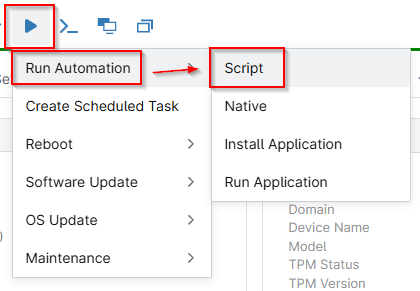  
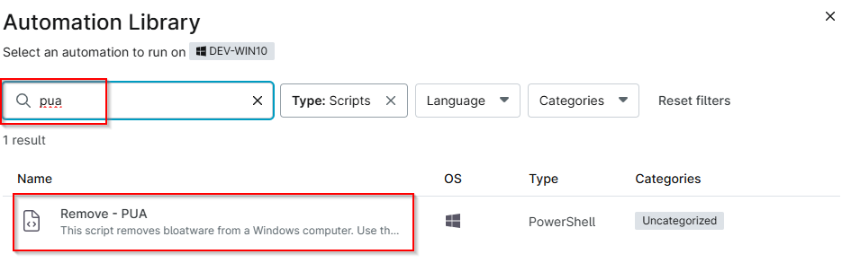  

Sample run to List Bloatware. This lists the bloatware detected on the endpoint that the script can remove:  
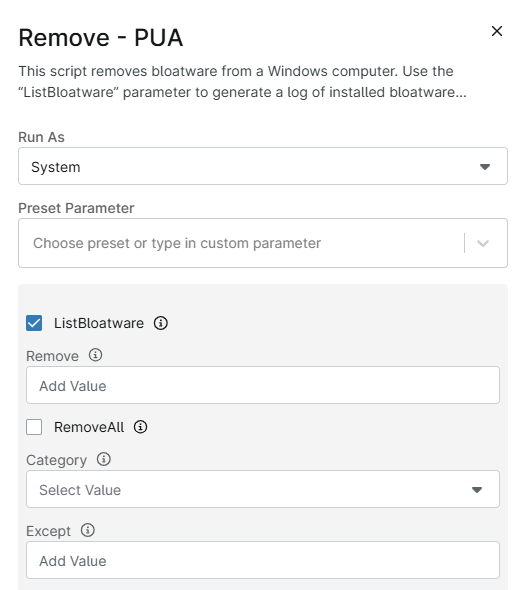

Below attempts to remove the Microsoft.XboxApp:  
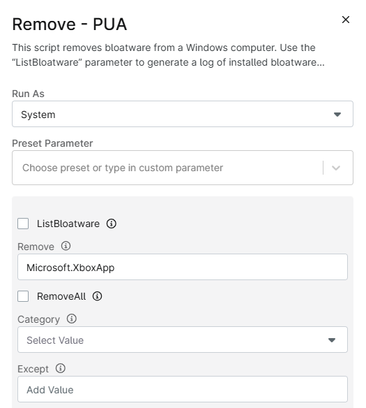

The below attempts to remove all detected bloatware listed in the [PUA List](https://content.provaltech.com/attachments/potentially-unwanted-applications.json) from the endpoint:  
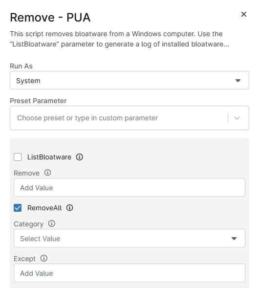

## Dependencies

[Remove-PUA](</docs/powershell/Remove-PUA.md>)

## User Parameters

| Parameter         | Required  | Type      | Description                               |
| ----------------- | --------- | --------- | ----------------------------------------- |
| `RemoveAll`       | True      | Switch    | Remove all packages from specified categories (default: both Microsoft and ThirdParty). |
| `Category`        | False     | Validate Set    | Filter removal to specific categories (`MsftBloatApps`/`ThirdPartyBloatApps`). |
| `Except`          | False     | String Array  | Exclude specific packages from removal operations. |
| `Remove`          | True      | String Array  | Remove specific packages by name (bypasses category filters). |
| `ListBloatware`   | True      | Switch    | List installed packages without making changes. |

## Automation Setup/Import

Navigate to `Administration` > `Library` > `Automation` > `Add` > `New Script`  
Add a New Script to the Automation library for this automation.  
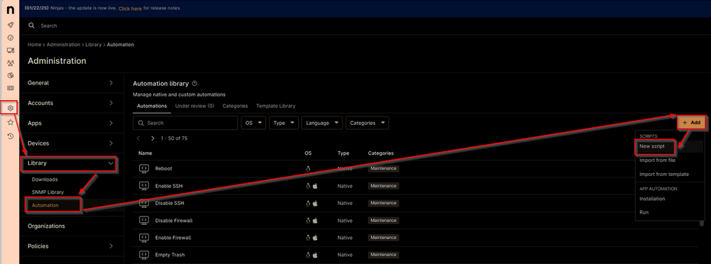

**Name:** `Remove - PUA`  
**Description:** `This script manages the removal of predefined bloatware packages or lists installed bloatware based on a centrally maintained list. It offers three primary operations: bulk removal, selective removal, and bloatware listing.`  
**Categories:** `<Leave it blank>`  
**Language:** `PowerShell`  
**Operating System:** `Windows`  
**Architecture:** `All`  
**Run As:** `System`  

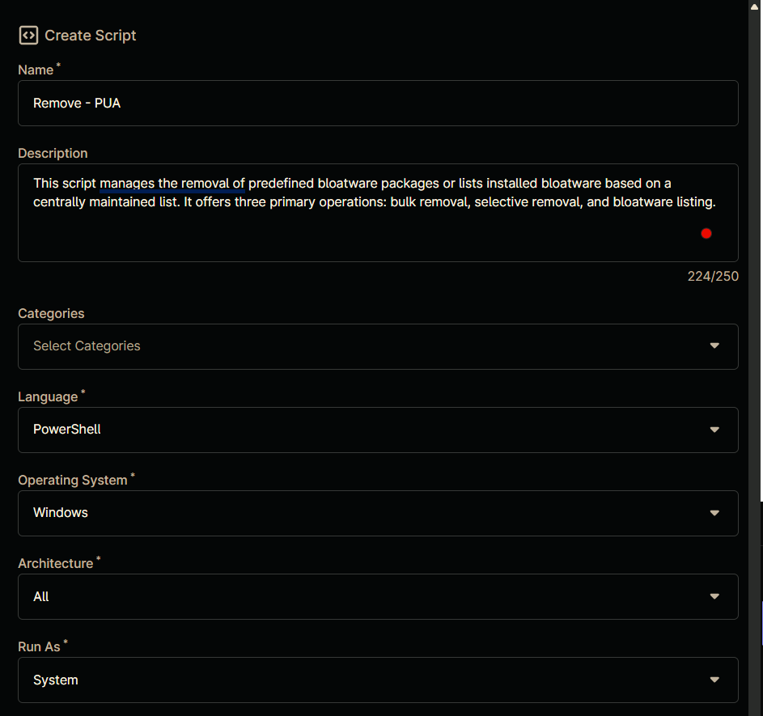

Paste in the following PowerShell script into the Ninja One editor  


```powershell
<#
.SYNOPSIS
    Script to manage and remove Potentially Unwanted Applications (PUA) using NinjaRMM.

.DESCRIPTION
    This script allows listing, removing, or removing all bloatware applications based on user-defined parameters.
    It supports filtering by category and excluding specific applications.

.PARAMETER ListBloatware
    Set to '1', 'True', or 'Yes' to list bloatware applications.

.PARAMETER Remove
    A comma-separated list of applications to remove.

.PARAMETER RemoveAll
    Set to '1', 'True', or 'Yes' to remove all bloatware applications.

.PARAMETER Category
    Specifies the category of bloatware to remove. Supported values: 'MsftBloatApps', 'ThirdPartyBloatApps'.

.PARAMETER Except
    A comma-separated list of applications to exclude when removing all bloatware.

.EXAMPLE
    # List bloatware applications
    $env:listbloatware = 'True'
    .\Remove-PUANinjaRmm.ps1

.EXAMPLE
    # Remove specific applications
    $env:remove = 'App1,App2'
    .\Remove-PUANinjaRmm.ps1

.EXAMPLE
    # Remove all bloatware except specified applications
    $env:removeall = 'True'
    $env:except = 'App1,App2'
    .\Remove-PUANinjaRmm.ps1

.NOTES
    Author: ProValTech
    Date: March 27, 2025
    Version: 1.0
#>

#region Begin
Begin {
    # Initialize user parameters
    $ListBloatware = $env:listbloatware
    $Remove = $env:remove
    $RemoveAll = $env:removeall
    $Category = $env:category
    $Except = $env:except

    if ($ListBloatware -match '1|True|Yes') {
        $ListBloatware = $true
    } else {
        $ListBloatware = $false
    }

    if ($Remove -and $Remove -notmatch 'Remove' -and $Remove -match '[A-z]') {
        $Remove = $Remove -replace ', ', ',' -replace ' ,', ','
        $Remove = $Remove.Trim()
        $Remove = $Remove.Split(',')
    }

    if ($RemoveAll -match '1|True|Yes') {
        $RemoveAll = $true
    } else {
        $RemoveAll = $false
    }

    if ($RemoveAll -and $Category -and $Category -notmatch 'Category' -and $Category -match '[A-z]') {
        if (!(('MsftBloatApps', 'ThirdPartyBloatApps') -contains $Category)) {
            throw 'Invalid category. Supported categories are: MsftBloatApps, ThirdPartyBloatApps'
        }
    } else {
        $Category = $false
    }

    if ($RemoveAll -and $Except -and $Except -notmatch 'Except' -and $Except -match '[A-z]') {
        $Except = $Except -replace ', ', ',' -replace ' ,', ','
        $Except = $Except.Trim()
        $Except = $Except.Split(',')
    } else {
        $Except = $false
    }

    # Build parameters hash table
    $Parameters = @{}
    if ($ListBloatware) {
        $Parameters.Add('ListBloatware', $true)
    } elseif ($Remove) {
        $Parameters.Add('Remove', $Remove)
    } elseif ($RemoveAll) {
        $Parameters.Add('RemoveAll', $true)
        if ($Category) {
            $Parameters.Add('Category', $Category)
        }
        if ($Except) {
            $Parameters.Add('Except', $Except)
        }
    } else {
        throw 'Invalid parameter set.'
    }
}
#endregion

#region Process
Process {
    # Variables
    [Net.ServicePointManager]::SecurityProtocol = [enum]::ToObject([Net.SecurityProtocolType], 3072)
    $ProjectName = 'Remove-PUA'
    $BaseURL = 'https://file.provaltech.com/repo'
    $PS1URL = "$BaseURL/script/$ProjectName.ps1"
    $WorkingDirectory = "C:\ProgramData\_automation\script\$ProjectName"
    $PS1Path = "$WorkingDirectory\$ProjectName.ps1"
    $LogPath = "$WorkingDirectory\$ProjectName-log.txt"
    $ErrorLogPath = "$WorkingDirectory\$ProjectName-Error.txt"

    # Setup - Folder Structure
    New-Item -Path $WorkingDirectory -ItemType Directory -ErrorAction SilentlyContinue | Out-Null
    $response = Invoke-WebRequest -Uri $PS1URL -UseBasicParsing
    if (($response.StatusCode -ne 200) -and (!(Test-Path -Path $PS1Path))) {
        Write-Error -Message "No pre-downloaded script exists and the script '$PS1URL' failed to download. Exiting."
        return
    } elseif ($response.StatusCode -eq 200) {
        Remove-Item -Path $PS1Path -ErrorAction SilentlyContinue
        [System.IO.File]::WriteAllLines($PS1Path, $response.Content)
    }
    if (!(Test-Path -Path $PS1Path)) {
        Write-Error -Message 'An error occurred and the script was unable to be downloaded. Exiting.'
        return
    }

    # Execute the downloaded script
    & $PS1Path @Parameters
}
#endregion

#region End
End {
    # Check logs and handle errors
    if (!(Test-Path $LogPath)) {
        throw 'PowerShell Failure. A Security application seems to have restricted the execution of the PowerShell Script.'
    }
    if (Test-Path $ErrorLogPath) {
        $ErrorContent = Get-Content -Path $ErrorLogPath
        throw $ErrorContent
    }
    Get-Content -Path $LogPath
}
#endregion
```

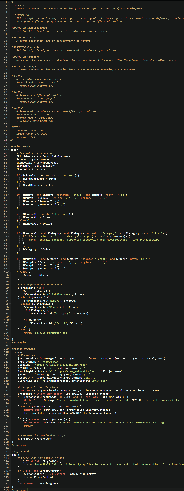

## Script Variables

Click the `Add` button next to `Script Variables`.  


Select the appropriate variable type (referenced below)  
  

Fill in the values as required (referenced below)

In the box, fill in the following details and select `Add` to create the script variable.

**Variable Type:** `CheckBox`  
**Variable Name:** `ListBloatware`  
**Description:** `Flagging this parameter will list down the installed Bloatware in script logs.`  
**Set Default Value:** `<Leave it unchecked.>`
Click on `ADD`  
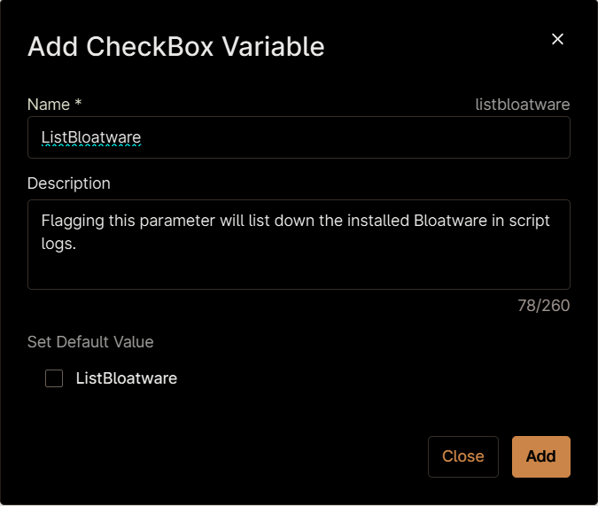  

**Variable Type:** `String`  
**Variable Name:** `Remove`  
**Description:** `The name(s) of the application or applications you wish to uninstall.`  
**Set Default Value:** `<Leave it unchecked.>`
**Mandatory:** `False`
Click on `ADD`  
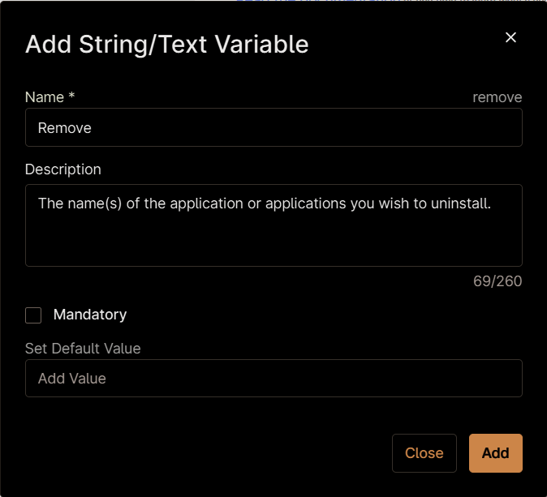  

**Variable Type:** `CheckBox`  
**Variable Name:** `Remove`  
**Description:** `Flag this parameter to remove all bloatware by category or all found bloatware supported by the script with or without exceptions.`  
**Set Default Value:** `<Leave it unchecked.>`
Click on `ADD`  
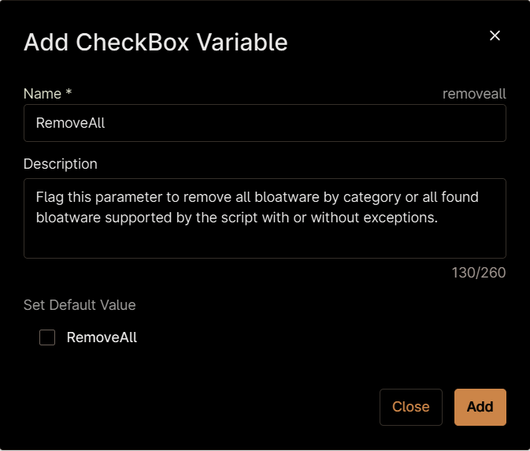

**Variable Type:** `Drop-Down`  
**Variable Name:** `Category`  
**Description:** `Used with RemoveAll will filter bloatware to a certain category allowing you to select just a specific category of bloatware.`  
**Set Default Value:** `<Leave it unchecked.>`
**Mandatory:** `False`
**Option Value:** Click on `+Add` button and add the below options:

- `MsftBloatApps`
- `ThirdPartyBloatApps`  

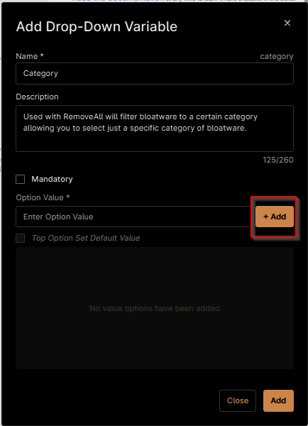  

Click on `Add`
Sample screenshot after creation:  
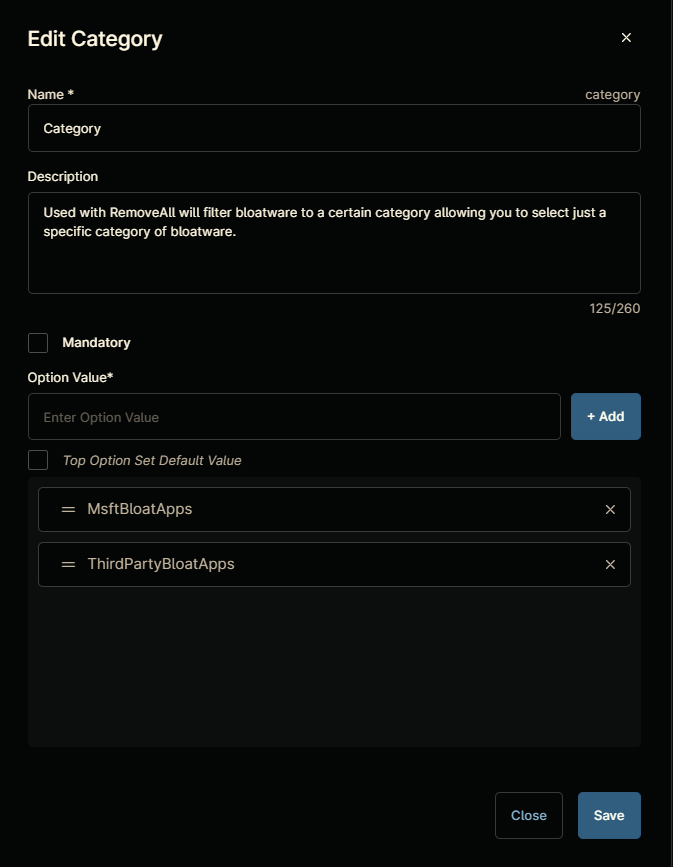  

**Variable Type:** `String`  
**Variable Name:** `Except`  
**Description:** `Used with RemoveAll or Category to remove all except some item(s) from a category or all together.`  
**Set Default Value:** `<Leave it unchecked.>`
**Mandatory:** `False`
Click on `ADD`  
  

Click the `Save` button to save the Automation.  
  

## Completed Automation

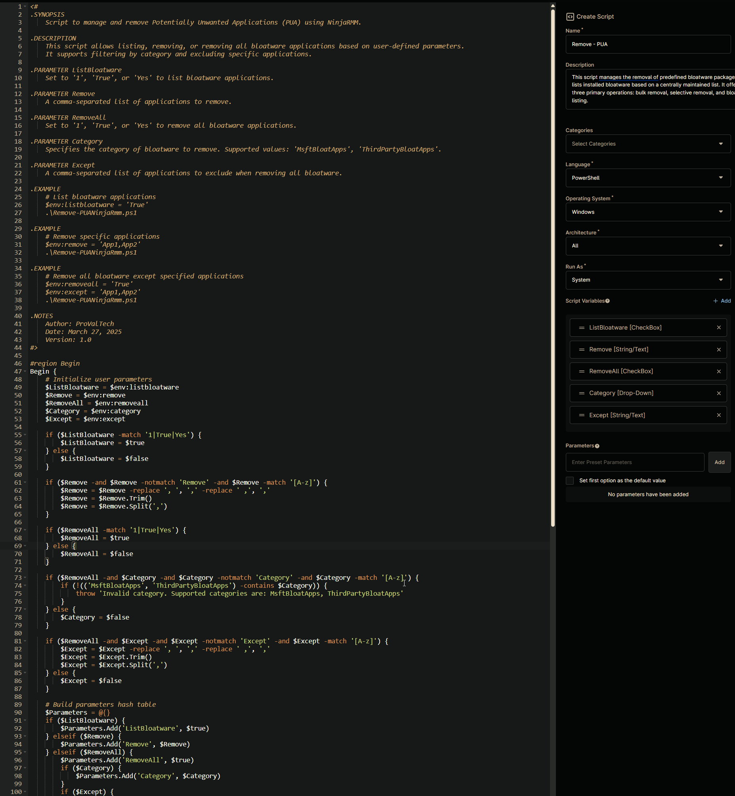

## Output

- Activity Details

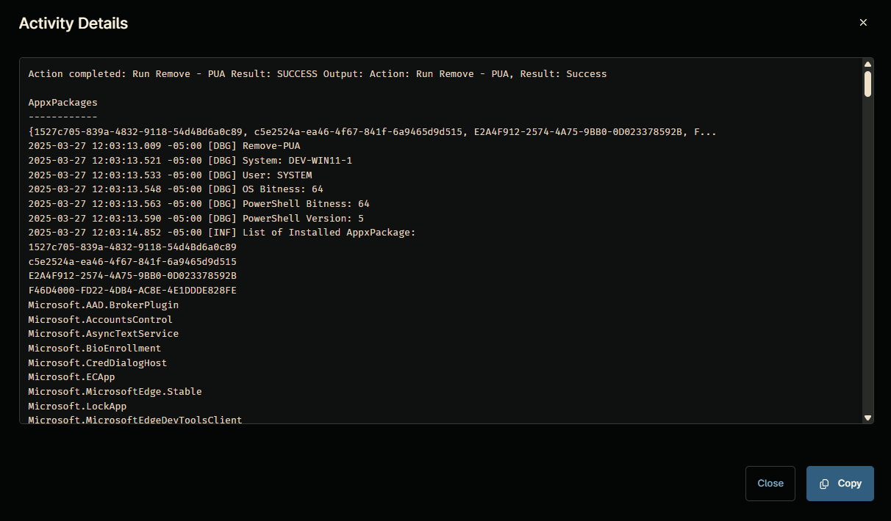  
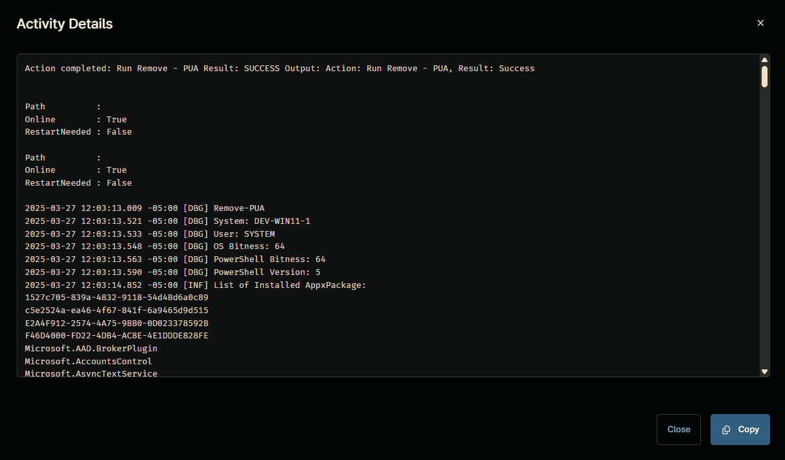
