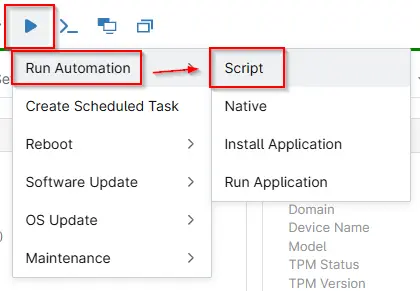
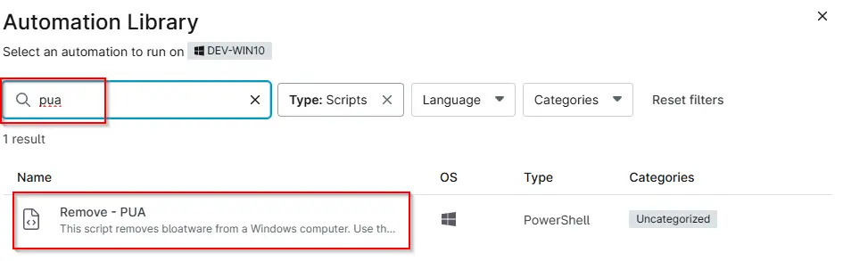
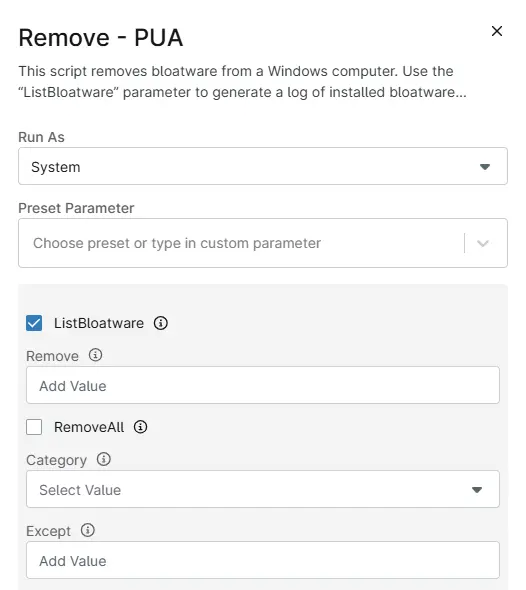
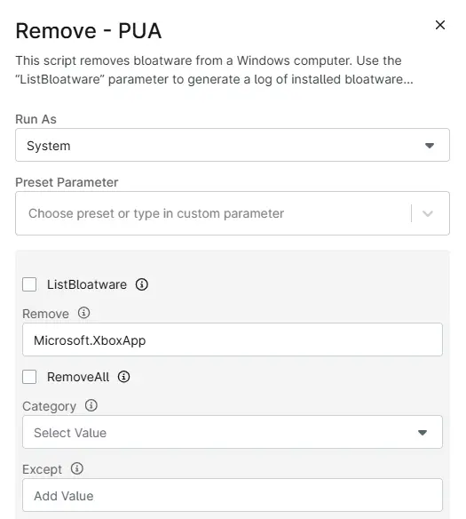
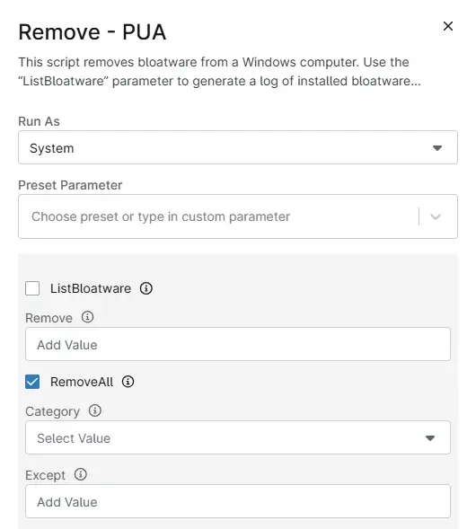

## Overview

This is a Ninja RMM implementation of the agnostic script [Remove-PUA](/docs/fda5f79b-3e83-4561-af2b-2533f41c7443). It manages the removal of predefined bloatware packages or lists installed bloatware based on a centrally maintained list. It offers three primary operations: bulk removal, selective removal, and bloatware listing. The remove parameter allows bypassing the PUA List to remove any installed AppxPackage.

**PUA List:** [PUA List](https://content.provaltech.com/attachments/potentially-unwanted-applications.json)

**EXERCISE EXTREME CAUTION - Removing system components may cause system instability.**

## Sample Run

Select any target, such as a computer or a group.  
Go to `Run` > `Run Automation` > `Script`  
  
  

Sample run to List Bloatware. This lists the bloatware detected on the endpoint that the script can remove:  

Below attempts to remove the Microsoft.XboxApp:  

The below attempts to remove all detected bloatware listed in the [PUA List](https://content.provaltech.com/attachments/potentially-unwanted-applications.json) from the endpoint:  

## Dependencies

[Remove-PUA](/docs/fda5f79b-3e83-4561-af2b-2533f41c7443)

## Parameters

| Parameter         | Example | Required  | Default |  Type      | Description                               |
| ----------------- | ------| --- | --------- | --------------------|--------------------- |
| `RemoveAll`       |   |  False  |          | Checkbox    | Select it to remove all packages from specified categories (default: both Microsoft and ThirdParty) with or without exceptions. |
| `Category`        |   | False  | `MsftBloatApps`,`ThirdPartyBloatApps` | DropDown   | Used with RemoveAll to filter bloatware to a certain category, allowing you to select just a specific category of bloatware. |
| `Except`          | xboxGameOverlay  | False |    | String | Used with RemoveAll or Category to remove all except some item(s) from a category or all together. |
| `Remove`          | `Microsoft.BingNews`, `Microsoft.BingWeather`, `Microsoft.People` |   |     | String | Specify name(s) of the bloatwares to uninstall. |
| `ListBloatware`   |   | True |    | Checkbox   | List installed packages without making changes. |
| `PUAListSource` | `https://my.cdn.example/pua.json`, `C:\ProgramData\_Automation\Script\PUA\pua.json` | False | | String  |Optional source for an alternate PUA list JSON. When provided, the script will use the specified local JSON file or downloadable URL instead of the default PUA list (https://content.provaltech.com/attachments/potentially-unwanted-applications.json). |

## Automation Setup/Import

[Automation Configuration](https://github.com/ProVal-Tech/ninjarmm/blob/main/scripts/remove-pua.ps1)

## Output

- Activity Details

## Changelog

### 2026-08-21

- Added another parameter `PuaListSource`. Its an Optional source for an alternate PUA list JSON. When provided, the script will use the specified local JSON file or downloadable URL instead of the default PUA list.
- Updated the script to use this new parameter and as per our new cwrmm script standards.
- Updated the document as per our new standards.

### 2025-03-27

- Initial version of the document
